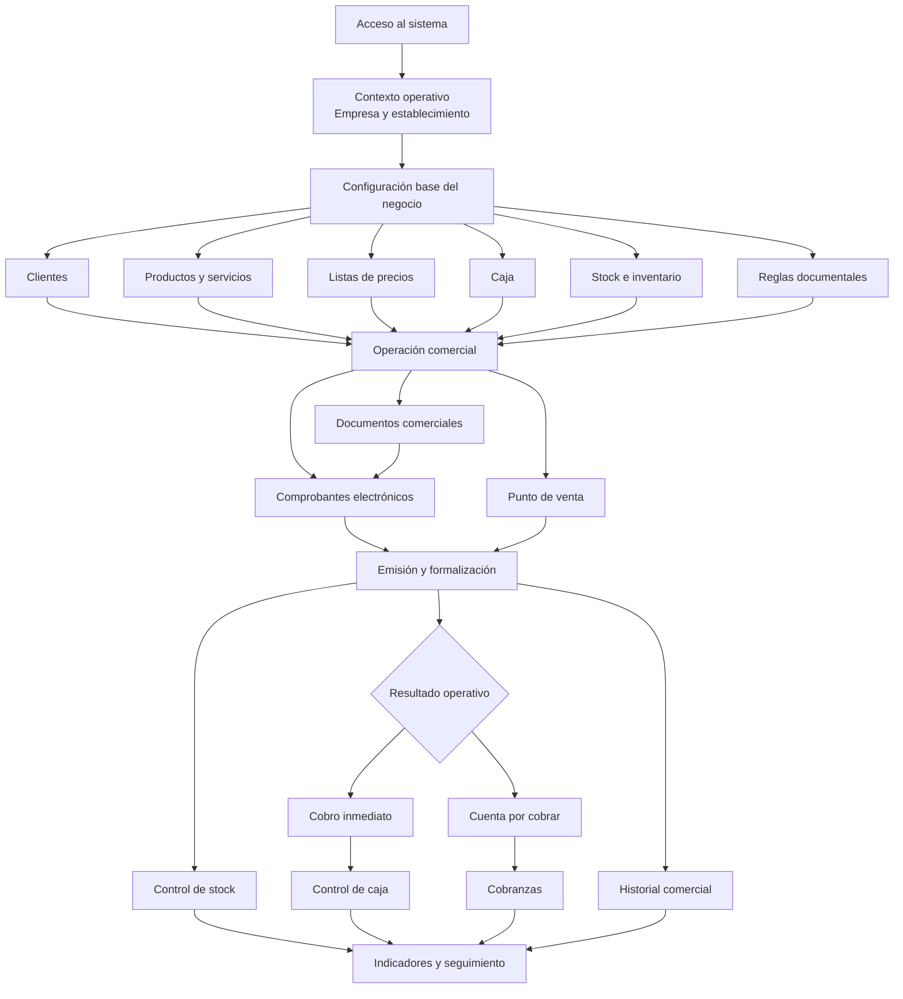

# Flujo General del Producto SenciYo

## 1. Resumen ejecutivo

SenciYo se presenta como una solución integral de gestión comercial orientada a la operación diaria del negocio. Su propuesta funcional combina preparación operativa, ejecución comercial, emisión documental, control de caja, seguimiento de cobranzas, administración de inventario y análisis del desempeño dentro de una misma experiencia de uso.

La lógica general del producto se organiza alrededor de un ciclo operativo completo. Ese ciclo inicia con el acceso al sistema y la definición del contexto de trabajo, continúa con la preparación de la operación mediante la configuración del negocio y los datos maestros, y se consolida en los procesos de venta, emisión, cobranza y seguimiento. De este modo, SenciYo no se entiende como un conjunto aislado de pantallas, sino como una plataforma conectada que articula las distintas etapas de la gestión comercial.

Los módulos troncales del producto son el acceso al sistema, el contexto operativo de empresa y establecimiento, la configuración base, la gestión de clientes, la gestión de productos, las listas de precios, el control de stock, la caja, los documentos comerciales, los comprobantes electrónicos, el punto de venta, las cobranzas y los indicadores. Cada uno cumple un rol dentro de una secuencia funcional coherente que sostiene la operación de principio a fin.

## 2. Alcance general del producto

SenciYo comprende funcionalmente las capacidades necesarias para preparar, ejecutar y monitorear la operación comercial de un negocio. Su alcance no se limita a la emisión de comprobantes, sino que abarca el conjunto de procesos que hacen posible vender, registrar, cobrar, controlar y analizar la actividad operativa.

En términos generales, el producto integra cinco dimensiones principales:

- gestión del contexto operativo, mediante la selección de empresa y establecimiento;
- configuración estructural del negocio, incluyendo parámetros esenciales para operar;
- administración de datos maestros, como clientes, productos y precios;
- operación comercial, mediante documentos, ventas, emisión y caja;
- seguimiento posterior, a través de cobranzas, control operativo e indicadores.

Dentro de este alcance, SenciYo funciona como una solución de operación comercial continua. La preparación del negocio habilita la ejecución transaccional; la ejecución transaccional alimenta el control y la cobranza; y el resultado de esa operación se proyecta en el seguimiento y el análisis del desempeño.

No forma parte del alcance troncal del producto un módulo de Compras como bloque principal del flujo general. En consecuencia, la lectura global del sistema debe centrarse en la gestión comercial, la emisión, la cobranza, el control operativo y el seguimiento.

## 3. Estructura funcional del producto

La estructura funcional de SenciYo puede entenderse en grandes bloques que se encadenan entre sí y que, en conjunto, dan forma a la solución completa.

### Acceso y contexto operativo

Este bloque reúne el ingreso al sistema, la validación de acceso y la definición del entorno de trabajo. Su función es asegurar que la operación se ejecute bajo una empresa y un establecimiento determinados, con el alcance correcto de permisos y configuración.

### Configuración base del negocio

Este bloque establece las condiciones estructurales para operar. Incluye la preparación de la información institucional, la definición de sedes o establecimientos, la organización de almacenes, la administración de usuarios, la configuración documental, la parametrización del negocio y la gestión de cajas.

### Datos maestros comerciales

Este bloque concentra la información reutilizable en los procesos operativos. Comprende la gestión de clientes, productos y listas de precios, y actúa como base para la ejecución comercial posterior.

### Operación comercial

Este bloque reúne los procesos mediante los cuales el negocio genera actividad transaccional. Incluye documentos comerciales, comprobantes electrónicos y punto de venta. Aquí se concreta la venta, la formalización documental y la transición hacia el cobro o el seguimiento financiero.

### Control operativo

Este bloque acompaña la operación y garantiza condiciones mínimas para ejecutarla correctamente. Incluye caja, stock e inventario, y permite controlar disponibilidad, movimientos y consistencia operativa.

### Seguimiento y gestión posterior

Este bloque ordena lo que ocurre después de la venta o de la emisión. Incluye cobranzas, historial comercial de clientes, alertas y métricas de desempeño. Su objetivo es dar continuidad a la operación y facilitar la toma de decisiones.

## 4. Módulos principales del producto

### Acceso al sistema

El acceso al sistema cumple la función de controlar la entrada al entorno operativo. Su rol dentro del producto es habilitar una sesión válida desde la cual se pueda trabajar sobre la información y los procesos del negocio. Es el punto de partida de toda la experiencia.

### Contexto operativo de empresa y establecimiento

Este módulo define el marco en el que se desarrolla la operación. Permite que la actividad comercial, documental y operativa se ejecute dentro de una empresa y un establecimiento concretos. Su relación con los demás módulos es transversal, ya que condiciona el ámbito de trabajo de toda la plataforma.

### Configuración base

La configuración base prepara las reglas y datos estructurales del negocio. Su propósito es dejar listo el entorno para que la operación posterior tenga consistencia institucional, documental y operativa. Se relaciona directamente con caja, emisión, inventario, usuarios y medios de pago.

### Gestión de clientes

La gestión de clientes organiza la información comercial de las personas o empresas con las que se opera. Su rol es abastecer los procesos de venta, emisión y seguimiento, además de consolidar el historial comercial y la relación posterior con la cobranza.

### Gestión de productos

La gestión de productos administra el catálogo comercial del negocio. Su propósito es sostener la venta, la emisión, el control de stock y la lógica de precios. Este módulo actúa como base para la operación transaccional y para la administración de inventario.

### Listas de precios

Las listas de precios permiten definir la lógica comercial con la que se valorizan productos y servicios. Su rol es alimentar la operación de venta y emisión, aportando flexibilidad para distintos escenarios comerciales. Se vinculan directamente con productos, clientes y venta.

### Control de stock e inventario

El módulo de inventario administra la disponibilidad operativa de productos, los movimientos y las alertas. Su propósito es mantener visibilidad sobre existencias y asegurar que la operación comercial pueda ejecutarse con control. Se relaciona estrechamente con productos, almacenes y venta.

### Caja

La caja articula la dimensión operativa del cobro y del control monetario diario. Su función es habilitar la operación de contado, registrar movimientos y mantener trazabilidad sobre aperturas, cierres y saldo operativo. Se vincula con punto de venta, comprobantes y cobranzas.

### Documentos comerciales

Los documentos comerciales cumplen un rol previo o complementario a la emisión final. Su propósito es estructurar propuestas o acuerdos comerciales que luego pueden integrarse al flujo transaccional. Se relacionan con clientes, productos y emisión, pero no constituyen el núcleo principal del producto.

### Comprobantes electrónicos

Este módulo formaliza la operación comercial mediante la emisión documental. Su rol dentro del producto es convertir la venta en un documento válido dentro del proceso operativo del negocio. Se conecta con clientes, productos, precios, caja, cobranzas e inventario.

### Punto de venta

El punto de venta concentra la ejecución ágil de ventas en escenarios de atención rápida. Su propósito es facilitar la operación comercial en contextos de mayor ritmo transaccional. Funcionalmente, comparte base con comprobantes, pero se diferencia por su orientación operativa y velocidad de uso.

### Cobranzas

El módulo de cobranzas organiza el seguimiento financiero posterior a la emisión o a la venta. Su rol es administrar cuentas por cobrar, registrar pagos y mantener continuidad en la gestión de saldos pendientes. Se relaciona directamente con comprobantes, caja y clientes.

### Indicadores

Los indicadores representan la capa de seguimiento y análisis del producto. Su propósito es consolidar información relevante para evaluar resultados, comportamiento comercial y desempeño general. Este módulo recibe información de la operación, pero no la habilita.

### Notificaciones y soporte transversal

El producto incorpora además componentes de soporte transversal, como notificaciones y mecanismos de acceso rápido a la información. Su función es acompañar la operación y mejorar visibilidad, pero no estructuran el flujo troncal del sistema.

## 5. Flujo general del producto

El flujo general del producto comienza con el ingreso al sistema y la definición del contexto operativo. A partir de ese momento, la experiencia se organiza sobre una empresa y un establecimiento activos, lo que permite que la información, la operación y el control se desarrollen en un marco concreto.

Una vez definido el contexto, el producto se apoya en la configuración base del negocio. Esta etapa establece los parámetros institucionales, documentarios y operativos necesarios para que la actividad posterior tenga coherencia. Sobre esa base se organizan también los datos maestros, principalmente clientes, productos y precios, que actúan como insumos de la operación comercial.

Con estas condiciones preparadas, SenciYo articula el núcleo de su funcionamiento en la operación comercial. Esa operación puede recorrer caminos previos, como la elaboración de documentos comerciales, o avanzar directamente hacia la venta y la emisión. En este punto, el sistema integra la lógica de clientes, productos, valorización, caja, stock y formalización documental dentro de un mismo recorrido funcional.

La operación se consolida con la emisión de comprobantes o con la ejecución de ventas por punto de venta. Una vez generada la transacción, el producto organiza sus efectos posteriores: cobro inmediato, generación de cuentas por cobrar, actualización del control operativo y proyección de la información hacia módulos de seguimiento.

El cierre del flujo general se produce en la etapa de control y análisis. La cobranza, el historial comercial, el monitoreo de caja, el control de stock y los indicadores permiten que la operación no termine en la emisión, sino que continúe en una lógica de seguimiento integral.

## 6. Flujos funcionales principales

### Flujo de preparación operativa

Este flujo reúne las actividades que dejan al negocio en condiciones de operar. Comprende la definición del contexto de empresa y establecimiento, la configuración base, la preparación documental, la organización de cajas y almacenes, y la carga o mantenimiento de datos maestros. Su función es habilitar el resto del sistema.

### Flujo de gestión comercial

Este flujo concentra la preparación de la relación comercial y la estructuración de la operación. Incluye la administración de clientes, productos y precios, así como la generación de documentos comerciales cuando la operación lo requiere. Su objetivo es ordenar la base comercial desde la cual se concreta la venta.

### Flujo de emisión y venta

Este flujo constituye el núcleo del producto. Comprende la creación de comprobantes y la operación de punto de venta. Aquí se formaliza la transacción comercial, se articula la lógica documental y se ejecuta la venta dentro del contexto operativo definido.

### Flujo de cobranza y control monetario

Este flujo organiza lo que ocurre cuando la operación genera cobros inmediatos o saldos pendientes. Incluye la participación de caja, el registro de cobros y la continuidad de las cuentas por cobrar. Su función es conectar la venta con su consecuencia financiera.

### Flujo de control operativo

Este flujo se enfoca en la consistencia de la operación. Incluye el control de stock, los movimientos de inventario, el seguimiento de caja y las alertas operativas. Su propósito es sostener la operación diaria con visibilidad y orden.

### Flujo de seguimiento y análisis

Este flujo agrupa las capacidades de monitoreo posteriores a la venta. Incluye cobranzas en seguimiento, historial comercial de clientes, indicadores y reportes. Su objetivo es dar lectura global al desempeño del negocio y extender el valor del sistema más allá de la transacción puntual.

## 7. Dependencias funcionales entre módulos

SenciYo articula sus módulos mediante dependencias funcionales claras, en las que unos bloques habilitan, condicionan o alimentan a otros.

El acceso y el contexto operativo habilitan toda la solución. Sin una sesión válida y sin un ámbito de trabajo definido, el resto del producto pierde aplicabilidad operativa.

La configuración base condiciona la operación comercial. La emisión, la caja, la lógica documental y parte del control operativo dependen de que existan parámetros, reglas y estructuras básicas del negocio correctamente definidas.

Los clientes, productos y precios alimentan la operación comercial. La venta y la emisión se construyen sobre estos módulos, que aportan identidad comercial, contenido transaccional y valorización.

La caja condiciona los flujos de contado. Cuando la operación requiere cobro inmediato, la caja deja de ser solo un módulo de soporte y se convierte en una condición funcional de la transacción.

El inventario depende de la existencia de productos y almacenes, pero a la vez condiciona la operación comercial al aportar disponibilidad y control sobre la salida de bienes.

La cobranza depende de la operación comercial previa. Su existencia funcional está directamente asociada a ventas, comprobantes y cuentas pendientes, por lo que actúa como continuación natural de la transacción.

Los indicadores dependen del conjunto de la operación. Se nutren del comportamiento del sistema y consolidan una lectura posterior del desempeño, por lo que se ubican al final de la cadena funcional, no al inicio.

## 8. Diagrama funcional general en Mermaid

## 9. Versión resumida para diagramación externa

- Acceso al sistema.
- Definición del contexto operativo.
- Configuración base del negocio.
- Gestión de clientes, productos y precios.
- Preparación de caja, stock y estructura documental.
- Operación comercial.
- Documentos comerciales, comprobantes electrónicos o punto de venta.
- Cobro inmediato o generación de cuenta por cobrar.
- Control operativo.
- Seguimiento e indicadores.

## 10. Conclusión general

SenciYo debe entenderse como una solución de gestión comercial integral que conecta preparación, operación, control y seguimiento dentro de una misma lógica funcional. Su valor no reside únicamente en emitir comprobantes o registrar ventas, sino en articular los distintos momentos del negocio dentro de un flujo continuo y coherente.

La estructura del producto demuestra una organización clara: primero se prepara el entorno de trabajo, luego se ordenan los datos maestros, después se ejecuta la operación comercial y finalmente se desarrolla el control y el seguimiento posterior. Esta secuencia permite leer el producto como una herramienta completa de operación diaria, no como un conjunto fragmentado de funciones.

Los módulos principales del sistema se integran alrededor de una columna vertebral compuesta por contexto operativo, configuración, operación comercial, emisión, caja, cobranza, inventario y análisis. Esa integración define la lectura correcta del producto a nivel global y ofrece una base sólida para documentación funcional, alineamiento de negocio y diagramación externa.