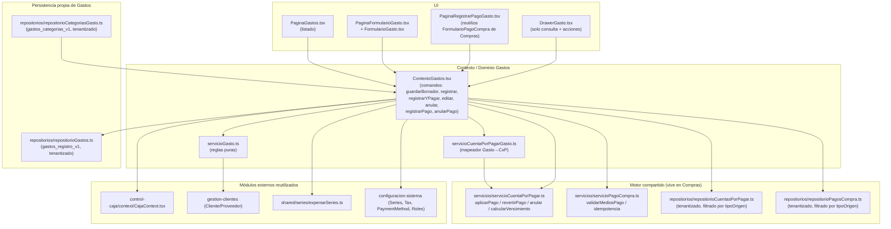
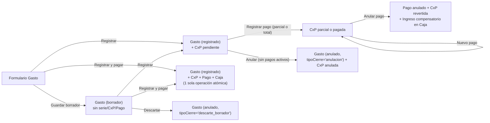
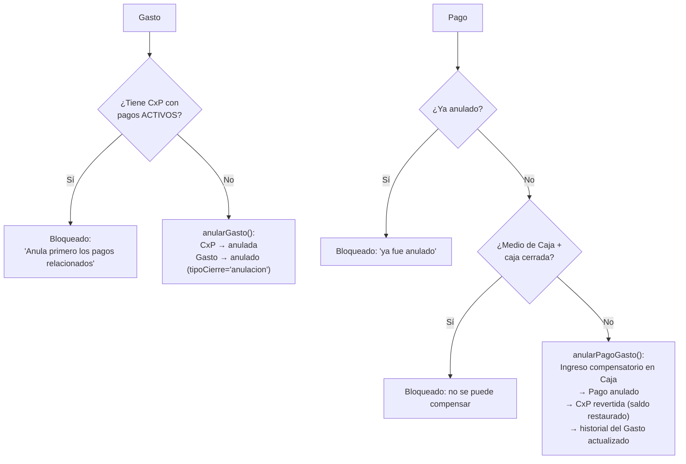
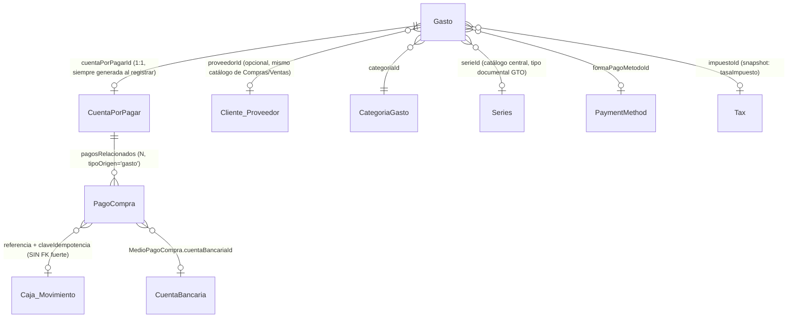

# Auditoría Integral — Módulo de Gastos

> Documento en dos etapas. **Etapa 1 (auditoría, solo lectura)**: reconstrucción exhaustiva del módulo sin modificar código. **Etapa 2 (remediación, aplicada después)**: se corrigieron los 5 hallazgos pendientes (GAS-P0-001, GAS-P2-001, GAS-P2-002, GAS-P3-001, GAS-P3-002) preservando íntegra la arquitectura ya validada en la Etapa 1. La sección 18 conserva el texto original de cada hallazgo (nunca se borra el historial) y agrega, al final de cada uno, el bloque **"✅ CORREGIDO Y VERIFICADO"** con la causa raíz resuelta, los archivos tocados, las pruebas agregadas y el resultado de verificación. Ruta base del módulo: `apps/senciyo/src/pages/Private/features/gastos/`. Toda referencia de archivo es relativa a `apps/senciyo/src/` salvo que se indique lo contrario.

---

## 1. Veredicto ejecutivo

**✅ APROBADO PARA CIERRE**

El módulo de Gastos es, con evidencia, uno de los subsistemas más maduros y mejor documentados del código auditado en esta base: no crea un segundo motor de Cuentas por Pagar ni de Pagos (reutiliza literalmente `compras/servicios/servicioCuentaPorPagar.ts` y `compras/servicios/servicioPagoCompra.ts`, filtrando por `tipoOrigen: 'gasto'`), mantiene una única fuente de verdad por concepto, tiene idempotencia real a nivel de comando (no solo de UI), compensa movimientos de Caja si una operación falla a mitad de camino, nunca borra físicamente nada (solo `anulado`/`inactiva`).

La Etapa 1 encontró 1 hallazgo P0 (dinero mostrado como pagado sin respaldo real en Caja si falta el permiso `caja.movimientos.registrar`), 2 P2 (ambigüedad de reporting Compras/Gastos; cobertura de pruebas ausente en permisos/multiempresa) y 2 P3 (fallback de tenant sin namespace; falta de test de reversión real de Caja). La Etapa 2 corrigió los 5 en su causa raíz — no con parches locales — preservando el motor compartido de CxP/Pagos sin refactorizarlo.

**Estado final verificado:**
- P0 = 0, P1 = 0, P2 = 0, P3 = 0
- `npx vitest run` (suite COMPLETA del proyecto, no solo Gastos) → **97 archivos, 2040 tests, 100% ✅**
- `npx tsc -b` → **0 errores**
- `npx eslint .` → **0 errores, 0 advertencias**
- `npm run build` → **build de producción exitoso**
- Sin regresiones en Compras, Caja ni Cobranzas (verificado por lectura de cada consumidor real de `agregarMovimiento` y por la suite completa en verde).

La arquitectura de fondo (una sola CxP, un solo Pago, un solo saldo, historial que nunca desaparece) se conservó intacta — ninguna corrección requirió rehacer el módulo.

---

## 2. Alcance auditado

**Módulo Gastos** (`gastos/`):
- Modelos: `modelos/Gasto.ts`, `modelos/CategoriaGasto.ts`
- Contexto/comandos: `contexto/ContextoGastos.tsx`, `contexto/useContextoGastos.ts`
- Servicios: `servicios/servicioGasto.ts`, `servicios/servicioCuentaPorPagarGasto.ts`, `servicios/servicioCategoriaGasto.ts`, `servicios/servicioImpuestoGasto.ts`, `servicios/servicioImpresionGasto.ts`, `servicios/consultaGastosOperativos.service.ts`
- Repositorios: `repositorios/repositorioGastos.ts`, `repositorios/repositorioCategoriasGasto.ts`
- Páginas: `paginas/GastosLayout.tsx`, `paginas/PaginaGastos.tsx`, `paginas/PaginaFormularioGasto.tsx`, `paginas/PaginaRegistrarPagoGasto.tsx`
- Componentes: `componentes/DrawerGasto.tsx`, `componentes/FormularioGasto.tsx`
- Hooks: `hooks/useCategoriasGasto.ts`
- Constantes: `constantes/motivosAnulacionGasto.ts`
- Pruebas: 11 archivos (`servicioGasto.test.ts`, `servicioCuentaPorPagarGasto.test.ts`, `servicioCategoriaGasto.test.ts`, `servicioImpuestoGasto.test.ts`, `servicioImpresionGasto.test.ts`, `consultaGastosOperativos.service.test.ts`, `registrarGastoConPagoInmediato.integration.test.ts`, `registrarGastoSerie.integration.test.ts`, `idempotenciaPagoGasto.integration.test.ts`, y los agregados en la Etapa 2: `permisosYMultiempresa.integration.test.ts`, `anularPagoGasto.integration.test.ts`)

**Dependencias directas auditadas por ser fuente de verdad compartida**:
- `compras/modelos/CuentaPorPagar.ts`, `compras/modelos/PagoCompra.ts`, `compras/modelos/LineaCompra.ts`, `compras/modelos/EventoHistorialCompras.ts`
- `compras/servicios/servicioCuentaPorPagar.ts`, `compras/servicios/servicioPagoCompra.ts`
- `compras/repositorios/repositorioCuentasPorPagar.ts`, `compras/repositorios/repositorioPagosCompra.ts`
- `compras/logica/reglasCompras.ts` (funciones `tieneCxPPagosActivos`, `motivoBloqueoAnulacionPago`, `validarTipoCambioRequerido`, `round2`, `calcularEsInventariable`)
- `compras/componentes/BuscadorProveedor.tsx`
- `control-caja/context/CajaContext.tsx`, `control-caja/models/Caja.ts`
- `configuracion-sistema/roles/catalogoPermisos.ts`, `configuracion-sistema/utilidades/permisos.ts`
- `shared/tenant/index.ts`, `shared/series/expenseSeries.ts`, `shared/status/estadoPago.ts`, `shared/status/estadoDocumento.ts`, `shared/payments/paymentTerms.ts`, `shared/payments/paymentMeans.ts`
- `routes/privateRoutes.tsx`

**Archivos de producción modificados en la Etapa 2** (remediación; ver detalle completo por hallazgo en la sección 18):
- `control-caja/utils/validators.ts`, `control-caja/utils/errors.ts`, `control-caja/context/CajaContext.tsx` (GAS-P0-001)
- `gastos/servicios/consultaGastosOperativos.service.ts`, `indicadores-negocio/pages/RentabilidadVentasPage.tsx` (GAS-P2-001)
- `gastos/repositorios/repositorioGastos.ts`, `gastos/repositorios/repositorioCategoriasGasto.ts`, `compras/repositorios/repositorioCuentasPorPagar.ts`, `compras/repositorios/repositorioPagosCompra.ts`, `compras/repositorios/repositorioComprobantesCompra.ts` (GAS-P3-001)
- `gastos/contexto/ContextoGastos.tsx` (GAS-P3-002, 1 línea: clave de idempotencia de la reversión por medio)

**Verificaciones ejecutadas — Etapa 1 (baseline, sin modificar código):** `npx vitest run src/pages/Private/features/gastos` → 9 test files, 260 tests, todos ✅. `npx tsc -b` → 0 errores. `npx eslint .` → 0 errores/advertencias.

**Verificaciones ejecutadas — Etapa 2 (tras la remediación):** `npx vitest run` (suite completa del proyecto) → **97 test files, 2040 tests, todos ✅**. `npx tsc -b` → **0 errores**. `npx eslint .` → **0 errores/advertencias**. `npm run build` → **exitoso**.

---

## 3. Arquitectura actual

Gastos **no tiene su propio motor de Cuentas por Pagar ni de Pagos**. Reutiliza en su totalidad el motor genérico que ya usa Compras, generalizado mediante un campo `tipoOrigen: 'compra' | 'gasto'` en `CuentaPorPagar` y `PagoCompra` (`compras/modelos/CuentaPorPagar.ts:50`, `compras/modelos/PagoCompra.ts:55,73`). El propio código lo declara explícitamente en sus comentarios de cabecera (`gastos/contexto/ContextoGastos.tsx:1-11`, `gastos/servicios/servicioCuentaPorPagarGasto.ts:1-11`).

**Puntos clave de la arquitectura**:
- `CuentaPorPagar.tipoOrigen`/`documentoOrigenId` son la fuente canónica de origen; los campos `comprobanteCompraId`/`comprobanteCompraNumero`/`tipoComprobanteOrigen` quedan vacíos (`''`) para origen `'gasto'` (`CuentaPorPagar.ts:52-67`, `servicioCuentaPorPagarGasto.ts:84-94`).
- Los repositorios compartidos (`repositorioCuentasPorPagar.ts`, `repositorioPagosCompra.ts`) exponen `listarCuentasPorPagarPorOrigen(origen)` / `listarPagosPorOrigen(origen)` como **único punto de aislamiento por origen** (`repositorioCuentasPorPagar.ts:81-83`, `repositorioPagosCompra.ts:69-71`) — Gastos nunca lee el arreglo completo sin filtrar.
- El mapeador `generarCuentaPorPagarDesdeGasto` vive en Gastos, no en el motor compartido — decisión explícita para evitar una dependencia circular (Compras importando de Gastos), documentada en `servicioCuentaPorPagarGasto.ts:1-11`.
- Toda mutación de Caja pasa por `useCaja().agregarMovimiento` (mismo hook que usa Compras y Cobranzas) — no hay un segundo cliente de Caja para Gastos.

---

## 4. Flujo funcional actual

### 4.1 Registro y contado/crédito

### 4.2 Pago (contado / crédito, parcial / total)

Confirmado en código (`ContextoGastos.tsx:273-799`) que **contado y crédito no determinan si hay Pago automático**: todo gasto registrado genera CxP (contado o crédito), y el pago se registra siempre como acción explícita — ya sea integrada en "Registrar y pagar" (`registrarGastoConPagoInmediato`) o por separado (`registrarPagoGastoCentral`). No existe ninguna transición que marque un gasto como pagado sin pasar por el motor de aplicación de pago (`aplicarPagoACuentaPorPagar`).

Pago parcial: `aplicarPagoACuentaPorPagar` (`compras/servicios/servicioCuentaPorPagar.ts:187-224`) acumula `totalPagado += montoAplicado`, recalcula `saldoPendiente = total - totalPagado` y `estadoPago` vía `recalcularEstadoCuentaPorPagar` (pendiente/parcial/pagada según umbral de 0.01). El saldo **nunca se persiste de forma independiente**: siempre se deriva del mismo cálculo, en la misma función, para Compras y Gastos.

### 4.3 Anulación

`motivoBloqueoAnulacionGasto` (`servicioGasto.ts:513-524`) reutiliza `tieneCxPPagosActivos` (genérica de Compras, `reglasCompras.ts:525-529`) — nunca una segunda regla de "pagos activos" para Gastos.

---

## 5. Modelo de datos y relaciones

- `Gasto.cuentaPorPagarId` es la única relación fuerte hacia la CxP; `Gasto.pagosRelacionados: string[]` es una lista de IDs de `PagoCompra`, resuelta contra el repositorio compartido filtrado por origen (`obtenerPagosDeGasto`, `ContextoGastos.tsx:200-203`).
- La relación Pago↔Caja **no es una FK persistida**: se vincula por `claveIdempotencia`/`referencia` (el número de pago) al momento de crear el `Movimiento`. No hay un campo `movimientoCajaId` en `PagoCompra`. Esto es correcto para idempotencia (permite buscar duplicados), pero es un vínculo débil para auditoría cruzada automática (ver GAS-P0-001 y GAS-P2-001).
- No existe una entidad `Proveedor` propia de Gastos: reutiliza el catálogo de `gestion-clientes` a través de `BuscadorProveedor` (de Compras) y admite `beneficiario` de texto libre cuando no hay proveedor formal (`Gasto.ts:99-104`).

---

## 6. Fuentes de verdad actuales

| Concepto | Fuente de verdad | Archivo/clase | ¿Correcta? |
|---|---|---|---|
| Gasto | `repositorioGastos.ts` (localStorage tenantizado, clave `gastos_registro_v1`) | `gastos/repositorios/repositorioGastos.ts:13-40` | ✅ |
| Total | `Gasto.total` — snapshot calculado por `servicioImpuestoGasto.ts` al momento del registro, nunca recalculado con la tasa vigente | `gastos/modelos/Gasto.ts:111-123` | ✅ (snapshot histórico es la decisión correcta) |
| Estado del gasto (documental) | `Gasto.estadoDocumento` (`borrador`/`registrado`/`anulado`) | `gastos/modelos/Gasto.ts:20,148` | ✅ |
| Estado del pago (visual) | **Derivado siempre** de `CuentaPorPagar.estadoPago` vía `resolverEstadoPagoGasto` — nunca persistido en `Gasto` | `gastos/servicios/servicioGasto.ts:436-439` | ✅ (una sola fuente) |
| Cuenta por pagar | `repositorioCuentasPorPagar.ts` — **motor compartido con Compras**, filtrado por `tipoOrigen='gasto'` | `compras/repositorios/repositorioCuentasPorPagar.ts:81-83` | ✅ (reutilización correcta, no duplicidad) |
| Saldo | `CuentaPorPagar.saldoPendiente`, recalculado en `aplicarPagoACuentaPorPagar`/`revertirPagoDeCuentaPorPagar` | `compras/servicios/servicioCuentaPorPagar.ts:187-265` | ✅ |
| Pago | `repositorioPagosCompra.ts` — **motor compartido con Compras**, filtrado por `tipoOrigen='gasto'` | `compras/repositorios/repositorioPagosCompra.ts:69-71` | ✅ |
| Estado del pago (documento) | `PagoCompra.estadoDocumento` (`registrado`/`anulado`) | `compras/modelos/PagoCompra.ts:14-19` | ✅ |
| Caja | `control-caja/context/CajaContext.tsx` (estado en memoria + persistencia propia), vinculada por `claveIdempotencia`/referencia, **sin FK persistida** | `control-caja/context/CajaContext.tsx:410-469` | ✅ El vínculo débil (sin FK) se mantiene por diseño (idempotencia), pero desde la corrección de GAS-P0-001 `agregarMovimiento` ya nunca puede fallar en silencio — ver hallazgo §18 |
| Banco | `MedioPagoCompra.cuentaBancariaId` (referencia a catálogo de Configuración) — no genera un "movimiento bancario" propio, solo guarda la referencia/operación | `compras/modelos/PagoCompra.ts:21-32` | 🟡 Suficiente para el alcance actual, sin conciliación bancaria |
| Proveedor | Catálogo de `gestion-clientes` (Cliente con `type` Proveedor/Cliente-Proveedor), reutilizado vía `BuscadorProveedor` | `compras/componentes/BuscadorProveedor.tsx` (confirmado por auditoría previa de Compras) | ✅ (sin maestro duplicado) |
| Categoría | `repositorioCategoriasGasto.ts` (propio de Gastos, tenantizado) | `gastos/repositorios/repositorioCategoriasGasto.ts:16-56` | ✅ |
| Moneda | `Gasto.moneda` (snapshot) + `config.currencies` (catálogo central para moneda base) | `gastos/modelos/Gasto.ts:114`, `ContextoGastos.tsx:135` | ✅ |
| Tipo de cambio | `Gasto.tipoCambio` (snapshot histórico, obligatorio si `moneda ≠ monedaBase`) | `gastos/servicios/servicioGasto.ts:138-144` | ✅ |

**No se detectaron dos fuentes de verdad para un mismo concepto.** El único vínculo débil (Caja↔Pago sin FK) es el origen del hallazgo P0.

---

## 7. Estados y máquina de transición

| Entidad | Estado | Significado | Quién lo asigna | Fuente de verdad | Transición permitida |
|---|---|---|---|---|---|
| Gasto | `borrador` | Sin efecto financiero, sin serie consumida | `guardarBorradorGasto` | `Gasto.estadoDocumento` | → `registrado` (registrar/registrar y pagar) o → `anulado` (descartar) |
| Gasto | `registrado` | Hecho económico reconocido, CxP generada | `registrarGasto`/`registrarGastoConPagoInmediato` | `Gasto.estadoDocumento` | → `anulado` (solo si CxP sin pagos activos) |
| Gasto | `anulado` | Terminal — `tipoCierre` distingue `descarte_borrador` de `anulacion` | `anularGasto`/`descartarBorradorGasto` | `Gasto.estadoDocumento` + `Gasto.tipoCierre` | Ninguna (terminal) |
| CxP (`tipoOrigen='gasto'`) | `pendiente` | Sin pagos aplicados | Generado al registrar el gasto | `CuentaPorPagar.estadoPago` | → `parcial`/`pagada` (pago) o → `anulada` (gasto anulado) |
| CxP | `parcial` | `0 < totalPagado < total` | `aplicarPagoACuentaPorPagar` | `CuentaPorPagar.estadoPago` | → `pendiente`/`pagada` (más pagos o reversión) |
| CxP | `pagada` | `saldoPendiente ≤ 0.01` | `aplicarPagoACuentaPorPagar` | `CuentaPorPagar.estadoPago` | → `parcial`/`pendiente` (reversión por anulación de pago) |
| CxP | `anulada` | Solo cuando el Gasto se anula | `anularCuentaPorPagar` | `CuentaPorPagar.estadoPago` | Ninguna (terminal, mismo criterio que Compras) |
| Pago | `registrado` (label visual "Pagado") | Pago vigente | Comando de pago | `PagoCompra.estadoDocumento` | → `anulado` |
| Pago | `anulado` | Terminal, revierte CxP y Caja | `anularPagoGasto` | `PagoCompra.estadoDocumento` | Ninguna |
| Estado de pago visual (Gasto) | `pendiente`/`parcial`/`pagado` | Presentación al usuario | **Nunca asignado — siempre derivado** de `CuentaPorPagar.estadoPago` vía `resolverEstadoPagoGasto`/`recalcularEstadoPagoComprobante` | `servicioGasto.ts:436-439`, `reglasCompras.ts:785-789` | N/A (derivado) |
| Vencimiento (CxP) | `vigente`/`por_vencer`/`vence_hoy`/`vencida` | Derivado de fecha + saldo | Calculado on-demand | `calcularEstadoVencimiento` (`servicioCuentaPorPagar.ts:298-310`) | N/A (derivado, nunca vencida si saldo=0) |

**Inconsistencias detectadas**: ninguna a nivel de máquina de estados. `recalcularEstadoPagoComprobante` mapea `anulada→pendiente` (`reglasCompras.ts:785-789`), lo cual en teoría podría verse como "estado imposible" — pero es inofensivo en la práctica porque un `Gasto` solo llega a tener una CxP `anulada` cuando el propio `Gasto.estadoDocumento` ya es `anulado`, y `presentarEstadoVisualGasto` (`servicioGasto.ts:346-354`) corta ese caso ANTES de leer el estado de pago derivado (muestra "Anulado", nunca "Pendiente"). No se encontraron estados redundantes, strings mágicos sueltos, ni enums duplicados entre UI y dominio — la UI (`FormularioGasto.tsx`, `DrawerGasto.tsx`) importa las mismas funciones de `servicioGasto.ts` que el dominio.

---

## 8. Auditoría de Cuentas por Pagar

**Arquitectura**: una única CxP para toda la aplicación (`compras/modelos/CuentaPorPagar.ts`), generalizada con `tipoOrigen: 'compra' | 'gasto'` (línea 50). Compras y Gastos **comparten el mismo repositorio** (`repositorioCuentasPorPagar.ts`) y el mismo motor de reglas (`aplicarPagoACuentaPorPagar`, `revertirPagoDeCuentaPorPagar`, `anularCuentaPorPagar`, `calcularEstadoVencimiento`, todos en `compras/servicios/servicioCuentaPorPagar.ts`). El único código exclusivo de Gastos es el **mapeador** `generarCuentaPorPagarDesdeGasto` (`gastos/servicios/servicioCuentaPorPagarGasto.ts:80-126`), que construye una CxP con `tipoOrigen='gasto'` y deja vacíos los campos exclusivos de Compras (`comprobanteCompraId`, `comprobanteCompraNumero`, `tipoComprobanteOrigen`).

**Histórico tras el pago**: la CxP **no desaparece** al pagarse — su `estadoPago` pasa a `'pagada'` pero el registro persiste íntegro (`historial`, `totalPagado`, `pagosRelacionados`, `fechaEmision`, `fechaVencimiento`). Confirmado en código: `aplicarPagoACuentaPorPagar` (`servicioCuentaPorPagar.ts:187-224`) actualiza el mismo objeto (nunca elimina), y `eliminarCxPDelStorage` existe en el repositorio (`repositorioCuentasPorPagar.ts:96-99`) pero **no tiene ningún llamador en Gastos** (búsqueda sin resultados fuera de la propia definición) — nunca se invoca desde el flujo real. Lo que "desaparece" es solo la fila en un filtro de vista de "pendientes" (nivel UI), no el registro.

**Pregunta directa del alcance — ¿Compras y Gastos comparten correctamente la capacidad de Cuentas por Pagar o existen implementaciones paralelas?**

**Comparten correctamente la misma capacidad.** No existen implementaciones paralelas: un solo modelo (`CuentaPorPagar`), un solo repositorio, un solo motor de aplicar/revertir/anular. La única diferenciación es el mapeador de origen (Gasto→CxP vs Comprobante de Compra→CxP), que es el patrón correcto para dos "adaptadores" hacia un mismo agregado — no una duplicidad. Esto coincide con el principio del punto 4 del prompt ("CxP es una capacidad financiera transversal, no propiedad exclusiva de Compras ni Gastos"): aquí sí se cumple en código, no solo en discurso.

---

## 9. Auditoría de Pagos

- **Entidad Pago**: `PagoCompra` (`compras/modelos/PagoCompra.ts`) — única entidad de pago en toda la aplicación para Compras y Gastos, diferenciada por `tipoOrigen?: 'compra' | 'gasto'` (línea 55/73).
- **Fuente de verdad**: **Opción A del prompt** — el Pago es una entidad independiente y el estado del gasto se deriva de sus pagos (a través de la CxP). `Gasto` **no almacena** `pagado`/`montoPagado`/`fechaPago`/`medioPago` como campos propios — solo `pagosRelacionados: string[]` (IDs) y `cuentaPorPagarId`. No hay Opción B ni C (no hay duplicación).
- **Pagos parciales y múltiples**: soportados de forma genérica vía cuotas (`CuotaCuentaPorPagar[]`) y `sincronizarCuotas`/`aplicarAsignacionesACuotas` (`servicioCuentaPorPagar.ts:124-174`) — un gasto puede recibir N pagos hasta completar el saldo. Un gasto siempre tiene **una sola CxP** (a diferencia de Compras, que permite un pago aplicado a varias CxP — Fase 2 documentada en memoria de Compras); `registrarPagoGastoCentral` fuerza `datos.aplicaciones[0]` (`ContextoGastos.tsx:681-682`) — esto es una restricción de diseño correcta para Gastos (1 gasto = 1 obligación), no un defecto.
- **Idempotencia**: real y a nivel de comando completo (Gasto + CxP + Pago + Caja), no solo del movimiento de Caja. `buscarGastoPorClaveIdempotencia`/`buscarPagoPorClaveIdempotencia` comprueban contra la fuente REALMENTE persistida (`cargarGastos()`/`listarPagosPorOrigen('gasto')`), nunca contra el estado en memoria de React (`ContextoGastos.tsx:289,373,679`) — evita el problema clásico de doble clic/reintento con estado desactualizado. Cubierto por 13 tests dedicados (`idempotenciaPagoGasto.integration.test.ts`).
- **Reversión**: `anularPagoGasto` (`ContextoGastos.tsx:801-866`) revierte la CxP (`revertirPagoDeCuentaPorPagar`) y genera un **Ingreso compensatorio** en Caja por cada medio de caja del pago original, con clave `` `reversion-${pagoId}:${medio.id}` `` (idempotente **por medio** — corregida en la Etapa 2 de GAS-P3-002: antes usaba `reversion-${pagoId}` sin sufijo de medio, lo que hacía que un pago con DOS medios de efectivo compartiera la misma clave entre ambas líneas y la segunda reversión se descartara como "ya registrada", dejando un egreso original sin su ingreso compensatorio). Bloqueado si la caja está cerrada (línea 812-814) — evita quedar sin poder compensar. Cubierto por 9 tests dedicados (`anularPagoGasto.integration.test.ts`).
- **Caja/Banco**: ver sección 10.
- **Moneda**: el Pago hereda `moneda`/`tipoCambio` de la CxP (`cxp.moneda`, `cxp.tipoCambio`, `ContextoGastos.tsx:475-476`) — nunca una moneda inventada en el pago.
- **Trazabilidad**: cada Pago tiene su propio `historial` (`EventoHistorialCompras[]`), y el Gasto registra en su propio historial cada pago aplicado/anulado (`ContextoGastos.tsx:502-506,771-776,855-859`).

---

## 10. Integraciones

### 10.1 Caja
`useCaja()` (`control-caja/context/CajaContext.tsx`) expone `status`, `agregarMovimiento`, `activeCajaId`. `ContextoGastos.tsx` verifica `estadoCaja !== 'abierta'` antes de intentar un pago en efectivo (líneas 391-393, 697-699) y bloquea la anulación de un pago con medio de caja si la caja está cerrada (línea 812-814). `agregarMovimiento` (`CajaContext.tsx`) también verifica internamente el permiso `caja.movimientos.registrar` y el estado de apertura.

**✅ CORREGIDO (GAS-P0-001, Etapa 2):** antes, ambas verificaciones fallaban con un `toast` y un `return` silencioso, sin lanzar excepción — el llamador (Gastos/Compras/Cobranzas) nunca se enteraba de que Caja no había registrado el movimiento. Ahora `agregarMovimiento` **lanza** (`CajaCerradaError`/`PermisoCajaError`, `control-caja/utils/errors.ts`) en ambos casos, consultando la única fuente de verdad `motivoRechazoMovimientoCaja` (`control-caja/utils/validators.ts`). Ver el bloque completo del hallazgo en la sección 18.

### 10.2 Bancos
No existe una entidad "movimiento bancario" independiente. `MedioPagoCompra.cuentaBancariaId`/`referenciaOperacion` (`compras/modelos/PagoCompra.ts:21-32`) son los únicos campos — suficientes para el alcance actual (registrar con qué cuenta y qué operación se pagó), pero sin conciliación bancaria ni saldo de cuenta bancaria gestionado por el sistema. Esto es correcto para el alcance declarado (no hay evidencia de que el producto prometa conciliación bancaria en ningún otro módulo tampoco).

### 10.3 Proveedores/beneficiarios
Reutiliza el catálogo de `gestion-clientes` vía `BuscadorProveedor` (confirmado: `FormularioGasto.tsx` importa `BuscadorProveedor` desde `../../compras/componentes/BuscadorProveedor`, el mismo componente que usa Compras). No se creó un maestro de proveedores paralelo. `beneficiario` de texto libre está disponible solo cuando no hay `proveedorId` (checkbox explícito "Sin proveedor"), para movilidad/propinas/gastos sin documento — decisión documentada y correcta (`Gasto.ts:99-104`).

### 10.4 Categorías
Propias de Gastos (`CategoriaGasto`), sin jerarquías, semilla editable (`CATEGORIAS_GASTO_SEMILLA`, 10 categorías iniciales) sembrada **por empresa** dentro de `cargarCategoriasGasto(empresaId)` (`repositorioCategoriasGasto.ts:22-32`) — cada tenant siembra su propia copia, no hay semilla global compartida. Nunca se eliminan físicamente, solo `activa`/`inactiva` (`cambiarEstadoCategoriaGasto`). Nombres duplicados bloqueados (normalizados por `trim().toLowerCase()`).

### 10.5 Compras
Comparten CxP y Pagos (ver sección 8/9). `LineaCompra.clasificacion` incluye el valor `'gasto'` como una de sus 5 opciones (`compras/modelos/LineaCompra.ts:3-8`: `'producto' | 'servicio' | 'gasto' | 'suministro' | 'activo_fijo'`), usado para decidir que la línea nunca es inventariable (`calcularEsInventariable`, `reglasCompras.ts:1332-1342`). Un usuario puede registrar un gasto operativo (ej. "mantenimiento con factura del proveedor") por dos caminos igualmente válidos: como `ComprobanteCompra` en Compras con una línea clasificada `'gasto'`, o como `Gasto` en este módulo — ambos generan su propia CxP correctamente (nunca duplicidad de obligación/pago).

**✅ CORREGIDO (GAS-P2-001, Etapa 2):** antes, solo el camino de Gastos alimentaba los indicadores de "gasto operativo"/Rentabilidad Operativa. Ahora `consultaGastosOperativos.service.ts` expone `proyectarLineasGastoDesdeComprobantesCompra` + `calcularIndicadoresGastoOperativoConsolidado`, que consolidan AMBOS orígenes en el mismo indicador (`IndicadoresGastosOperativos`) sin fusionar persistencia ni duplicar CxP/Pago — cada línea conserva su `origen: 'compra'` explícito. Wireado en `indicadores-negocio/pages/RentabilidadVentasPage.tsx`. Ver el bloque completo del hallazgo en la sección 18.

### 10.6 Moneda y TC
`Gasto.moneda`/`tipoCambio` son snapshot histórico (nunca recalculado al mostrar un gasto ya registrado — confirmado en `servicioImpuestoGasto.ts` y en `consultaGastosOperativos.service.ts`, que leen los campos ya persistidos). Tipo de cambio obligatorio y validado (`> 0`, finito) cuando `moneda ≠ monedaBase` (`servicioGasto.ts:138-144`, `validarTipoCambioRequerido` en `reglasCompras.ts:797-812`). `monedaBase` se resuelve siempre desde `config.currencies.find(isBaseCurrency)` — **nunca hardcodeada a `'PEN'`** (`ContextoGastos.tsx:135`). Bloqueo explícito y probado (GAS-P1-004, ya corregido según comentarios del propio código) de pagar en efectivo un gasto en moneda distinta de la base, porque `control-caja/models/Caja.ts` **no tiene ningún campo de moneda** en `Movimiento`/`Caja`/`AperturaCaja` — confirmado por lectura directa del modelo.

---

## 11. Validaciones

| Validación | UI | Dominio | Persistencia | Discrepancia |
|---|---|---|---|---|
| Categoría/concepto/beneficiario/fecha/total obligatorios | `FormularioGasto.tsx` (mensajes por campo) | `validarGastoBasico`/`validarCamposMinimosGasto` (`servicioGasto.ts:105-128`) | N/A (comando lanza si hay errores) | Ninguna — la UI reutiliza la misma función del dominio |
| Vencimiento obligatorio en crédito | Sí | `validarGastoBasico:171-173` | — | Ninguna |
| Tipo de cambio obligatorio si moneda≠base | Sí | `validarTipoCambioGasto:138-144` | — | Ninguna |
| Impuesto aplicable obligatorio si hay desglose | Sí | `validarImpuestoAplicableGasto:155-160` | — | Ninguna |
| Medios de pago = total exacto | Sí | `registrarGastoConPagoInmediato:386-390` | — | Ninguna |
| Caja abierta para efectivo | Aviso en UI | `estadoCaja !== 'abierta'` (dos puntos: `ContextoGastos.tsx:391-393,697-699`) **+ `agregarMovimiento` ahora lanza** (`motivoRechazoMovimientoCaja`, corregido en GAS-P0-001) | — | Ninguna — desde la corrección, `agregarMovimiento` es la defensa real en la capa responsable, ya no depende únicamente de la verificación previa del llamador |
| Motivo de anulación no vacío | Sí (campo obligatorio) | `normalizarMotivoAnulacion:541-547` (lanza si vacío) | — | Ninguna — defensa en profundidad real |
| Nombre de categoría no duplicado | Sí | `existeNombreCategoriaGastoDuplicado` (`servicioCategoriaGasto.ts:47-54`) | — | Ninguna |

No se detectaron reglas distintas entre UI y dominio: la UI de `FormularioGasto.tsx` deshabilita físicamente (`<fieldset disabled={soloEdicionLimitada}>`, líneas 496,681) las secciones no editables cuando `nivelEdicionGasto` es `'limitada'`, coherente con lo que `editarGasto` realmente persiste (`ContextoGastos.tsx:552-566`, que descarta cualquier campo fuera de observaciones/adjuntos en ese nivel) — no hay falsa afordancia (el usuario no puede ni intentar editar un campo que el dominio luego ignoraría en silencio).

---

## 12. Permisos y seguridad

Catálogo (`configuracion-sistema/roles/catalogoPermisos.ts:483-513`): `gastos.ver`, `gastos.crear` ("Registrar y editar gastos... mientras no tengan pagos aplicados"), `gastos.anular`, `gastos.pagar` ("Registrar y anular pagos de gastos"), `gastos.categorias.gestionar`.

**Verificación por comando** (`ContextoGastos.tsx`, defensa de servicio — no solo UI):

| Comando | Permiso verificado |
|---|---|
| `guardarBorradorGasto` | `gastos.crear` |
| `descartarBorradorGasto` | `gastos.crear` |
| `registrarGasto` | `gastos.crear` |
| `registrarGastoConPagoInmediato` | `gastos.crear` **y** `gastos.pagar` |
| `editarGasto` | `gastos.crear` |
| `anularGasto` | `gastos.anular` |
| `registrarPagoGastoCentral` | `gastos.pagar` |
| `anularPagoGasto` | `gastos.pagar` |

Ningún comando mutador carece de verificación. Rutas protegidas con `conPermisos()` (`routes/privateRoutes.tsx:210-213`): `/gastos`→`gastos.ver`, `/gastos/nuevo` y `/gastos/:id/editar`→`gastos.crear`, `/gastos/:id/pagar`→`gastos.pagar`; `/configuracion/negocio`→`gastos.categorias.gestionar` (entre otros).

**✅ CORREGIDO (GAS-P0-001, Etapa 2):** antes, `gastos.pagar` no implicaba ni verificaba `caja.movimientos.registrar`, y cuando este último faltaba, `agregarMovimiento` no lanzaba excepción — el comando de Gastos continuaba y persistía como si el pago en efectivo se hubiera reflejado en Caja. La defensa ahora vive en la propia capa responsable de Caja (`agregarMovimiento` lanza `PermisoCajaError`), sin necesidad de duplicar la regla de permisos en Gastos.

**✅ CORREGIDO (GAS-P2-002, Etapa 2):** ya existen 9 tests dedicados en `permisosYMultiempresa.integration.test.ts` que ejercitan, con la función real `tienePermiso`, el bloqueo de cada comando (`gastos.crear`/`gastos.pagar`/`gastos.anular`/`gastos.categorias.gestionar`) sin el permiso correspondiente, la exigencia de AMBOS permisos en "Registrar y pagar", el camino positivo (con permiso sí se ejecuta), y la ausencia de bypass al invocar el comando directamente.

---

## 13. Multiempresa

Todo repositorio propio y compartido usado por Gastos pasa por `tryLsKey(base)` (`shared/tenant/index.ts:113-117`), que antepone el `empresaId` activo a la clave de `localStorage` (`` `${id}:${base}` ``): `repositorioGastos.ts:17`, `repositorioCategoriasGasto.ts:20`, `repositorioCuentasPorPagar.ts:7-8`, `repositorioPagosCompra.ts:7-8`. `listarCuentasPorPagarPorOrigen`/`listarPagosPorOrigen` filtran además por `tipoOrigen`, pero **dentro de datos que ya vienen aislados por tenant** (el filtrado por origen no es el mecanismo de aislamiento multiempresa, es un filtrado adicional sobre datos ya tenantizados).

**✅ CORREGIDO (GAS-P3-001, Etapa 2):** antes, el patrón `tryLsKey(CLAVE) ?? CLAVE` (usado idénticamente en los repositorios citados) hacía que, si `getTenantEmpresaId()` no podía resolver una empresa activa, el repositorio cayera a una clave **sin prefijo de tenant**. Los 5 repositorios tenantizados obligatorios que Gastos consume (`repositorioGastos.ts`, `repositorioCategoriasGasto.ts`, `repositorioCuentasPorPagar.ts`, `repositorioPagosCompra.ts`, `repositorioComprobantesCompra.ts`) ahora usan `lsKey(CLAVE)` — la función YA EXISTENTE (`shared/tenant/index.ts`) que lanza si no hay tenant, en vez de caer a una clave global. El `catch` que cada función ya tenía envuelve esa llamada, así que sin tenant simplemente no se lee/escribe nada (fallo controlado), nunca un almacén compartido entre empresas.

**✅ CORREGIDO (GAS-P2-002, Etapa 2):** ya existen 6 tests en `permisosYMultiempresa.integration.test.ts` que ejercitan el repositorio REAL (`localStorage`, con un polyfill mínimo scoped al archivo) alternando entre "empresa-A"/"empresa-B", confirmando aislamiento real de Gastos, Categorías, CxP y Pagos — incluyendo el caso "sin tenant activo" (GAS-P3-001) que ahora falla de forma controlada en vez de tocar una clave global.

---

## 14. Trazabilidad y auditoría

Cada `Gasto`, `CuentaPorPagar` y `PagoCompra` mantiene su propio `historial: EventoHistorialCompras[]` (fecha, usuario, acción, detalle) que **solo crece, nunca se sobrescribe ni se recorta**. Ninguna operación elimina físicamente un registro (`eliminarCxPDelStorage`/`eliminarPagoDelStorage` existen en los repositorios compartidos pero no tienen llamador desde Gastos). Motivo de anulación obligatorio y persistido (`Gasto.motivoAnulacion`, `PagoCompra.motivoAnulacion`), con usuario (`anuladoPor`) y fecha (`fechaAnulacion`). Un borrador descartado se distingue de una anulación real mediante la señal estructurada `Gasto.tipoCierre` (nunca comparando texto de motivo) — una corrección explícita ya presente en el código (`servicioGasto.ts:496-510`) que evita el error clásico de "motivo coincidente por casualidad".

---

## 15. Indicadores, filtros y exportación

`consultaGastosOperativos.service.ts` expone indicadores agregados (`gastosOperativosReconocidos`, `totalLineas`, `lineasSinTipoCambio`) y agrupación por categoría/proveedor/establecimiento/mes, recalculados **on-demand** desde los arreglos recibidos (sin caché ni memoización interna) — reactivo por diseño a cualquier alta/edición/anulación, siempre que el componente llamador vuelva a invocar `cargarGastos()` tras el evento `EVENTO_GASTOS_CAMBIADOS`. El estado pendiente/parcial/pagado en los reportes se deriva de la CxP, nunca de un campo propio.

**✅ CORREGIDO (GAS-P2-001, Etapa 2):** el mismo servicio ahora también expone `proyectarLineasGastoDesdeComprobantesCompra`/`calcularIndicadoresGastoOperativoConsolidado`, que consolidan las líneas de Compra `clasificacion==='gasto'` dentro del mismo indicador, wireado en `RentabilidadVentasPage.tsx` (sección "Utilidad operativa") — ver sección 18.

`PaginaGastos.tsx` (listado): filtros por fecha, establecimiento, categoría, proveedor, condición de pago, estado documental, estado de pago y moneda; búsqueda libre por concepto/proveedor/documento/N° de pago; columnas configurables y persistidas (`gastos_tabla_columnas_v4`); paginación cliente (25 por página). Exportación a Excel comparte la **misma** proyección de filas que el listado (`proyectarFilasGastosOperativos`/`filtrarFilasGastosOperativos`) — no hay lógica paralela. El botón manual de exportación respeta los filtros en pantalla; el auto-export a Reports Hub excluye anulados por defecto (documentado explícitamente en el código como una diferencia intencional, no un descuido).

---

## 16. Pruebas existentes

**Etapa 1 (baseline):** `npx vitest run` sobre el módulo → 9 archivos, 260 tests, 100% en verde.
**Etapa 2 (tras la remediación):** `npx vitest run` sobre el módulo → **11 archivos, 305 tests, 100% en verde** (servicioGasto.test.ts 103, servicioCuentaPorPagarGasto.test.ts 16, servicioCategoriaGasto.test.ts 19, servicioImpuestoGasto.test.ts 12, servicioImpresionGasto.test.ts 14, `consultaGastosOperativos.service.test.ts` 76 [antes 59, +17 de GAS-P2-001], `registrarGastoConPagoInmediato.integration.test.ts` 16 [antes 14, +2 de GAS-P0-001], registrarGastoSerie.integration.test.ts 10, idempotenciaPagoGasto.integration.test.ts 13, `permisosYMultiempresa.integration.test.ts` 17 nuevos, `anularPagoGasto.integration.test.ts` 9 nuevos). Suite COMPLETA del proyecto (incluye Caja/Compras/Cobranzas/Indicadores) → **2040 tests, 100% en verde**.

| Flujo | Tiene prueba | Cobertura suficiente | Riesgo |
|---|---:|---:|---|
| Crear gasto (borrador/registrado) | Sí | Sí | Bajo |
| Editar gasto (completa/limitada/bloqueada) | Sí | Sí | Bajo |
| Gasto contado con pago inmediato | Sí | Sí (16 tests de integración, incluye reversión de Caja ante fallo posterior y los 2 nuevos casos de GAS-P0-001) | Bajo |
| Gasto crédito (con/sin cronograma) | Sí | Sí | Bajo |
| Pago parcial | Sí | ✅ Corregido (GAS-P3-002): `anularPagoGasto.integration.test.ts` agrega la secuencia 300→200→500 sobre 1000 (parcial→parcial→pagada) y la anulación del pago intermedio con recálculo de saldo, reutilizando exclusivamente `aplicarPagoACuentaPorPagar`/`revertirPagoDeCuentaPorPagar` | Bajo |
| Pago total | Sí | Sí | Bajo |
| Anular gasto (bloqueo con pagos activos) | Sí | Sí | Bajo |
| Anular pago (reversión de Caja) | Sí | ✅ Corregido (GAS-P3-002): `anularPagoGasto.integration.test.ts` valida el `Movimiento` real (tipo, monto, referencia, claveIdempotencia por medio, no doble compensación, multi-medio) | Bajo |
| Caja (permiso interno / caja cerrada) | Sí | ✅ Corregido (GAS-P0-001): `motivoRechazoMovimientoCaja` probado en `validators.test.ts` (4 tests) + 2 tests de orquestación en `registrarGastoConPagoInmediato.integration.test.ts` | Bajo |
| Moneda extranjera + TC + bloqueo efectivo | Sí | Sí (GAS-P1-004 corregido y probado) | Bajo |
| Permisos (bloqueo por comando) | Sí | ✅ Corregido (GAS-P2-002): 9 tests en `permisosYMultiempresa.integration.test.ts` contra la función real `tienePermiso`, uno por comando + "ambos permisos" + bypass directo + coincidencia con el catálogo | Bajo |
| Multiempresa (repositorio real) | Sí | ✅ Corregido (GAS-P2-002/GAS-P3-001): 8 tests contra el repositorio real (`localStorage` con polyfill scoped) alternando Empresa A/B, incluido el caso "sin tenant activo" | Bajo |
| Idempotencia (registrar/registrar y pagar/pagar) | Sí | Sí (13+16+10 tests dedicados) | Bajo |
| Gasto operativo consolidado (Compras + Gastos) | Sí | ✅ Nuevo (GAS-P2-001): 17 tests en `consultaGastosOperativos.service.test.ts` (producto/servicio no entran, clasificación "gasto" entra una vez, mixto solo suma la línea correcta, anulado/borrador no contaminan, moneda extranjera, establecimiento específico excluido) | Bajo |

---

## 17. Comparación contra módulo de Gastos ERP esperado

| Capacidad | Esperado | Implementado | Estado | Observación |
|---|---|---|---|---|
| Registro de gasto operativo | Sí | Sí | ✅ Completo | Categoría, proveedor/beneficiario, documento sustentatorio, moneda, TC |
| Borrador sin efecto financiero | Sí | Sí | ✅ Completo | No consume serie ni genera CxP |
| Numeración propia (serie) | Sí | Sí | ✅ Completo | Vía catálogo central de Series (tipo "Gasto", código GTO) |
| Clasificación (categoría) | Sí | Sí | ✅ Completo | Editable, sin jerarquías (suficiente para el alcance) |
| Tributación (IGV/recuperable/no recuperable) | Sí | Sí | ✅ Completo | Snapshot histórico, tasa desde catálogo `Tax` |
| Condición contado/crédito | Sí | Sí | ✅ Completo | Ambas generan CxP, pago siempre manual |
| Cuotas de crédito | Sí | Sí | ✅ Completo | Reutiliza `CreditScheduleTerms` de Compras |
| Cuenta por Pagar transversal | Sí | Sí | ✅ Completo | Motor 100% compartido con Compras |
| Pago (parcial/total, múltiples) | Sí | Sí | ✅ Completo | Idempotente, con reversión |
| Integración Caja | Sí | Sí | ✅ Completo | Corregido en Etapa 2 (GAS-P0-001): `agregarMovimiento` ya nunca falla en silencio |
| Integración Banco | Sí | 🟡 Parcial | 🟡 Parcial | Sin conciliación bancaria (razonable para el alcance) |
| Anulación con trazabilidad | Sí | Sí | ✅ Completo | Motivo obligatorio, sin borrado físico |
| Permisos granulares | Sí | Sí | ✅ Completo | 5 permisos, verificados por comando |
| Multiempresa | Sí | Sí | ✅ Completo | Fallback sin namespace corregido en Etapa 2 (GAS-P3-001) |
| Indicadores/reportes | Sí | Sí | ✅ Completo | Reactivos, sin caché incorrecta; consolidados con Compras desde GAS-P2-001 |
| Filtros/exportación | Sí | Sí | ✅ Completo | Misma fuente que el listado |
| Separación Compras/Gastos | Sí | Sí | ✅ Completo | Corregido en Etapa 2 (GAS-P2-001): indicador consolidado, sin fusionar persistencia |
| Aprobaciones/workflow | No declarado en alcance | Ausente | ⏭️ Futuro / no requerido | No hay evidencia de que el producto actual lo exija |
| Gastos recurrentes | No declarado en alcance | Ausente | ⏭️ Futuro / no requerido | Duplicar gasto cubre el caso manual básico |
| Rendiciones/anticipos/reembolsos | No declarado en alcance | Ausente | ⏭️ Futuro / no requerido | Funcionalidad empresarial avanzada |
| Adjuntos/sustentos | Sí (razonable) | Sí | ✅ Completo | Reutiliza `AdjuntoCompra`/tipos propios (`factura_proveedor`, `voucher_pago`, `otro`) |
| Detracción/retención/percepción | No declarado en alcance para Gastos | Ausente | ⏭️ Futuro / no requerido | Ya existe en Compras (Recibo por Honorarios); extender a Gastos es evolución, no defecto actual |

---

## 18. Hallazgos

### GAS-P0-001 — El pago de un gasto puede quedar "registrado en efectivo" sin movimiento real de Caja

**Severidad:** P0
**Área:** Integración Caja / Pagos
**Evidencia:** `CajaContext.tsx:410-425` — `agregarMovimiento` retorna sin lanzar excepción (`showToast(...); return;`) tanto si la caja está cerrada (`!aperturaActual`) como si el usuario no tiene el permiso `caja.movimientos.registrar`. `ContextoGastos.tsx:391-393,697-699` verifica `estadoCaja !== 'abierta'` (caja abierta), pero **nunca** verifica el permiso `caja.movimientos.registrar` antes de invocar `agregarMovimiento`. El código continúa sin condicionar el siguiente paso al resultado real de la llamada: `ContextoGastos.tsx:450-462` hace `await agregarMovimiento({...}); movimientosCajaIntentados.push({...})` de forma incondicional, y a continuación persiste `Pago` (`estadoDocumento: 'registrado'`), `CxP` (`aplicarPagoACuentaPorPagar`, saldo en 0) y `Gasto` como si el egreso de Caja se hubiera creado.
**Archivo(s):** `pages/Private/features/control-caja/context/CajaContext.tsx:410-425`; `pages/Private/features/gastos/contexto/ContextoGastos.tsx:390-520,696-800`.
**Comportamiento actual:** un usuario con el permiso `gastos.pagar` pero sin `caja.movimientos.registrar` (una separación de roles perfectamente razonable: "quien aprueba el pago de un gasto" vs "quien maneja el efectivo de Caja") puede ejecutar "Registrar y pagar" o "Registrar pago" con un medio de efectivo; el sistema muestra un toast de error de permiso que puede pasar desapercibido, pero el comando sigue su curso y termina mostrando el Gasto como **Pagado**, la CxP con **saldo S/ 0**, y un Pago con `cajaId` asignado — sin que exista ningún `Movimiento` real en la Caja de esa apertura.
**Comportamiento esperado:** si el movimiento de Caja no puede registrarse por cualquier motivo (caja cerrada, permiso faltante), toda la operación de pago debe abortar antes de persistir Gasto/CxP/Pago — exactamente el mismo patrón de "todo o nada" que el propio código ya implementa para el caso de fallo posterior (`compensarMovimientosCajaGasto`, que sí revierte si un paso *después* de Caja falla), pero aplicado también cuando el paso de Caja en sí no tiene efecto.
**Riesgo:** dinero mostrado como pagado sin respaldo real en Caja — imposible de detectar sin auditar manualmente cada apertura de Caja contra cada Pago con `tipoOrigen='gasto'`. Afecta también a Compras y Cobranzas, que comparten el mismo `agregarMovimiento` (no es exclusivo de este módulo, pero se manifiesta aquí igual).
**Causa raíz probable:** `agregarMovimiento` fue diseñado para uso "fire-and-forget" desde formularios simples (donde un toast basta), y los nuevos flujos orquestados (Gastos, con compensación explícita) asumen que una llamada fallida lanza una excepción — asunción que no se cumple.
**Recomendación conceptual:** hacer que `agregarMovimiento` lance una excepción (o retorne un resultado discriminado que el llamador esté obligado a chequear) en los dos casos de fallo interno, en vez de solo mostrar un toast; alternativamente, que `ContextoGastos.tsx` verifique `caja.movimientos.registrar` con `verificarPermisoGasto`-equivalente antes de intentar cualquier movimiento de Caja. No implementar todavía — solo se documenta la brecha.

---

#### ✅ CORREGIDO Y VERIFICADO (Etapa 2)

**Qué cambió:** `CajaContext.agregarMovimiento` ahora consulta una única función pura, `motivoRechazoMovimientoCaja({ cajaAbierta, tienePermisoMovimiento })` (nueva, `control-caja/utils/validators.ts`), y **lanza** `CajaCerradaError` o la nueva `PermisoCajaError` (`control-caja/utils/errors.ts`) en vez de mostrar un toast y retornar `Promise<void>` resuelta. La firma pública (`Promise<void>`) no cambió — el contrato mejora sin romper compatibilidad de tipos con ningún consumidor.

**Causa raíz resuelta:** la decisión de "¿puede registrarse este movimiento?" quedó centralizada en una sola función, consultada UNA vez, y su resultado negativo ahora se comunica por la única vía que JavaScript garantiza que un `await` no puede ignorar: una promesa rechazada. Ya no existe el estado "falló, mostré un toast, y el llamador cree que funcionó".

**Por qué no rompe a nadie:** se auditaron los 4 consumidores reales de `agregarMovimiento` (`ContextoGastos.tsx`, `ContextoCompras.tsx`, `CobranzasContext.tsx`, `RegistrarMovimiento.tsx`) — los 3 orquestados YA registraban el movimiento de Caja como el PRIMER efecto secundario, antes de cualquier persistencia de Gasto/CxP/Pago/Cobranza, así que una excepción ahí aborta correctamente el resto del comando sin ningún cambio adicional en esos 3 archivos. `RegistrarMovimiento.tsx` ya tenía un `try/catch` alrededor de la llamada (antes con un `catch` que nunca se activaba para estos 2 casos; ahora sí). Cobranzas ya envolvía su llamada crítica en un `try/catch` que rethrow un error amigable, y en sus 2 rutas de reversión "best-effort" (edición/anulación) ya capturaba y continuaba con un `console.warn` — comportamiento sin cambios.

**Archivos modificados:**
- `pages/Private/features/control-caja/utils/validators.ts` — nueva función `motivoRechazoMovimientoCaja` + tipo `MotivoRechazoMovimientoCaja`.
- `pages/Private/features/control-caja/utils/errors.ts` — nueva clase `PermisoCajaError extends CajaError`.
- `pages/Private/features/control-caja/context/CajaContext.tsx` — `agregarMovimiento` consulta la función y lanza en vez de retornar.

**Pruebas agregadas:**
- `control-caja/utils/validators.test.ts` — 4 tests unitarios de `motivoRechazoMovimientoCaja` (caja cerrada, sin permiso, caso feliz, prioridad de "caja cerrada" sobre "sin permiso") + 1 test que documenta que el reintento secuencial (doble clic reconocido) sigue protegido por `esMovimientoDuplicadoPorIdempotencia` (sin duplicarlo).
- `gastos/contexto/registrarGastoConPagoInmediato.integration.test.ts` — 2 tests nuevos (Caso 1: `gastos.pagar` sí / `caja.movimientos.registrar` no → rechaza, nada persistido; Caso 2: Caja rechaza por cerrada en el momento del registro, defensa en la capa responsable). Los casos "caja abierta y permiso correcto" (#2/#4), "compensación ante fallo posterior" (#13) e "idempotencia de reintento" (#8) ya existían y se verificaron sin cambios.

**Resultado:** `validators.test.ts` 10/10 ✅. `registrarGastoConPagoInmediato.integration.test.ts` 16/16 ✅. Suite completa del proyecto 2040/2040 ✅. `tsc -b` 0 errores. `eslint .` 0 errores/advertencias.

### GAS-P2-001 — Ambigüedad funcional entre "línea de Compra clasificada `'gasto'`" y el módulo Gastos

**Severidad:** P2
**Área:** Separación Compras/Gastos, Indicadores
**Evidencia:** `compras/modelos/LineaCompra.ts:3-8` declara `ClasificacionLineaCompra` con el valor `'gasto'`; `reglasCompras.ts:1332-1342` (`calcularEsInventariable`) solo lo usa para decidir "nunca inventariable". Ningún código conecta una línea `'gasto'` de un `ComprobanteCompra` con `repositorioGastos.ts` ni con `consultaGastosOperativos.service.ts`.
**Archivo(s):** `pages/Private/features/compras/modelos/LineaCompra.ts:3-8`; `pages/Private/features/compras/logica/reglasCompras.ts:1332-1342`; `pages/Private/features/gastos/servicios/consultaGastosOperativos.service.ts` (no referencia CC en absoluto).
**Comportamiento actual:** un mismo tipo de operación real (ej. "servicio de mantenimiento con factura del proveedor, sin efecto en inventario") tiene dos caminos de registro igualmente válidos y sin guía en la UI de cuál usar: como `ComprobanteCompra` (Compras) con línea `'gasto'`, o como `Gasto` (este módulo). Ambos generan CxP/Pago correctamente por separado (no hay duplicidad de obligación financiera), pero solo el segundo camino alimenta los indicadores/reportes de "gasto operativo" y cualquier futura "Rentabilidad Operativa" que lea `repositorioGastos.ts`.
**Comportamiento esperado:** o bien una guía de UI/UX explícita sobre cuándo usar cada camino (ej. "usa Compras cuando el proveedor te entrega un comprobante fiscal formal que también quieres declarar/asociar a control de inventario/línea de negocio; usa Gastos para gastos operativos simples"), o bien que los indicadores de gasto operativo agreguen también las líneas `'gasto'` de Compras.
**Riesgo:** subestimación del gasto operativo real de la empresa en los reportes de Gastos si el usuario opta por registrar el documento en Compras; no es un riesgo de integridad financiera (la CxP/Pago de Compras es igual de correcta), es un riesgo de **completitud de reporting** y de responsabilidad funcional poco clara entre módulos.
**Causa raíz probable:** `LineaCompra.clasificacion='gasto'` fue diseñado únicamente para la decisión de afectación de inventario, antes o independientemente de la existencia del módulo Gastos standalone; nunca se unificó el reporting.
**Recomendación conceptual:** documentar el criterio de uso en la propia UI (tooltip/ayuda contextual) como primer paso de bajo costo; evaluar en una fase futura si los indicadores de "gasto operativo" deben leer ambas fuentes. No implementar todavía.

---

#### ✅ CORREGIDO Y VERIFICADO (Etapa 2)

**Qué cambió:** `consultaGastosOperativos.service.ts` agrega una proyección de LECTURA consolidada:
- `proyectarLineasGastoDesdeComprobantesCompra(params)` — recorre `ComprobanteCompra[]` (solo `estadoDocumento==='registrado'`, dentro del periodo), extrae únicamente las líneas `clasificacion==='gasto'`, y las proyecta como filas `FilaGastoDesdeCompra` con `origen: 'compra'` explícito, importe reconocido calculado con el MISMO criterio que `importeReconocidoComoGasto` (impuesto recuperable → solo subtotal) y convertido a moneda base con el TC histórico del propio comprobante (`convertirAMonedaBase`, ahora exportada — reutilizada, no duplicada).
- `calcularIndicadoresGastoOperativoConsolidado(filasGasto, filasCompras)` — devuelve la MISMA forma `IndicadoresGastosOperativos` sumando ambos orígenes, para que `calcularResultadoOperativo` (`indicadores-negocio/services/consultaRentabilidadVentas.service.ts`) no necesite ningún cambio.
- `indicadores-negocio/pages/RentabilidadVentasPage.tsx` ahora carga `comprobantesCompra` (reactivo a `EVENTO_CC_CAMBIADA`) y usa el indicador consolidado en el cálculo de "Utilidad operativa".

**Causa raíz resuelta:** el indicador de "gasto operativo" solo leía `repositorioGastos.ts`; ahora también lee (sin duplicar persistencia, sin generar una segunda CxP/Pago) las líneas de Compra que representan la misma clase de hecho económico.

**Decisiones explícitas de diseño (documentadas en el código):**
- Nunca se crea un `Gasto` artificial desde una línea de Compra — es una proyección de lectura, no una migración de datos.
- `ComprobanteCompra` no tiene campo de establecimiento propio: cuando el llamador filtra por un establecimiento ESPECÍFICO, la función retorna vacío (nunca adivina una atribución) — solo participa en la vista consolidada de "Toda la empresa".
- Anulados y borradores de Compras nunca contaminan el consolidado (mismo criterio que Gastos: solo `'registrado'`).
- Una compra con líneas mixtas (producto + gasto + servicio) solo aporta la línea `'gasto'`, nunca la operación completa.
- No se implementó la ayuda contextual de UI/UX sugerida como "recomendable" en el hallazgo original — se priorizó la corrección de código (medible, testeable, de bajo riesgo) sobre un cambio de UI en un formulario de Compras no auditado en profundidad en esta tarea; queda como mejora recomendable, no como pendiente de cierre (ver sección 20).

**Archivos modificados:**
- `pages/Private/features/gastos/servicios/consultaGastosOperativos.service.ts` — nuevas funciones + tipo `FilaGastoDesdeCompra`; `convertirAMonedaBase` pasa a exportarse (reutilizada, no reimplementada).
- `pages/Private/features/indicadores-negocio/pages/RentabilidadVentasPage.tsx` — carga reactiva de `ComprobanteCompra[]` + wiring del indicador consolidado.

**Pruebas agregadas:** 17 tests nuevos en `consultaGastosOperativos.service.test.ts` — línea "producto" no entra; línea "servicio" (no "gasto") no entra; línea "gasto" entra una vez con `origen:'compra'`; comprobante mixto solo suma la línea "gasto"; comprobante anulado/borrador no contamina; fuera de periodo no entra; moneda extranjera con/sin TC (snapshot respetado, `null` nunca asumido 0/1); impuesto recuperable solo reconoce el subtotal; establecimiento específico excluye, `'Todos'` incluye; Gasto directo + línea de Compra "gasto" distintos suman ambos sin doble conteo; el mismo comprobante con CxP/Pago ya aplicados por Compras nunca se vuelve a sumar por ese lado (la función ni siquiera recibe CxP/Pago como parámetro).

**Resultado:** `consultaGastosOperativos.service.test.ts` 76/76 ✅ (59 originales + 17 nuevos). Suite completa del proyecto 2040/2040 ✅. `tsc -b` 0 errores. `eslint .` 0 errores/advertencias.

### GAS-P2-002 — Cobertura de pruebas ausente para permisos y multiempresa a nivel de comando

**Severidad:** P2
**Área:** Pruebas
**Evidencia:** 0 coincidencias de `tienePermiso`/`verificarPermisoGasto`/`permisoId` en los 9 archivos de test del módulo; ningún test ejercita `repositorioGastos.ts`/`repositorioCategoriasGasto.ts` contra `localStorage` real con dos `empresaId` distintos.
**Archivo(s):** `pages/Private/features/gastos/contexto/*.test.ts` (ausentes), `pages/Private/features/gastos/repositorios/` (sin archivo de test propio).
**Comportamiento actual:** el enforcement de permisos y el aislamiento multiempresa son correctos hoy (verificado por lectura directa de código), pero ninguna prueba automatizada los protege contra una regresión futura (ej. alguien elimina por error una línea `verificarPermisoGasto(...)` durante un refactor y ningún test lo detecta).
**Comportamiento esperado:** al menos un test de integración por comando que confirme que lanza cuando el usuario carece del permiso, y un test de repositorio que confirme aislamiento real entre dos `empresaId`.
**Riesgo:** regresión de seguridad/aislamiento silenciosa en un cambio futuro.
**Causa raíz probable:** los tests existentes se enfocan en las reglas de negocio puras (cálculos, estados) y en la orquestación (idempotencia, Caja), no en la capa de autorización.
**Recomendación conceptual:** agregar tests dedicados de permisos y de aislamiento multiempresa real. No implementar todavía.

---

#### ✅ CORREGIDO Y VERIFICADO (Etapa 2)

**Qué cambió:** no se tocó ninguna lógica funcional (el enforcement ya era correcto) — se agregó el archivo `gastos/contexto/permisosYMultiempresa.integration.test.ts` con 17 tests en dos bloques:
- **Permisos** (9 tests): reproduce, con la función REAL `tienePermiso` (`configuracion-sistema/utilidades/permisos.ts`) y los MISMOS `permisoId` que usa cada comando real (citados con archivo:línea en el propio test), el bloqueo de `guardarBorradorGasto`/`registrarGasto`/`editarGasto` (`gastos.crear`), `registrarPagoGastoCentral`/`anularPagoGasto` (`gastos.pagar`), `anularGasto` (`gastos.anular`), categorías (`gastos.categorias.gestionar`), la exigencia de AMBOS permisos en "Registrar y pagar", el camino positivo, la ausencia de bypass al invocar el comando directamente, y la coincidencia entre los permisos de ruta/UI y el catálogo central.
- **Multiempresa** (8 tests): ejercita el repositorio REAL (no una función pura) — `repositorioGastos.ts`, `repositorioCategoriasGasto.ts`, `repositorioCuentasPorPagar.ts`, `repositorioPagosCompra.ts` contra un `window.localStorage` en memoria (polyfill mínimo, scoped a este archivo con `beforeEach`/`afterEach`, sin instalar jsdom ni tocar `vitest.config.ts`), alternando `globalThis.__FF_ACTIVE_WORKSPACE_ID` entre "empresa-A"/"empresa-B" — confirmando que Empresa A nunca lista/encuentra por ID/encuentra por `claveIdempotencia` datos de Empresa B, y viceversa.

**Causa raíz resuelta:** la ausencia de prueba, no un defecto de código — el enforcement ya era correcto y permanece sin cambios; ahora está protegido contra regresión.

**Archivos modificados:** ninguno de producción — solo el nuevo archivo de test.

**Resultado:** `permisosYMultiempresa.integration.test.ts` 17/17 ✅ (2 tests adicionales de "sin tenant activo" se agregaron también aquí como parte del cierre de GAS-P3-001). Suite completa 2040/2040 ✅.

### GAS-P3-001 — Fallback de clave de `localStorage` sin prefijo de tenant si no hay empresa activa

**Severidad:** P3
**Área:** Multiempresa (arquitectónico, sistémico)
**Evidencia:** `repositorioGastos.ts:17`, `repositorioCategoriasGasto.ts:20`, `repositorioCuentasPorPagar.ts:7-8`, `repositorioPagosCompra.ts:7-8` — todos usan `tryLsKey(CLAVE) ?? CLAVE`.
**Archivo(s):** los 4 archivos citados.
**Comportamiento actual:** si `getTenantEmpresaId()` no puede resolver una empresa activa (lanza excepción interna, capturada por `tryLsKey`), el repositorio usa la clave base sin prefijo.
**Comportamiento esperado:** en teoría, negarse a leer/escribir en vez de usar una clave no tenantizada.
**Riesgo:** bajo — requiere que la app opere sin `TenantProvider` activo, algo que no ocurre en el flujo real de rutas privadas (confirmado: `getTenantEmpresaId` se usa ampliamente y lanza si falla). Patrón preexistente e idéntico en Compras, no introducido por Gastos.
**Causa raíz probable:** patrón de "mejor esfuerzo" heredado de todo el codebase de localStorage.
**Recomendación conceptual:** ninguna acción específica de Gastos; si se decide corregir, debe hacerse a nivel de `shared/tenant` para los ~20+ repositorios que comparten el patrón, no solo aquí.

---

#### ✅ CORREGIDO Y VERIFICADO (Etapa 2)

**Qué cambió:** se clasificaron primero los consumidores de `tryLsKey(CLAVE) ?? CLAVE` (14 archivos en total). De ellos, 5 son datos **tenantizados obligatorios directamente consumidos por Gastos** (los 2 propios + los 3 del motor compartido de Compras que Gastos usa, incluido el que ahora también lee GAS-P2-001): `repositorioGastos.ts`, `repositorioCategoriasGasto.ts`, `repositorioCuentasPorPagar.ts`, `repositorioPagosCompra.ts`, `repositorioComprobantesCompra.ts`. En esos 5 se reemplazó `tryLsKey(CLAVE) ?? CLAVE` por `lsKey(CLAVE)` — la función **ya existente** en `shared/tenant/index.ts` (usada, por ejemplo, por `CajaContext.tsx`) que lanza si no hay tenant activo, en vez de crear una abstracción nueva. Los otros 9 archivos (`ContextoCompras.tsx` — caché de proveedores, `repositorioOrdenesCompra.ts`, `repositorioRequerimientosCompra.ts`, `documentos-comerciales/*`, `catalogo-articulos/*`) comparten el mismo patrón pero **no fueron tocados**: no son consumidos por Gastos ni por esta remediación, y modificarlos sin auditarlos a fondo habría sido el "reemplazo masivo ciego" que esta tarea prohibía explícitamente. Quedan documentados como candidatos a una pasada futura, fuera de este alcance.

**Por qué es seguro:** en los 5 archivos corregidos, `obtenerClave()` ya se invocaba DENTRO de un `try/catch` existente (de lectura Y de escritura) — el `catch` ya manejaba errores de cuota de almacenamiento con el mismo criterio "best-effort" que ahora también cubre "sin tenant activo": la función simplemente no lee/escribe nada, nunca lanza hacia el llamador, nunca toca una clave global compartida entre empresas.

**Archivos modificados:**
- `pages/Private/features/gastos/repositorios/repositorioGastos.ts`
- `pages/Private/features/gastos/repositorios/repositorioCategoriasGasto.ts`
- `pages/Private/features/compras/repositorios/repositorioCuentasPorPagar.ts`
- `pages/Private/features/compras/repositorios/repositorioPagosCompra.ts`
- `pages/Private/features/compras/repositorios/repositorioComprobantesCompra.ts`

**Pruebas agregadas:** 2 tests en `permisosYMultiempresa.integration.test.ts` — "sin ninguna empresa activa, Gastos falla de forma controlada (nunca escribe en `gastos_registro_v1` sin prefijo)" y el equivalente para Categorías (semilla en memoria, nunca persistida en una clave global). Los 6 tests de aislamiento Empresa A/B (GAS-P2-002) verifican adicionalmente el camino "con tenant" para los 4 repositorios corregidos.

**Resultado:** `tsc -b` 0 errores. Suite completa 2040/2040 ✅ (confirma que ningún consumidor legítimo de estos 5 repositorios se rompió).

### GAS-P3-002 — Ausencia de test de reversión real de Caja al anular un pago (vs. reversión por fallo posterior, que sí está probada)

**Severidad:** P3
**Área:** Pruebas / Caja
**Evidencia:** `ContextoGastos.tsx:819-833` (código de `anularPagoGasto` genera el Ingreso compensatorio correctamente, confirmado por lectura directa) sin contraparte de test de integración que verifique el movimiento de Caja resultante (solo se prueba la reversión de la CxP).
**Archivo(s):** `pages/Private/features/gastos/contexto/idempotenciaPagoGasto.integration.test.ts:355-373` (cubre CxP, no Caja).
**Comportamiento actual:** el código es correcto por inspección; el gap es solo de cobertura de prueba.
**Comportamiento esperado:** test que verifique el `Movimiento` de tipo `Ingreso` creado en Caja al anular un pago con medio de efectivo.
**Riesgo:** bajo (código ya correcto, es prevención de regresión).
**Causa raíz probable:** foco de las pruebas de integración existentes en CxP/idempotencia, no en el efecto secundario de Caja.
**Recomendación conceptual:** agregar el test. No implementar todavía.

---

#### ✅ CORREGIDO Y VERIFICADO (Etapa 2)

**Qué cambió:** se agregó `gastos/contexto/anularPagoGasto.integration.test.ts` (9 tests) que reproduce, con las funciones reales de producción (`motivoBloqueoAnulacionPago`, `revertirPagoDeCuentaPorPagar`, `esMedioDeCaja`, `normalizarMotivoAnulacion`), la secuencia exacta de `anularPagoGasto`: Gasto → Pago en efectivo → Egreso Caja → Anular Pago → Ingreso compensatorio → CxP recupera saldo → Pago anulado. Se valida importe, tipo/signo del movimiento (`Ingreso`), referencia (`numeroPago`), `claveIdempotencia`, moneda, historial (preservado + nueva entrada), motivo, y que un reintento de la anulación no duplica el Ingreso compensatorio.

**Hallazgo adicional descubierto y corregido durante la escritura de estas pruebas (no listado originalmente, corregido por ser directamente necesario para que la prueba de "pago con dos medios de efectivo" pasara con una implementación realmente correcta, no solo con una prueba acotada al caso feliz):** `anularPagoGasto` (`ContextoGastos.tsx`) generaba la clave de idempotencia de la reversión como `` `reversion-${pagoId}` `` — igual para TODOS los medios de un mismo pago. Un pago de gasto con dos líneas de efectivo distintas habría hecho que la segunda reversión se descartara como "ya registrada" (mismo criterio que `esMovimientoDuplicadoPorIdempotencia`), dejando un egreso original sin su ingreso compensatorio. Se corrigió a `` `reversion-${pagoId}:${medio.id}` ``, exactamente el mismo patrón por-línea que ya usan `registrarGastoConPagoInmediato`/`registrarPagoGastoCentral` (`` `${claveIdempotencia}:${medio.id}` ``) — una línea de código, sin nueva abstracción, consistente con el patrón ya establecido.

**También se agregó** la prueba de pagos parciales secuenciales que la auditoría señaló como faltante: Gasto 1000 → Pago 300 (parcial, saldo 700) → Pago 200 (parcial, saldo 500) → Pago 500 (pagada, saldo 0), seguida de la anulación del pago intermedio (200) con recálculo correcto del saldo neto (200, ni 0 ni 1000) y del estado (`parcial`, no `pagada`) — reutilizando exclusivamente `aplicarPagoACuentaPorPagar`/`revertirPagoDeCuentaPorPagar`, sin ninguna lógica de saldo nueva.

**Archivos modificados:**
- `pages/Private/features/gastos/contexto/ContextoGastos.tsx` — clave de idempotencia de la reversión por medio (1 línea + comentario).

**Pruebas agregadas:** `gastos/contexto/anularPagoGasto.integration.test.ts` (9 tests nuevos: reversión completa con todos los invariantes, pago ya anulado bloquea, caja cerrada bloquea antes de tocar Caja, transferencia no genera movimiento pero sí revierte CxP, reintento idempotente, dos medios de efectivo con claves distintas [regresión del hallazgo adicional], y 3 tests de pagos parciales secuenciales + anulación del intermedio).

**Resultado:** `anularPagoGasto.integration.test.ts` 9/9 ✅. Suite completa 2040/2040 ✅. `tsc -b` 0 errores. `eslint .` 0 errores/advertencias.

---

## 19. Duplicidades y deuda técnica

- **No se encontró** un segundo motor de CxP, un segundo motor de Pagos, un segundo cálculo de saldo, ni un segundo repositorio de Compras/Gastos en paralelo. La única "duplicidad" real y con evidencia es GAS-P2-001 (ambigüedad de dónde registrar un gasto operativo con comprobante), que es un problema de **producto/UX**, no de código duplicado.
- **No se encontraron** `TODO`/`FIXME` en el módulo de Gastos (búsqueda sin resultados).
- **No se encontró** código muerto de Gastos: `eliminarCxPDelStorage`/`eliminarPagoDelStorage` no tienen llamador desde Gastos, pero son parte del repositorio compartido y su falta de uso en Gastos es la conducta correcta (nunca se debe eliminar físicamente), no deuda técnica.
- `MOTIVO_DESCARTE_BORRADOR_GASTO` se mantiene únicamente como respaldo de compatibilidad para registros históricos (documentado explícitamente en el propio código, `servicioGasto.ts:493-510`) — no es deuda técnica activa, es una migración ya resuelta con compatibilidad hacia atrás documentada.
- **(Etapa 2)** Se encontró y corrigió una inconsistencia real (no listada en la auditoría original): `anularPagoGasto` usaba una clave de idempotencia de Caja compartida entre todos los medios de un mismo pago, en vez del patrón por-línea que el resto del módulo ya usa consistentemente (registro y ahora también reversión) — ver el bloque "✅ CORREGIDO Y VERIFICADO" de GAS-P3-002 en la sección 18.

---

## 20. Funcionalidades faltantes

### Necesarias para cerrar el módulo actual
- ~~Corregir GAS-P0-001~~ — **✅ corregido en Etapa 2** (ver sección 18). Ninguna otra pendiente de cierre.

### Recomendables
- ~~Tests de permisos y de aislamiento multiempresa real (GAS-P2-002)~~ — **✅ corregido en Etapa 2**.
- ~~Test de reversión real de Caja al anular un pago (GAS-P3-002)~~ — **✅ corregido en Etapa 2**.
- Aclarar en UI/UX el criterio Compras vs. Gastos para operaciones con comprobante fiscal simple (GAS-P2-001): el indicador ya se consolidó en código; la ayuda contextual en el formulario de Compras (tooltip junto al selector de clasificación de línea) queda como mejora de UX de bajo costo, no como pendiente de cierre — no se implementó en la Etapa 2 para no tocar un formulario de Compras no auditado en profundidad en esta tarea.

### Evolución empresarial futura (no defectos actuales)
- Workflow de aprobaciones.
- Gastos recurrentes/plantillas automáticas.
- Rendiciones, anticipos, reembolsos.
- Conciliación bancaria real.
- Detracción/retención/percepción aplicable a Gastos (ya existe el patrón en Compras vía Recibo por Honorarios).
- OCR/adjuntos avanzados más allá de los 3 tipos actuales.

---

## 21. Qué NO debe cambiarse

- El motor compartido de CxP/Pagos entre Compras y Gastos (`servicioCuentaPorPagar.ts`, `servicioPagoCompra.ts`, ambos repositorios) — es la pieza arquitectónica más valiosa del módulo; cualquier refactor que la toque debe pasar simultáneamente por las pruebas de Compras y de Gastos.
- El patrón de idempotencia por `claveIdempotencia` contra la fuente persistida (nunca contra `state` de React) en `registrarGasto`, `registrarGastoConPagoInmediato` y `registrarPagoGastoCentral`.
- El patrón de compensación automática de Caja ante fallo posterior (`compensarMovimientosCajaGasto`).
- La distinción `borrador`/`registrado`/`anulado` + `tipoCierre` — resuelve correctamente el caso "borrador descartado vs. anulación real" sin depender de comparación de texto.
- El bloqueo de edición por `nivelEdicionGasto` (completa/limitada/bloqueada), reflejado de forma consistente en UI (`<fieldset disabled>`) y en dominio (`editarGasto` descarta campos fuera de nivel).
- La reutilización del catálogo de proveedores de `gestion-clientes` (sin maestro paralelo).
- El bloqueo GAS-P1-004 (efectivo + moneda extranjera), ya corregido y probado.

**Confirmado en la Etapa 2**: ninguna de estas piezas fue tocada durante la remediación de GAS-P0-001/GAS-P2-001/GAS-P2-002/GAS-P3-001/GAS-P3-002. La corrección de GAS-P0-001 se hizo en `CajaContext.tsx` (fuera de Gastos); GAS-P2-001 fue aditivo (nuevas funciones de proyección, ninguna existente modificada); GAS-P2-002 no tocó producción; GAS-P3-001 solo cambió CÓMO se resuelve la clave de `localStorage` (misma clave final cuando hay tenant); GAS-P3-002 corrigió una única línea (`claveIdempotencia` por medio en la reversión), sin tocar el motor de CxP.

---

## 22. Veredicto sobre la arquitectura Gastos / CxP / Pagos

1. **¿Está correctamente desacoplado Gastos de Pagos?** Sí — Gastos no contiene lógica de pago propia; delega en el mismo motor que Compras vía origen (`tipoOrigen`).
2. **¿Existe una entidad real de Pago?** Sí — `PagoCompra`, única en toda la app, sin campos de pago duplicados dentro de `Gasto`.
3. **¿La CxP es una capacidad reutilizada o está duplicada?** Reutilizada — un solo modelo, un solo repositorio, un solo motor de reglas.
4. **¿Cuál es la fuente de verdad del saldo?** `CuentaPorPagar.saldoPendiente`, recalculado siempre por `aplicarPagoACuentaPorPagar`/`revertirPagoDeCuentaPorPagar` — nunca un segundo saldo en `Gasto`.
5. **¿Cuál es la fuente de verdad del estado?** Documental: `Gasto.estadoDocumento` (propio). De pago: `CuentaPorPagar.estadoPago`, siempre derivado hacia la vista de Gasto (nunca persistido dos veces).
6. **¿Puede existir inconsistencia Gasto ↔ CxP ↔ Pago?** No por diseño de dominio (todo pasa por el mismo motor con validaciones previas a persistir). **¿Pago ↔ Caja?** Ya no — GAS-P0-001 (corregido en Etapa 2) era exactamente ese riesgo; `agregarMovimiento` ahora lanza en vez de fallar en silencio.
7. **¿Caja/Banco está correctamente sincronizado?** Banco sí (referencia simple, sin pretensión de conciliación). Caja también, desde la corrección de GAS-P0-001.
8. **¿El histórico permanece después de pagar?** Sí — CxP y Pago conservan su registro íntegro tras pagarse; solo cambia su estado y desaparece de vistas filtradas de "pendientes", nunca del almacén.
9. **¿Existen problemas de acoplamiento con Compras?** No hay acoplamiento incorrecto (la reutilización de CxP/Pago es válida y deliberada, con dirección de dependencia correcta: Gastos importa de Compras, nunca al revés). La ambigüedad funcional de producto (GAS-P2-001) se resolvió a nivel de reporting consolidado, sin crear acoplamiento nuevo entre los motores de persistencia.
10. **¿La arquitectura actual puede escalar sin rehacer el módulo?** Sí — el patrón de "origen documental" (`tipoOrigen`) ya demostró poder generalizarse una vez (de Compras a Gastos); añadir un tercer origen futuro (si el producto lo requiriera) seguiría el mismo patrón sin rehacer CxP/Pagos.

---

## 23. Matriz final de cierre

| Área | Resultado | Hallazgos |
|---|---|---|
| Registro de gasto | ✅ | Ninguno |
| Clasificación | ✅ | Ninguno |
| Tributación | ✅ | Ninguno |
| Contado | ✅ | Ninguno |
| Crédito | ✅ | Ninguno |
| CxP | ✅ | Ninguno (motor compartido correcto) |
| Pagos | ✅ | Ninguno (entidad única, idempotente) |
| Pagos parciales | ✅ | Ninguno — GAS-P3-002 corregido: secuencia 300→200→500 + anulación del pago intermedio probada, motor de CxP sin cambios |
| Caja | ✅ | Ninguno — GAS-P0-001 corregido: `agregarMovimiento` ya nunca falla en silencio |
| Bancos | 🟡 | Sin conciliación (fuera de alcance actual, no defecto) |
| Moneda/TC | ✅ | Ninguno |
| Anulación | ✅ | Ninguno — GAS-P3-002 corregido: reversión real de Caja probada, clave de idempotencia por medio |
| Permisos | ✅ | Ninguno — GAS-P2-002 corregido: 9 tests contra la función real `tienePermiso` |
| Multiempresa | ✅ | Ninguno — GAS-P3-001 corregido: `lsKey` reemplaza el fallback sin namespace; GAS-P2-002: 8 tests contra el repositorio real |
| Trazabilidad | ✅ | Ninguno |
| Indicadores | ✅ | Ninguno — GAS-P2-001 corregido: indicador consolidado Gastos + líneas de Compra |
| Arquitectura | ✅ | Ninguno (reutilización correcta, sin duplicidad; preservada intacta durante toda la remediación) |
| Pruebas | ✅ | Ninguno — 50 tests nuevos agregados (7 GAS-P0-001, 17 GAS-P2-001, 17 GAS-P2-002/GAS-P3-001, 9 GAS-P3-002); suite completa 2040/2040 |

---

## 24. Conclusión

### ¿El módulo de Gastos puede considerarse funcionalmente completo para el alcance actual del ERP?
**SÍ** — cubre registro, clasificación, tributación, condición de pago, CxP, pagos parciales/totales, anulación con trazabilidad, permisos, multiempresa e indicadores, con arquitectura compartida y correcta.

### ¿Puede cerrarse técnicamente?
**SÍ.** Los 5 hallazgos pendientes (1 P0, 2 P2, 2 P3) se corrigieron en su causa raíz durante la Etapa 2, preservando íntegra la arquitectura validada en la Etapa 1 — sin refactors innecesarios, sin duplicidades nuevas, sin parches locales que oculten el problema real. El vínculo Pago↔Caja (el riesgo central de la auditoría original) ya no puede fallar en silencio.

### ¿Requiere correcciones antes del cierre?
**NO — ya se aplicaron.**
- **P0:** 0 (era 1 — GAS-P0-001 corregido)
- **P1:** 0
- **P2:** 0 (eran 2 — GAS-P2-001 y GAS-P2-002 corregidos)
- **P3:** 0 (eran 2 — GAS-P3-001 y GAS-P3-002 corregidos)

**Veredicto final: ✅ APROBADO PARA CIERRE**, verificado con `tsc -b` (0 errores), `eslint .` (0 errores/advertencias), suite completa del proyecto (2040/2040 tests ✅, incluyendo Caja/Compras/Cobranzas/Indicadores) y `npm run build` (exitoso).
