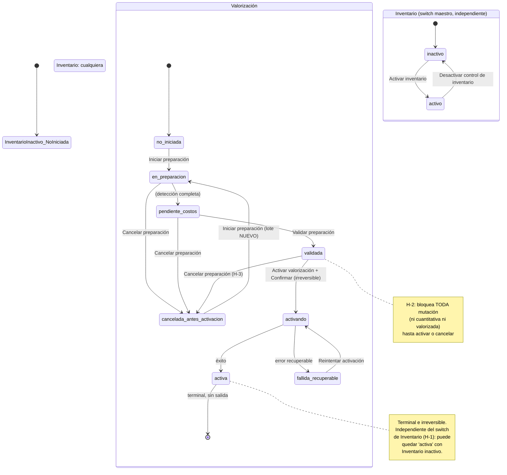

# Auditoría del flujo de configuración, preparación y activación del Inventario Valorizado

Auditoría de solo lectura. No se modificó, refactorizó ni corrigió ningún componente, texto o servicio. No se reabre la auditoría del motor FIFO (capas, consumo, reconciliación) ya auditado previamente — esta auditoría se limita a si el usuario comprende y puede ejecutar correctamente el flujo de **activación**.

Rama auditada: `AjustesVALORIZACION`. `git status --short` verificado limpio antes y después.

Metodología: 5 agentes de solo lectura en paralelo, cada uno con instrucción explícita de citar archivo:línea y no asumir comportamiento sin verificarlo en código, cubriendo: (1) UI del modal y la sección de valorización, (2) fuentes de verdad en `ContextoConfiguracion.tsx`, (3) servicio de preparación de valorización inicial, (4) decisión real de "modo de operación" (sin inventario / cuantitativo / valorizado), (5) permisos, atajos y mecanismos de reset/reversión.

---

## Resumen ejecutivo

El flujo audita dos configuraciones de tenant que el usuario percibe como una sola experiencia ("configurar inventario") pero que son, en el código, **dos fuentes de estado completamente independientes, sin ninguna validación cruzada entre sí**:

1. **Switch maestro de Inventario** (`salesPreferences.controlStockActivo`, booleano) — decide si Ventas descuenta stock.
2. **Máquina de estados de Valorización** (`preferenciasInventario.estadoValorizacion`, enum de 9 valores) — decide si existe costeo FIFO por capas.

Ambas viven en la misma clave de `localStorage` (mismo blob de configuración de empresa) pero se actualizan mediante **acciones de reducer distintas, en momentos distintos, sin ningún efecto que las sincronice**. Esto confirma, con evidencia de código, la sospecha central del enunciado: **"Inventario" y "Valorización" no son una sola activación ni dos etapas de una misma activación — son dos configuraciones independientes que pueden quedar en cualquier combinación**, incluyendo combinaciones inconsistentes entre módulos (ver hallazgo H-1).

Hallazgos más relevantes (detalle con evidencia en cada sección):

- **H-1 (Inconsistencia real entre módulos):** el switch maestro de Inventario bloquea el descuento de stock en **Ventas**, pero **no bloquea nada en Compras, Notas de Ingreso, Notas de Salida ni en la importación masiva de stock**. Con el switch maestro apagado, una compra o una Nota de Ingreso sigue moviendo stock (y, si la valorización ya está `activa`, sigue creando capas de costo reales) mientras Ventas simplemente no hace nada. Es decir: la combinación "Valorización activa + Inventario inactivo" **sí es alcanzable en el código actual**, y su comportamiento es inconsistente según el documento que se emita.
- **H-2 (Bloqueo total no explicado en `validada`):** el estado `estadoValorizacion: 'validada'` resuelve a un modo `bloqueado_snapshot_aprobado` que **impide TODA mutación de inventario — ni cuantitativa ni valorizada** (ninguna venta, compra, ajuste, transferencia ni Nota de Ingreso/Salida puede completarse) hasta que la empresa termine de activar (o cancele la preparación). La interfaz no comunica esta consecuencia en ningún texto visible al usuario.
- **H-3 (Reversión de una preparación ya "validada"):** el botón "Cancelar preparación" sigue visible y funcional incluso después de "Preparación validada" — el usuario puede revertir una preparación que la propia UI acaba de calificar de "validada", sin ninguna advertencia adicional a la genérica de cancelar.
- **H-4 (Permisos solo en UI, no en el servicio):** los 3 permisos de valorización (`configurar`/`confirmar_costos`/`activar`) se verifican únicamente en los componentes de React; ninguna función del servicio (`valorizacionInicial.service.ts`) valida permisos — no hay defensa en profundidad.
- **H-5 (Activar/desactivar Inventario sin permiso):** el paso más básico del modal (activar o desactivar el switch maestro de Inventario) **no verifica ningún permiso**, a diferencia de la entrada a "Valorización" que sí lo hace.
- **H-6 (Reset masivo de stock sin permiso):** el "Reseteo masivo de stock a cero" en el módulo Inventario no verifica ningún permiso — cualquier usuario con acceso a `/inventario` puede ejecutarlo (bloqueado solo por el estado de valorización, no por rol).
- **H-7 (`suspendida_por_inconsistencia` sin UI dedicada):** este estado del enum no tiene ningún bloque de interfaz propio — si ocurriera, la pantalla se comportaría como si la preparación siguiera en curso, sin explicar la inconsistencia.
- El caso "todo en cero" (Detectados=0, Pendientes=0, Requieren recálculo=0, Unidades/valor=0/0.00) **no tiene ningún atajo**: el usuario debe pasar por los mismos 4 pasos (Iniciar → Validar → Activar → Confirmar) que si tuviera miles de productos, y el sistema lo permite sin objeción — confirmado con test end-to-end real.
- La irreversibilidad de `estadoValorizacion: 'activa'` **es real y está verificada** (matriz de transiciones vacía + test dedicado), aunque la garantía vive en la disciplina del único componente llamador, no en el reducer que persiste el estado (gap arquitectónico teórico, no explotado hoy).
- No existe ningún reset general del prototipo accesible desde producción — solo `localStorage.clear()` dentro de archivos de test (Vitest), nunca expuesto al navegador del usuario final.

**Conclusión de una línea:** el motor subyacente es sólido (irreversibilidad real, idempotencia, reconciliación), pero la **experiencia de activación expone demasiados estados técnicos sin traducir sus consecuencias reales al usuario**, y dos configuraciones que se presentan como una sola ("configurar inventario") son, en el modelo de datos, independientes y parcialmente cruzadas de forma inconsistente entre módulos.

---

## 1. Contexto

SenciYo es un ERP orientado a MYPE. Esta auditoría no vuelve a revisar el motor de valorización (capas, FIFO, reconciliación, aislamiento multiempresa, permisos de operación diaria) — ya fue auditado y corregido en una iteración previa (ver `docs/AUDITORIA_EXHAUSTIVA_MODULO_GASTOS.md` y el diseño técnico de Kardex Valorizado referenciados en memoria del proyecto). El objetivo aquí es exclusivamente **la comprensión y ejecución del flujo de activación** por parte de un usuario no técnico.

## 2. Problema observado

Confirmado tal como lo describe el enunciado: desde Configuración de Negocio, "Configurar inventario" abre un modal con 3 filas configurables (no 7, ver §10), una sub-pantalla de "Valorización del inventario" con 4 etapas (Iniciar preparación → tratamiento tributario + revisión → Validar preparación → Activar valorización → Confirmar activación irreversible), y al volver a la pantalla principal el indicador puede seguir mostrando "Inventario: Inactivo" — porque, como se confirma en §4, son dos fuentes de estado distintas.

## 3. Objetivo central de la auditoría

Se responde con evidencia, sección por sección, cada una de las 9 preguntas del enunciado (cuántos estados existen, fuentes de verdad, si son una o dos configuraciones, qué pasa en cada combinación, si "irreversible" es correcto, si el usuario puede recuperarse, si el flujo es adecuado para el público objetivo, si hay pasos técnicos innecesarios, y qué flujo debería presentarse).

---

## 4. Fuentes de verdad

| Elemento | Archivo | Tipo/interfaz | Servicio/repo/hook/contexto | Clave de persistencia | ¿Por empresa? | ¿Quién la modifica? | ¿Qué pantalla la consulta? | ¿Fuente paralela? | ¿Se deriva o se almacena? | ¿Puede desincronizarse? |
|---|---|---|---|---|---|---|---|---|---|---|
| **Inventario activo/inactivo** (switch maestro) | `configuracion-sistema/contexto/ContextoConfiguracion.tsx:89-104,873` | `SalesPreferences.controlStockActivo?: boolean` (default `false`; migración legacy asume `true`, línea 923) | `ConfigurationContext` (reducer, acción `SET_SALES_PREFERENCES`) | `lsKey('facturaFacilConfig', tenantId)` (mismo blob que todo el tenant config) | Sí | Solo `ModalConfiguracionInventario.tsx` (`handleGuardar`/`handleDesactivar`) | `SeccionPreferenciasVenta.tsx`, `ModalConfiguracionInventario.tsx`, `useComprobanteActions.tsx`, `useCart.tsx`, `useDocumentoComercialActions.ts`, `ListadoDocumentosComerciales.tsx`, `InventoryPage.tsx` | `Configuration.inventory` (`modelos/Configuration.ts:49-72`) — **huérfana, sin consumidores reales** (verificado por grep de todo `src`) | Se almacena directamente (no se deriva) | **Sí** — no hay ningún guard cruzado con `estadoValorizacion`; además Compras/NI/NS/Importación **no lo consultan en absoluto** (H-1) |
| **Valorización activa/inactiva** (máquina de estados) | `gestion-inventario/models/estadoActivacionValorizacion.types.ts:18-27`; expuesto en `ContextoConfiguracion.tsx:110-121` | `PreferenciasInventario.estadoValorizacion: EstadoActivacionValorizacion` (9 valores) | `ConfigurationContext` (reducer, acción `SET_PREFERENCIAS_INVENTARIO`) + `gestion-inventario/services/valorizacionInicial.service.ts` (única fuente de transición válida) | Misma clave que arriba, sub-objeto `preferenciasInventario` | Sí | Solo `SeccionValorizacionInventario.tsx` (todo `dispatch` de esta acción vive ahí) | `SeccionValorizacionInventario.tsx`, y por derivación (`resolverModoOperacion`) en `useComprobanteActions.tsx`, `notaIngreso.service.ts`, `notaSalida.service.ts`, `PanelImportacionStock.tsx` | Ninguna — es la única fuente confirmada | Se almacena (el valor persistido es la fuente; se deriva de él el "modo de operación" vía `resolverModoOperacion`) | Técnicamente sí — el reducer (`case 'SET_PREFERENCIAS_INVENTARIO'`) no valida nada, acepta cualquier payload; la disciplina de solo transicionar vía `validarTransicionEstadoValorizacion` depende de que el único llamador (`SeccionValorizacionInventario.tsx`) siga usando el servicio (ver H-8 en §7) |
| **Estado de preparación** (`en_preparacion`/`pendiente_costos`) | Igual que arriba (es parte del mismo enum) | — | — | — | Sí | — | — | — | — | — |
| **Preparación iniciada** | `gestion-inventario/models/valorizacionInicialInventario.types.ts` | `ValorizacionInicialInventario` (lote completo: `id`, `empresaId`, `estado: EstadoLoteValorizacionInicial`, `detalles[]`) | `services/valorizacionInicial.service.ts` (`iniciarPreparacionValorizacion`) + `repositories/valorizacionInicialInventario.repository.ts` | `facturafacil_valorizacion_inicial_inventario`, tenantizada (namespace de clave + campo `empresaId` interno, doble aislamiento) | Sí | Servicio de valorización | `SeccionValorizacionInventario.tsx` | Ninguna | Se almacena (lote completo persistido, no recalculado en cada lectura) | El **enum de la empresa** (`estadoValorizacion`) y el **estado del lote** (`EstadoLoteValorizacionInicial`: `en_preparacion\|pendiente_costos\|validada\|cancelada`) son **dos máquinas de estado paralelas y distintas** — normalmente sincronizadas por convención (el servicio siempre actualiza ambas juntas), pero son objetos separados en el modelo de datos |
| **Preparación validada** | Igual (campo `estado: 'validada'` del lote + `estadoValorizacion: 'validada'` de la empresa) | — | `validarYTransicionarAValidada` (service) | — | Sí | — | — | — | — | No, mientras se use siempre la función de servicio (ver H-8) |
| **Activación en curso** | `estadoValorizacion: 'activando'` | — | `ejecutarActivacionValorizacion` (service), reservado ANTES de la llamada asíncrona | — | Sí | — | `SeccionValorizacionInventario.tsx` (rama 319-345, con reanudación automática tras recarga) | — | Se almacena antes de ejecutar el efecto real (para poder reanudar tras un cierre/recarga) | No — la reanudación usa el mismo `estadoValorizacion` persistido, más un mecanismo de idempotencia (ledger) del propio servicio |
| **Activación completada** | `estadoValorizacion: 'activa'` | — | — | — | Sí | Nadie (terminal, `TRANSICIONES_PERMITIDAS['activa'] = []`) | Todas las pantallas de inventario, vía `resolverModoOperacion` | — | Se almacena | Ver H-8 |
| **Activación fallida/recuperable** | `estadoValorizacion: 'fallida_recuperable'` | — | — | — | Sí | — | `SeccionValorizacionInventario.tsx` (rama 347-368, botón "Reintentar activación") | — | — | — |
| **Tratamiento tributario seleccionado** | `ContextoConfiguracion.tsx:110-121` | `PreferenciasInventario.tratamientoImpuestoCompra: TratamientoImpuestoCompra` (`'pendiente_configuracion'\|'impuesto_recuperable'\|'impuesto_no_recuperable'\|'segun_afectacion'`) | Reducer (misma acción `SET_PREFERENCIAS_INVENTARIO`) | Misma clave | Sí | `SeccionValorizacionInventario.tsx` (radios, `onChange` inmediato, sin botón "guardar" separado) | Se lee en `verificarCondicionesValidacion`/`verificarCondicionesActivacion`/`ejecutarActivacionValorizacion` (service) | Ninguna | Se almacena (config de empresa, no del lote) | El propio servicio lo relee "en vivo" en cada verificación — un cambio posterior a "validada" (si se lograra, ver §8) afectaría la activación aunque el lote ya diga `validada` |
| **Costos propuestos** | `valorizacionInicialInventario.types.ts` | `DetalleValorizacionInicial.costoPropuesto`, `origenPropuestaCosto: OrigenPropuestaCosto` | `resolverPropuestaCosto` (dentro de `construirDetalles`, service) | Dentro del lote persistido | Sí | Servicio, al iniciar/reiniciar preparación | `SeccionValorizacionInventario.tsx` (columna "Costo propuesto") | — | Se almacena dentro de cada detalle del lote | — |
| **Costos confirmados** | Igual | `DetalleValorizacionInicial.costoConfirmado`, `confirmado: boolean` | `confirmarCostoDetalle` (service) | Dentro del lote | Sí | Usuario con permiso `inventario.valorizacion.confirmar_costos`, vía UI únicamente (sin verificación en el service) | `SeccionValorizacionInventario.tsx` (columna "Costo confirmado") | — | Se almacena | Puede quedar en `requiereRecalculo: true` si hay una mutación concurrente (ver §9-invalidación) — el valor numérico se conserva como referencia visual pero deja de contar como confirmado |
| **Registros pendientes** (de costo) | — | Derivado: `detallesRelevantes.filter(d =&gt; !d.confirmado \|\| ...)` | `verificarCondicionesValidacion` (service) | — | Sí | — | Tarjeta "Pendientes de costo" | — | Se deriva en cada verificación (no se persiste un contador aparte) | No |
| **Registros que requieren recálculo** | — | `DetalleValorizacionInicial.requiereRecalculo: boolean` | `invalidarLoteValorizacionInicialSiAfectado` (utils) | Dentro del lote | Sí | Automático, al confirmarse una operación cuantitativa que afecta un producto+almacén del lote en preparación | Tarjeta "Requieren recálculo" + fila con estado "Stock modificado, requiere revisión" | Repositorio de invalidación pendiente (`invalidacionPendienteValorizacionInicial.repository.ts`) para cuando la invalidación falla y debe reintentarse | Se almacena (flag por detalle) | No — tiene su propio mecanismo de cola/reintento para no perderse silenciosamente |
| **Comportamiento de inventario por tipo de documento** | `ContextoConfiguracion.tsx` (`StockDescuentoDocumento`) | `stockDescuentoFacturaYBoleta`/`stockDescuentoNotaVenta`/`stockDescuentoGuiaRemision` dentro de `SalesPreferences` | Reducer (`SET_SALES_PREFERENCES`) | Misma clave | Sí | `ModalConfiguracionInventario.tsx` | Múltiples (Ventas, Comprobantes) | Ninguna | Se almacena | No (mismo slice que el switch maestro, se guardan juntos en el mismo dispatch) |
| **Configuración por empresa** (aislamiento) | `shared/tenant/index.ts:109-111` | `lsKey(base, empresaId)` | — | Prefijo `"{empresaId}:facturaFacilConfig"` | Sí, por diseño | — | — | — | — | El `useEffect` de hidratación (`ContextoConfiguracion.tsx:1596-1631`) se re-dispara cuando `tenantId` cambia, recargando ambos estados desde la nueva clave — sin caché cruzada entre empresas |
| **Permisos** (configurar/confirmar/activar) | `configuracion-sistema/roles/catalogoPermisos.ts:205,211,217` | 3 permisos: `inventario.valorizacion.configurar`, `.confirmar_costos`, `.activar` | `utilidades/permisos.ts` (`tienePermiso`) | — | Por rol/usuario, no por tenant en sí | Administración de roles | Verificado **solo en componentes de React** (`ModalConfiguracionInventario.tsx`, `SeccionValorizacionInventario.tsx`) — **nunca en el servicio** (H-4) | — | Se deriva de los roles asignados al usuario | El servicio no impone nada — si algún código futuro invocara las funciones de servicio sin pasar por la UI, no habría ningún bloqueo por permisos |
| **Indicador en Configuración de Negocio** | `SeccionPreferenciasVenta.tsx:55,74,109` | Deriva de `preferences.controlStockActivo` (prop) | — | — | Sí | — | — | — | Se deriva directamente del mismo `state.salesPreferences` que consume el modal (**misma fuente confirmada**, sin riesgo de desincronización para ESTE indicador en particular) | No, para este indicador puntual |
| **Indicador en módulo Inventario** | `InventoryPage.tsx:597`, `CintilloControlStock.tsx` | Deriva de `controlStockActivo` (mismo campo) | — | — | Sí | — | — | — | Misma fuente que el anterior | No |
| **Estado al reabrir el modal** | `ModalConfiguracionInventario.tsx:136-144` | Efecto que resetea estado LOCAL del modal (no el estado global) | — | — | — | — | — | — | El progreso real (lote, `estadoValorizacion`) vive en contexto/repositorio, no en el estado local del modal | El modal siempre reabre en la pantalla principal (pierde la sub-navegación a "Valorización", pero no el progreso real) |
| **Reset/limpieza del prototipo** | No existe en producción | — | — | `localStorage.clear()` solo aparece en ~20 archivos `*.test.ts` (Vitest) | No aplica | Nadie desde la UI | No aplica | No aplica | No aplica | No aplica — confirmado que no hay ningún botón/ruta/herramienta de desarrollo accesible desde el navegador de un usuario real |

---

## 5. Archivos y flujos revisados

- `configuracion-sistema/components/negocio/ModalConfiguracionInventario.tsx` (420 líneas, leído completo)
- `configuracion-sistema/components/negocio/SeccionValorizacionInventario.tsx` (609 líneas, leído completo)
- `configuracion-sistema/components/negocio/SeccionPreferenciasVenta.tsx` (134 líneas, leído completo)
- `configuracion-sistema/components/negocio/orquestacionConfirmacionCosto.ts` (+ test)
- `configuracion-sistema/components/negocio/opcionesTratamientoImpuestoCompra.ts`
- `configuracion-sistema/contexto/ContextoConfiguracion.tsx` (secciones de inventario/valorización completas, ~líneas 89-121, 873-1000, 1214, 1395-1399, 1442-1466, 1596-1631, 2286-2287)
- `configuracion-sistema/contexto/migratePreferenciasInventario.test.ts`
- `configuracion-sistema/modelos/Configuration.ts` (campo `inventory`, confirmado huérfano)
- `configuracion-sistema/hooks/useConfiguracionSistema.ts`
- `configuracion-sistema/paginas/ConfiguracionNegocio.tsx`
- `configuracion-sistema/roles/catalogoPermisos.ts`, `rolesDelSistema.ts`, `tiposRolesPermisos.ts`
- `configuracion-sistema/utilidades/permisos.ts`
- `gestion-inventario/models/estadoActivacionValorizacion.types.ts`
- `gestion-inventario/utils/estadoActivacionValorizacionInventario.ts` (+ test)
- `gestion-inventario/models/valorizacionInicialInventario.types.ts`
- `gestion-inventario/services/valorizacionInicial.service.ts` (+ test)
- `gestion-inventario/repositories/valorizacionInicialInventario.repository.ts` (+ test)
- `gestion-inventario/utils/deteccionValorizacionInicial.ts` (+ test)
- `gestion-inventario/utils/invalidacionValorizacionInicial.ts` (+ test)
- `gestion-inventario/repositories/invalidacionPendienteValorizacionInicial.repository.ts`
- `gestion-inventario/utils/bloqueoInventario.ts` (+ test)
- `gestion-inventario/utils/entradaCuantitativaInventario.ts`, `salidaCuantitativaInventario.ts` (+ tests)
- `gestion-inventario/services/servicioKardexValorizado.ts`, `consultaKardexValorizado.service.ts`
- `gestion-inventario/components/CintilloControlStock.tsx`
- `gestion-inventario/pages/InventoryPage.tsx`
- `gestion-inventario/components/PanelImportacionStock.tsx`
- `gestion-inventario/components/tables/MovementsTable.tsx`
- `gestion-inventario/hooks/useInventory.ts`
- `comprobantes-electronicos/hooks/useComprobanteActions.tsx`
- `comprobantes-electronicos/punto-venta/hooks/useCart.tsx`
- `documentos-comerciales/.../useDocumentoComercialActions.ts`
- `compras/contexto/ContextoCompras.tsx` (integración vía `generarNIEnInventario`)
- `gestion-inventario/services/notaIngreso.service.ts`, `notaSalida.service.ts`
- `routes/privateRoutes.tsx` (permiso de ruta `/inventario`)
- `shared/tenant/index.ts`

No se encontró: `ContextoInventario.tsx` (no existe, la feature usa hooks+servicios+repositorios sin Context API propio), `resolverModoOperacion` con ese nombre exacto **sí existe** (confirmado en `estadoActivacionValorizacionInventario.ts:14-43`), ningún reset general del prototipo en producción.

---

## 6. Preguntas funcionales obligatorias

### 6.1 Inventario sin activar (`controlStockActivo = false`)

- **¿Las ventas descuentan stock?** No. Guard exacto: `useComprobanteActions.tsx:827` — `if (!isNoteCredit && controlStockActivo && stockDescuentoFacturaYBoleta === 'automatico')`. Con el switch apagado, el bloque completo que incluye `ServicioKardexValorizado.registrarSalidaValorizada` (línea 983) nunca se ejecuta. Verificado.
- **¿Las compras incrementan stock?** **Sí.** `ContextoCompras.tsx:1729-1742` invoca `generarNIEnInventario` pasando solo `estadoValorizacion`, sin verificar `controlStockActivo` en ningún punto (grep sin coincidencias). Verificado — **este es el hallazgo H-1**: inconsistente con el bloqueo de Ventas.
- **¿Se generan Notas de Ingreso/Salida?** Sí, sin restricción — las pestañas correspondientes en `InventoryPage.tsx` (líneas 564-592) están siempre habilitadas; `notaIngreso.service.ts`/`notaSalida.service.ts` no referencian `controlStockActivo`. Solo se muestra un banner informativo (`CintilloControlStock`), nunca un bloqueo real.
- **¿Se generan movimientos / se crean capas?** Se generan `MovimientoStock` normalmente para Compras/NI/NS (no gateadas); si además `estadoValorizacion === 'activa'`, esas mismas operaciones (Compras/NI, no Ventas) sí crean `CapaCostoInventario` reales, pese al switch de inventario apagado.
- **¿Existe Kardex?** Sí, siempre visible (pestaña "Movimientos" de `InventoryPage.tsx`), independiente del switch maestro.
- **¿Qué ve el usuario?** Un banner "Configura tu inventario" (`CintilloControlStock`) y el indicador "Inventario: Inactivo" en Configuración de Negocio — pero sin ninguna advertencia de que Compras/NI/NS igual están moviendo stock.
- **¿Puede seguir emitiendo documentos?** Sí, todos los documentos siguen emitiéndose; solo cambia si afectan o no el stock.
- **¿El stock se muestra siempre en cero o se conserva información previa?** Se conserva — no hay ningún reseteo automático al desactivar; el comentario de la propia UI lo confirma ("El stock registrado, movimientos y Kardex histórico se conservarán", `ModalConfiguracionInventario.tsx:258-260`).

### 6.2 Inventario activo sin valorización

Aplica a los estados `no_iniciada`, `en_preparacion`, `pendiente_costos`, `cancelada_antes_activacion` → `resolverModoOperacion` los resuelve a `cuantitativo_libre` o `cuantitativo_invalida_snapshot`.

- **¿Se controlan cantidades?** Sí, vía el motor cuantitativo normal (`entradaCuantitativaInventario.ts`/`salidaCuantitativaInventario.ts`), que siempre genera `MovimientoStock`.
- **¿Se descuentan/aumentan existencias? ¿Stock real/reservado/disponible?** Sí, con el modelo completo de disponibilidad ya auditado en el motor (fuera de este alcance).
- **¿Se crean capas de costo?** **No.** El guard exacto: `entradaCuantitativaInventario.ts:424` y `salidaCuantitativaInventario.ts:265`, ambos condicionados a `datos.modoOperacion === 'valorizado'`, que solo se fija cuando `resolverModoOperacion(estadoValorizacion) === 'valorizado_exclusivo'` — es decir, únicamente cuando `estadoValorizacion === 'activa'`.
- **¿Existe costo de salida?** No, en este rango de estados no hay costeo FIFO.
- **¿Kardex valorizado o solo de cantidades?** Es la **misma tabla** (`MovementsTable.tsx`), con columnas de costo que se muestran como `—` cuando la fila no tiene valorización asociada (`CeldaValorizada`, línea 73-77) — no son dos vistas separadas.
- **¿Puede activarse valorización posteriormente?** Sí, ese es exactamente el flujo diseñado (transición `no_iniciada → en_preparacion → ... → activa`).
- **¿Qué ocurre con el stock acumulado antes de activar?** Se detecta y se convierte en el "lote" de valorización inicial (`deteccionValorizacionInicial.ts`), que al activarse genera una capa de costo por cada producto+almacén con `procedencia: 'migracion_inicial'`.

**Matiz importante no contemplado en el enunciado original:** el estado `validada` (que técnicamente sigue siendo "antes de `activa`") **NO permite ningún control de cantidad** — resuelve a `bloqueado_snapshot_aprobado`, que bloquea toda mutación (ver H-2, §7).

### 6.3 Valorización activa con Inventario inactivo

- **¿Es técnicamente posible?** **Sí, confirmado.** No existe ninguna validación cruzada en `valorizacionInicial.service.ts` ni en `estadoActivacionValorizacionInventario.ts` que consulte `controlStockActivo` antes de permitir avanzar el estado de valorización.
- **¿Es funcionalmente válido / intencional / transitorio / inconsistencia / defecto de interfaz?** Es una **inconsistencia real de diseño**, no documentada como intencional en ningún comentario del código. No es un "defecto de interfaz" superficial — es una brecha en el modelo de dominio: dos configuraciones que deberían tener una relación de dependencia (no debería poder haber valorización sin inventario activo) no la tienen.
- **¿Qué operaciones se ejecutan en ese estado?** Una **venta** queda completamente bloqueada antes de llegar al motor FIFO (el guard de `controlStockActivo` en `useComprobanteActions.tsx:827` corta el flujo antes). Una **compra o Nota de Ingreso**, en cambio, **sí llega** al motor FIFO y **sí crea una capa de costo real** (`construirCapasEntradaValorizada`), porque esos flujos no verifican `controlStockActivo` en absoluto.
- **¿Se crean capas? ¿Se mueven cantidades?** Depende del documento: en Compras/NI sí; en Ventas no.
- **¿Compras y Ventas operan realmente en modo valorizado?** No de forma pareja — Compras sí, Ventas no, en esta combinación específica.
- **¿Por qué la UI puede seguir mostrando "Inventario: Inactivo"?** Porque ese indicador deriva exclusivamente de `controlStockActivo` (§4), que es independiente de `estadoValorizacion`.
- **¿Qué fuente consulta cada mensaje?** Ver tabla de §4.
- **¿Qué riesgo representa para el usuario?** Alto: un negocio podría creer que "el inventario está apagado, nada se mueve", mientras sus compras siguen generando capas de costo reales y consumiendo la lógica valorizada — con la consiguiente confusión al reactivar Ventas más adelante (el histórico de capas ya estaría desalineado con lo que el usuario esperaba).

### 6.4 Ambos activos

- **¿Qué cambia definitivamente?** Se activa el motor FIFO real: `entradaCuantitativaInventario.ts:424` y `salidaCuantitativaInventario.ts:265` bifurcan hacia la construcción/consumo de capas.
- **¿Qué documentos generan movimientos?** Todos los que ya generaban movimientos cuantitativos (Ventas si `controlStockActivo`, Compras/NI/NS siempre), ahora con costeo real.
- **¿Cuándo se crean capas?** En cada entrada valorizada (compra, NI, ajuste positivo, importación, y el lote de migración inicial al momento de activar).
- **¿Cuándo se consume FIFO?** En cada salida valorizada (venta con inventario activo, NS, ajuste negativo, transferencia de salida).
- **¿Qué configuraciones todavía pueden modificarse?** El comportamiento por tipo de documento (Factura/Boleta, NV, GR) y el switch maestro de inventario siguen siendo editables sin restricción aparente (no hay guard que los bloquee tras `activa` en `ModalConfiguracionInventario.tsx`). El tratamiento tributario, en cambio, deja de ser editable desde esta pantalla (desaparece el control, ver §8).
- **¿Qué configuraciones quedan bloqueadas?** El flujo de preparación/activación en sí (terminal, sin vuelta atrás) y el selector de tratamiento tributario dentro de esta pantalla.
- **¿Qué ocurre con productos creados después?** Ninguna distinción: cada producto nuevo entra con cero capas y su primera entrada valorizada sigue el camino genérico (`entradaCuantitativaInventario.ts:213-227`, "nunca revaloriza ni promedia: cada línea nace como una capa nueva, independiente").

---

## 7. Auditoría de la irreversibilidad

**Texto exacto en la UI:** "Activar la valorización de inventario es irreversible." (`SeccionValorizacionInventario.tsx:415`) y "A partir de la activación, Compras, Ventas, ajustes, importaciones y transferencias operarán en modo valorizado (costo por capas FIFO). No existe una acción para desactivar." (líneas 416-419).

1. **¿Irreversible técnicamente o por decisión funcional?** Técnicamente: la matriz `TRANSICIONES_PERMITIDAS['activa'] = []` (`estadoActivacionValorizacionInventario.ts:78`) no define ninguna transición de salida, y `validarTransicionEstadoValorizacion` lanza excepción para cualquier intento. Es una decisión de diseño **implementada como restricción técnica real** en la única función de validación de transición del dominio.
2. **¿Qué dato/estado impide regresar?** El propio valor `estadoValorizacion: 'activa'` combinado con la ausencia de transiciones de salida en `TRANSICIONES_PERMITIDAS`.
3. **¿Existe función de desactivación oculta/técnica/de test?** No se encontró ninguna. Los únicos usos de `'activa'` en tests son como **dato de entrada** a funciones puras del motor Kardex (para probar comportamiento dado ese estado), nunca como un bypass que mute el estado del tenant hacia atrás.
4. **¿Existe un reset general del prototipo?** No, en producción. `localStorage.clear()` solo aparece en archivos `*.test.ts` (Vitest), nunca en componentes/hooks/servicios de producción.
5. **¿Puede ejecutarlo un usuario normal?** No aplica — no existe tal reset accesible desde la UI.
6. **¿Qué elimina el reset?** No aplica.
7. **¿Sería posible desactivar sin borrar movimientos?** Técnicamente sí sería posible diseñar una transición `activa → algo` que preserve movimientos/capas ya creados y solo detenga la creación de NUEVAS capas — pero **no existe tal mecanismo hoy**, y diseñarlo está fuera del alcance de esta auditoría (es una decisión de producto, no una corrección).
8. **¿Sería seguro?** No evaluable sin diseño concreto — implicaría decidir qué pasa con capas ya consumidas parcialmente, documentos históricos emitidos en modo valorizado, y la relectura de costos ya reportados en Rentabilidad Operativa (módulo auditado por separado). Alto riesgo si se implementara sin un diseño explícito de "modo mixto".
9. **¿Qué ocurriría con las capas ya consumidas?** No aplica hoy (no existe camino de reversión); si existiera, quedarían con su `ConsumoCapaCostoInventario` histórico intacto salvo que se diseñara explícitamente una reversión.
10. **¿Qué ocurriría con documentos emitidos mientras estuvo activo?** Igual — permanecerían con su costo real ya calculado; no hay ningún mecanismo (ni debería haberlo sin una razón de negocio) que los "desvalorice" retroactivamente.
11. **¿La irreversibilidad aplica a...?**
    - Activar FIFO: sí, es lo que queda fijo (`estadoValorizacion` terminal).
    - El tratamiento tributario: **no está bloqueado por la máquina de estados en sí** — ver §8, es solo un bloqueo de presentación (el control desaparece de la UI tras `validada`, pero nada en el dominio impide que otro punto de la app lo cambie después).
    - Los costos iniciales: sí, indirectamente — una vez creadas las capas (`activa`), no hay función de "recalcular costo inicial" (el motor de capas ya auditado maneja ajustes hacia adelante, no una reescritura del costo de migración).
    - El comportamiento por documento (Factura/Boleta, NV, GR): **no**, sigue editable en `ModalConfiguracionInventario.tsx` sin relación con `estadoValorizacion`.
    - Toda la configuración: **no**, solo la máquina de estados de valorización es terminal; el resto de configuración de inventario (switch maestro, comportamiento por documento) permanece editable.
12. **¿La interfaz explica claramente qué no podrá cambiarse?** No. El texto es genérico ("no existe una acción para desactivar") y no distingue entre lo que sí queda fijo (la máquina de estados) y lo que sigue siendo editable (comportamiento por documento, switch maestro). Tampoco menciona que el tratamiento tributario técnicamente podría seguir cambiándose fuera de esa pantalla (aunque la UI ya no lo muestre).
13. **¿El doble botón aporta seguridad o solo fricción?** Aporta seguridad relativa (previene un solo clic accidental), pero **no aporta información nueva** — el segundo paso solo cambia el texto del botón, sin mostrar un resumen adicional de lo que se va a activar (unidades, valor estimado, cantidad de productos). El texto de advertencia es el mismo en ambos pasos.
14. **¿Existe una confirmación más clara posible?** Sí sería posible — un resumen explícito ("Estás por activar la valorización de N productos por un valor estimado de S/ X, en el establecimiento Y") en el momento exacto de la confirmación final, no solo en las tarjetas de arriba (que están siempre visibles pero no se repiten en el punto de decisión).

**Hallazgo H-8 (matiz arquitectónico):** la irreversibilidad de `'activa'` es real en la práctica (nadie puede revertirla hoy), pero la garantía **no está en el punto único de mutación del estado** (el reducer `SET_PREFERENCIAS_INVENTARIO` acepta cualquier payload sin validar, `ContextoConfiguracion.tsx:1395-1399`) sino en la disciplina de que el único componente que despacha esa acción (`SeccionValorizacionInventario.tsx`) siempre pase por el servicio que sí valida. Es un gap de defensa en profundidad, no un defecto explotado hoy.

---

## 8. Tratamiento tributario

Las 3 opciones reales (`opcionesTratamientoImpuestoCompra.ts:28-44`):

| Valor del enum | Etiqueta mostrada | Ayuda mostrada |
|---|---|---|
| `impuesto_recuperable` | "Excluir impuestos recuperables" | "El impuesto recuperable no forma parte del costo." |
| `impuesto_no_recuperable` | "Incluir impuestos en el costo" | "El impuesto no recuperable forma parte del costo." |
| `segun_afectacion` | "Definir por cada línea de compra" | "Cada línea de tus compras decide si su impuesto forma parte del costo." |

- **¿Cuándo se guarda?** Inmediatamente al hacer clic en el radio (`onChange`, `SeccionValorizacionInventario.tsx:465-470`) — no hay botón "guardar" separado, se despacha al instante.
- **¿Es obligatorio antes de activar?** Sí — `verificarCondicionesValidacion` bloquea si `tratamientoImpuestoCompra === 'pendiente_configuracion'` (línea 293-295 del servicio).
- **¿Puede cambiarse antes de validar?** Sí, libremente, mientras `lote.estado !== 'validada'`.
- **¿Después de validar?** El control **desaparece de la UI** (condición `lote.estado !== 'validada'`, línea 453) — bloqueo de presentación, no de dominio.
- **¿Después de activar?** Tampoco accesible desde esta pantalla (el componente retorna el bloque terminal antes de llegar al formulario).
- **¿Un cambio afecta solo compras futuras o puede alterar documentos históricos?** El servicio relee el valor "en vivo" en cada verificación (`verificarCondicionesActivacion`, `ejecutarActivacionValorizacion`) — si técnicamente se lograra cambiarlo tras "validada" (fuera de esta pantalla, sin guard de dominio), afectaría el cálculo de la activación pendiente, no documentos ya emitidos (que ya calcularon su propio costo en su momento).
- **¿Qué pasa si el usuario selecciona la opción equivocada?** Mientras no haya validado, puede corregirla sin costo. Una vez validada/activada, no hay corrección desde esta pantalla — quedaría fija para esa activación.
- **¿La explicación actual es suficiente para un pequeño empresario?** No es evidente. "Impuesto recuperable" es terminología contable (crédito fiscal de IGV) que un microempresario sin conocimientos contables probablemente no entienda sin ayuda adicional — la ayuda contextual ya existente ("El impuesto recuperable no forma parte del costo") es correcta pero asume que el usuario ya sabe qué es "recuperable".
- **¿Debería existir una recomendación predeterminada?** Es razonable considerarlo, pero **esto es una recomendación de diseño, no una corrección** — queda fuera del alcance de esta auditoría de solo lectura.
- **¿El sistema puede sugerir una opción según la configuración tributaria de la empresa?** Existe ya un campo de régimen tributario en la configuración de empresa (auditado en otras iteraciones) que en teoría podría informar una sugerencia — no se encontró tal lógica de sugerencia implementada hoy.
- **¿El usuario necesita decidirlo durante la activación o podría configurarse antes, en Configuración tributaria?** Dado que el campo vive físicamente en `PreferenciasInventario` (parte de la configuración de negocio, no del lote de migración), **nada impide técnicamente exponerlo antes**, en Configuración → Tributaria, como una decisión aparte de la activación. Hoy solo se presenta en el momento de la preparación, acoplando una decisión contable a un flujo operativo de inventario — esto es una observación de diseño, no una corrección a implementar aquí.

---

## 9. Stock inicial y preparación

| Etapa | Qué hace realmente | Qué crea/modifica | ¿Reversible? | ¿Necesaria con stock=0? | ¿Debe ser visible? | ¿Podría ser automática? | Qué previene | Qué pasa si se abandona |
|---|---|---|---|---|---|---|---|---|
| **Iniciar preparación** | Detecta stock positivo por producto+almacén (`deteccionValorizacionInicial.ts`) y arma un lote con costo propuesto por detalle | Un lote `ValorizacionInicialInventario` (`estado: 'pendiente_costos'`); **no crea capas ni movimientos** | Sí (cancelable) | No aporta nada con 0 detalles — se crea un lote vacío igual, sin error | Discutible — con 0 detectados no informa nada útil al usuario | Si el sistema detecta 0 productos con stock, podría auto-avanzar sin mostrar este paso como decisión | Que se "confirme" una migración sin que el usuario haya visto qué se detectó | El lote queda en `pendiente_costos`/`en_preparacion`; se puede reanudar o cancelar en cualquier momento posterior |
| **Confirmar costos** | Guarda el costo real de cada producto+almacén detectado | `DetalleValorizacionInicial.costoConfirmado`, `confirmado: true` | Sí (se puede recalcular) | No aplica si no hay detalles | Sí, es la única decisión de negocio real de esta etapa | No — requiere el juicio del usuario sobre el costo real de su stock | Que se active la valorización con costos inventados o en cero | Los costos no confirmados quedan pendientes; bloquean "Validar preparación" |
| **Validar preparación** | Verifica que no haya pendientes de costo, recálculos, tratamiento tributario sin definir, duplicados, ni discrepancias con el stock físico actual | Cambia `lote.estado` a `'validada'` y `estadoValorizacion` a `'validada'` | Parcialmente — solo se puede cancelar (`validada → cancelada_antes_activacion`), no retroceder a `pendiente_costos` | Con 0 detalles, todas las verificaciones sobre "detalles relevantes" pasan vacuamente — se permite validar igual | Sí, es el punto de "no hay nada pendiente" | No debería ser automática — es la confirmación explícita de que los datos son correctos | Que se intente activar con datos incompletos o inconsistentes con el stock real | El lote queda `validada` — **pero, según H-2, este estado bloquea TODA operación de inventario hasta activar o cancelar** |
| **Activar valorización + Confirmar** | Crea una `CapaCostoInventario` real por cada detalle con cantidad > 0, con `procedencia: 'migracion_inicial'` | Capas de costo reales; nunca toca `stockPorAlmacen` ni crea `MovimientoStock` (el stock físico ya existía) | No — terminal | Con 0 detalles, se activa igual, sin crear ninguna capa (verificado por test) | Sí, es la acción irreversible | No — debe requerir confirmación explícita dado que es terminal | Que se abandonen datos a medio confirmar como si fueran definitivos | Si se cierra/recarga durante `activando`, el componente reanuda automáticamente al reabrir (mecanismo de idempotencia del propio servicio) |

**Caso concreto "todo en cero" (Detectados=0, Pendientes=0, Requieren recálculo=0, Unidades/valor=0/0.00):**

Verificado con test end-to-end real (`valorizacionInicial.service.test.ts:804-819`): el sistema permite iniciar preparación, validar y activar un lote completamente vacío, sin ningún error, sin ninguna capa creada al final. **No existe ningún atajo ni flujo abreviado** — el usuario debe pulsar los mismos 4 controles (Iniciar preparación → Validar preparación → Activar valorización → Confirmar activación) que si tuviera miles de productos.

**¿Tiene sentido exigir los 4 pasos en este caso?** Funcionalmente no aporta nada verificar "pendientes de costo" cuando no hay ningún costo que confirmar — pero **sí tiene sentido exigir la decisión consciente de activar la valorización** (el usuario debe decidir explícitamente "quiero empezar a valorizar mi inventario desde ahora", incluso si hoy no tiene stock). Lo que sobra no es la decisión de activar, sino los pasos intermedios de revisión de una tabla vacía. **Un flujo abreviado sería razonable para este caso específico** (saltar directo de "sin stock detectado" a la confirmación de activar), pero implementarlo es una recomendación de diseño, no una corrección de esta auditoría.

---

## 10. Auditoría de experiencia de usuario

Evaluación por heurística, con hallazgos concretos (no genéricos):

- **Visibilidad del estado del sistema:** Débil. El estado técnico (`estadoValorizacion`) tiene 9 valores, pero solo 5 tienen un mensaje dedicado claro (`no_iniciada`/`cancelada_antes_activacion`, `validada`, `activando`, `activa`, `fallida_recuperable`); `en_preparacion`/`pendiente_costos` comparten un formulario genérico sin un título de estado explícito, y `suspendida_por_inconsistencia` no tiene ninguna UI dedicada (H-7).
- **Correspondencia sistema-lenguaje del usuario:** Parcial. Frases como "impuesto recuperable", "requiere recálculo", "snapshot" (en nombres internos, no visibles) son técnicas. "Detectados"/"Pendientes de costo" son razonablemente claras.
- **Control y libertad del usuario:** Existe "Cancelar preparación" en casi todos los estados previos a `activa` — pero su disponibilidad **incluso en `validada`** (H-3) da MÁS libertad de la que la propia UI comunica (dice "Preparación validada" como si fuera un punto de no retorno, pero no lo es).
- **Prevención de errores:** Buena en el dominio (validaciones exhaustivas antes de validar/activar), débil en permisos (H-4, H-5, H-6 — ninguna verificación en el servicio, y la activación del switch maestro no tiene ningún permiso).
- **Reconocimiento antes que memorización:** Aceptable — las tarjetas resumen y la tabla de detalle están siempre visibles mientras se decide.
- **Flexibilidad y eficiencia:** Baja para el caso "todo en cero" — 4 clics obligatorios sin atajo (§9).
- **Diseño simple:** El modal en sí es simple (3 filas configurables reales), pero la sub-pantalla de valorización introduce vocabulario y pasos que superan lo que un usuario no técnico necesita decidir activamente.
- **Recuperación ante errores:** Buena — `fallida_recuperable` tiene botón de reintento explícito, y la reanudación tras recarga durante `activando` es automática.
- **Ayuda contextual:** Existe para el tratamiento tributario (frases de ayuda) y para los 4 documentos fijos (tooltips) — no existe para el significado de "irreversible" más allá de la frase genérica.
- **Divulgación progresiva:** Parcialmente lograda (el modal separa "configuración básica" de "valorización" en dos pantallas), pero dentro de "valorización" se muestra toda la complejidad de golpe (tratamiento tributario + tabla + tarjetas), sin secuenciar la decisión tributaria de la revisión de costos.
- **Confirmación proporcional al riesgo:** El doble botón es proporcional al riesgo real (terminal, irreversible), pero **no proporcional a la información entregada** — no hay un resumen específico en el momento de la confirmación final (§7, punto 13).
- **Consistencia entre pantallas:** El mismo componente se abre igual desde Configuración de Negocio y desde el atajo de Inventario (confirmado, sin diferencias) — consistente.
- **Claridad de consecuencias:** Débil para el caso de `validada` (bloqueo total no explicado, H-2) y para qué configuraciones siguen editables tras activar (§7, punto 12).
- **Reducción de carga cognitiva:** Los 4 documentos fijos de solo lectura con tooltips (Orden de Venta, Cotización, NI, NS) son una buena decisión de reducción de carga — solo se pide decidir sobre lo que realmente varía (3 documentos).

**Clics/decisiones para el camino feliz completo** (desde "Inventario: Inactivo" hasta "Inventario valorizado activo"): abrir modal (1) → confirmar 3 comportamientos + activar inventario (1) → entrar a Valorización (1) → Iniciar preparación (1) → elegir tratamiento tributario (1, obligatorio) → confirmar costo por cada producto detectado (variable, 1 por producto) → Validar preparación (1) → Activar valorización (1) → Confirmar activación irreversible (1) = **mínimo 8 clics/decisiones sin contar productos**, más 1 por cada producto a costear.

**¿El usuario comprende dónde está / qué configura / qué falta / por qué / qué pasará después / qué puede cambiar / qué no / cuál es la acción recomendada?** Parcialmente. Sabe DÓNDE está (títulos claros) y QUÉ falta (tarjetas de conteo), pero no siempre POR QUÉ debe hacerlo (ej. el tratamiento tributario no explica su impacto real en costos futuros), ni QUÉ PASARÁ DESPUÉS con precisión (el bloqueo total en `validada` no se anuncia), ni QUÉ PUEDE CAMBIAR después (§7, punto 12).

---

## 11. Escenarios obligatorios

Todos evaluados por lectura de código (no fue posible ejecutar interactivamente el prototipo en este entorno de auditoría — se indica explícitamente cuando la respuesta es inferida del código y no de una ejecución real).

| ID | Escenario | Resultado (evidencia de código) |
|---|---|---|
| ACT-01 | Empresa nueva, sin inventario y sin stock | `controlStockActivo=false` (default), `estadoValorizacion='no_iniciada'` (default). Ventas no descuentan stock; Compras si se registran, sí mueven stock (H-1). |
| ACT-02 | Empresa nueva con productos, stock cero | `deteccionValorizacionInicial.ts` no detecta nada (filtra `cantidad > 0`); "Iniciar preparación" crea un lote con `detalles: []`. Ver §9, caso "todo cero". |
| ACT-03 | Empresa con stock positivo, sin costos confirmados | El lote se crea con costo **propuesto** (`resolverPropuestaCosto`) pero `confirmado: false`; "Validar preparación" queda bloqueada por `pendientesCosto.length > 0` (`verificarCondicionesValidacion`). |
| ACT-04 | Empresa con stock positivo y costos completos | Validación pasa sin motivos de bloqueo; puede avanzar a `validada` y luego `activa`. |
| ACT-05 | Iniciar preparación y cerrar el modal | El lote queda persistido en `pendiente_costos`. Al reabrir, `SeccionValorizacionInventario` remonta y lee el mismo lote — no se pierde. Solo se pierden ediciones de costo tecleadas pero no confirmadas con el botón "Confirmar" (estado efímero del componente). |
| ACT-06 | Iniciar preparación y recargar la página | Igual que ACT-05 — el estado persiste en `localStorage`/contexto, no en memoria volátil del componente. |
| ACT-07 | Validar preparación y no activar | El lote queda en `validada` indefinidamente. **Según H-2, esto bloquea TODA operación de inventario de la empresa** hasta que se active o se cancele — no hay expiración ni aviso proactivo. |
| ACT-08 | Activar valorización y no presionar "Confirmar activación" | `confirmandoActivacion` es estado local del componente (`useState`); si no se confirma, no pasa nada — `estadoValorizacion` sigue en `validada`. Si se cierra el modal en este punto intermedio, al reabrir vuelve a mostrar el botón "Activar valorización" desde cero (el estado `confirmandoActivacion` no persiste). |
| ACT-09 | Activar inventario (switch maestro) sin activar valorización | Válido y es el caso más común/recomendado: Ventas empieza a descontar stock cuantitativamente, sin costeo FIFO. |
| ACT-10 | Activar valorización desde el acceso directo del módulo Inventario | Mismo componente exacto (`ModalConfiguracionInventario`), mismas props, mismo comportamiento — confirmado sin diferencias. |
| ACT-11 | Activar valorización desde Configuración de Negocio | Idéntico a ACT-10 (mismo componente). |
| ACT-12 | Cambiar tratamiento tributario antes de validar | Permitido libremente, sin restricción, mientras `lote.estado !== 'validada'`. |
| ACT-13 | Intentar cambiar tratamiento tributario después de validar | El control desaparece de la UI (`lote.estado !== 'validada'` en la condición de render) — bloqueo de presentación, no de dominio (ver H-8/§8). |
| ACT-14 | Intentar cambiarlo después de activar | Tampoco accesible desde esta pantalla (bloque terminal `activa` no incluye ningún formulario). |
| ACT-15 | Usuario sin permiso de configurar | El botón "Valorización del inventario" ni siquiera aparece en el modal principal (`puedeConfigurarValorizacion` gatea el render, `ModalConfiguracionInventario.tsx:370-379`). El switch maestro de inventario, en cambio, **sí es accionable sin ningún permiso** (H-5). |
| ACT-16 | Usuario que puede configurar y confirmar, pero no activar | Puede iniciar preparación, confirmar costos y validar; al llegar a "Activar valorización", ve un mensaje "No tienes permiso para activar la valorización del inventario." en vez del botón (`SeccionValorizacionInventario.tsx:402-406`). Esto es posible porque los 3 permisos son independientes entre sí (sin relación de "implica"). |
| ACT-17 | Interrupción o recarga durante la activación (`activando`) | `estadoValorizacion='activando'` ya persistido antes de la llamada asíncrona; al reabrir, se detecta ese estado y se reanuda automáticamente (`useEffect` con `reanudacionAutomaticaIntentadaRef`), apoyado en el mecanismo de idempotencia del servicio (resuelve `'nueva'`/`'repetida'`/`'reactivada'`/`'ambigua'`). |
| ACT-18 | Activación fallida y reintento | `estadoValorizacion='fallida_recuperable'`; botón "Reintentar activación" invoca la misma función (`ejecutarActivacionValorizacion`), que resuelve la idempotencia por sí sola. |
| ACT-19 | Cambio de empresa durante una preparación | El `useEffect` de hidratación de `ContextoConfiguracion.tsx` (líneas 1596-1631) depende de `tenantId` — al cambiar de empresa activa, se releen `preferenciasInventario` de la NUEVA empresa desde su propia clave tenantizada. Cualquier preparación en curso de la empresa anterior queda intacta en su propio almacenamiento, simplemente deja de mostrarse mientras se opera con la otra empresa. |
| ACT-20 | Intentar reiniciar o desactivar después de activar | No existe ningún control ni función para ello (§7) — `activa` es terminal. |
| ACT-21 | Ejecutar el "reset técnico" disponible en el prototipo | No existe tal reset en producción; solo `localStorage.clear()` dentro de suites de test (Vitest), inaccesible desde la UI del navegador. |
| ACT-22 | Cerrar con X en cada etapa | La X siempre llama a `onClose()` sin lógica condicional por etapa (`ModalConfiguracionInventario.tsx:226-232`); el progreso persistido (lote, `estadoValorizacion`) nunca se pierde por cerrar con X — solo estados efímeros de UI (ediciones no confirmadas, `confirmandoActivacion`). |
| ACT-23 | Presionar "Cancelar preparación" en cada estado donde aparezca | Disponible en `en_preparacion`, `pendiente_costos` y **también en `validada`** (H-3) — invoca `cancelarPreparacion`, marca el lote como `'cancelada'` (nunca se borra) y transiciona `estadoValorizacion` a `'cancelada_antes_activacion'`. Reiniciar después crea un lote **nuevo** (pierde las confirmaciones de costo anteriores, aunque el lote cancelado queda en el repositorio para auditoría). |
| ACT-24 | Regresar al modal principal después de activar valorización | El modal principal no tiene ninguna referencia visual al estado de valorización en su pantalla principal — solo lo vería si vuelve a entrar a "Valorización del inventario" (donde vería el banner "Inventario valorizado activo."). El switch maestro de inventario es una configuración aparte que no se actualiza automáticamente al activar valorización. |
| ACT-25 | Indicador en cada pantalla | Configuración de Negocio: "Inventario: Activo"/"Inventario: Inactivo" (deriva de `controlStockActivo`). Inventario (`InventoryPage`): mismo campo, mismo banner condicional. Modal de configuración: mismo campo (`estaActivo`). Atajo de Inventario: mismo componente. **Ninguno de estos 4 puntos muestra el estado de `estadoValorizacion`** fuera de la propia sub-pantalla de "Valorización del inventario" — es decir, no hay ningún indicador de "Valorización: Activa/En preparación/etc." visible desde fuera del modal. |

---

## 12. Modelo de estados

### Estado de Inventario

- `inactivo` (`controlStockActivo: false`, valor por defecto)
- `activo` (`controlStockActivo: true`)

No existen estados intermedios reales para este campo — es un booleano simple, sin máquina de transición ni validación (cualquier `dispatch` puede cambiarlo libremente en cualquier momento, sin relación con `estadoValorizacion`).

### Estado de Valorización (`EstadoActivacionValorizacion`, 9 valores reales)

`no_iniciada` · `en_preparacion` · `pendiente_costos` · `validada` · `cancelada_antes_activacion` · `activando` · `activa` (terminal) · `fallida_recuperable` · `suspendida_por_inconsistencia` (terminal, sin UI dedicada — H-7)

Transiciones permitidas (`TRANSICIONES_PERMITIDAS`, `estadoActivacionValorizacionInventario.ts:71-81`):

```
no_iniciada              → en_preparacion
en_preparacion            → pendiente_costos | cancelada_antes_activacion
pendiente_costos           → validada | cancelada_antes_activacion
validada                   → cancelada_antes_activacion | activando
cancelada_antes_activacion → en_preparacion
activando                  → activa | fallida_recuperable
activa                     → (ninguna — terminal)
fallida_recuperable         → activando
suspendida_por_inconsistencia → (ninguna — terminal, fuera de alcance de esta etapa)
```

### Tabla de combinaciones Inventario × Valorización

| Inventario | Valorización | ¿Combinación posible? | ¿Es válida? | Comportamiento real | Riesgo |
|---|---|---:|---:|---|---|
| Inactivo | `no_iniciada` | Sí | Sí (estado inicial normal) | Ventas no descuenta stock; Compras/NI sí mueven stock (H-1) | Bajo — es el estado por defecto |
| Inactivo | `en_preparacion`/`pendiente_costos` | Sí | Sí (el usuario puede preparar valorización sin tener aún Ventas activo) | Cuantitativo libre para Compras/NI; Ventas sigue sin descontar | Bajo |
| Inactivo | `validada` | Sí | Cuestionable | **Toda mutación de inventario bloqueada** (H-2) — incluidas Compras/NI, que normalmente sí operan con Inventario inactivo | Medio — el usuario podría no entender por qué de pronto sus compras dejan de mover stock |
| **Inactivo** | **`activa`** | **Sí (confirmado en código)** | **No — inconsistencia real (H-1)** | Ventas bloqueada antes del motor FIFO; Compras/NI sí crean capas de costo reales | **Alto** — exactamente el escenario que motivó esta auditoría |
| Inactivo | `activando`/`fallida_recuperable`/`suspendida_por_inconsistencia` | Sí | Transitorio/recuperable | Bloqueo total de mutación mientras dura | Medio |
| Activo | `no_iniciada` | Sí | Sí | Cuantitativo puro en todos los documentos | Bajo |
| Activo | `en_preparacion`/`pendiente_costos` | Sí | Sí | Cuantitativo puro; posible invalidación de detalles del lote si hay mutaciones concurrentes | Bajo (mecanismo de invalidación cubre el riesgo) |
| Activo | `validada` | Sí | Cuestionable | Bloqueo total de mutación (H-2) | Medio — mismo problema que con Inventario inactivo, pero aquí SÍ se esperaría poder seguir vendiendo |
| Activo | **`activa`** | Sí | **Sí — único estado "completo" real** | Motor FIFO completo en todos los flujos | Bajo (es el estado objetivo del flujo) |
| Activo | `activando`/`fallida_recuperable`/`suspendida_por_inconsistencia` | Sí | Transitorio/recuperable | Bloqueo total mientras dura | Medio |

### Diagrama Mermaid



---

## 13. Conclusión final

1. **¿Cuántos estados de activación existen realmente?** Dos booleanos/máquinas independientes: el switch maestro de Inventario (2 valores: activo/inactivo) y la máquina de Valorización (9 valores, de los cuales 2 son terminales: `activa` y `suspendida_por_inconsistencia`).
2. **¿Inventario y Valorización son una sola configuración, dos independientes, dos etapas, o pueden quedar incoherentes?** Son **dos configuraciones independientes** (fuentes de verdad distintas, acciones de reducer distintas, sin validación cruzada) que **sí pueden quedar incoherentes** — confirmado con evidencia de código (H-1), no es una suposición.
3. **¿La palabra "irreversible" es correcta?** Sí, es técnicamente correcta para el estado `activa` de la máquina de Valorización — está respaldada por una restricción real de código y un test dedicado. No es correcta ni completa como descripción de "toda la configuración de inventario", porque el switch maestro y el comportamiento por documento siguen siendo editables después.
4. **¿El usuario puede recuperarse de una decisión equivocada?** Antes de "Confirmar activación (irreversible)", sí, ampliamente (incluso después de "validada", vía "Cancelar preparación", H-3). Después de esa confirmación, no — por diseño.
5. **¿El flujo actual es adecuado para el público objetivo?** Parcialmente. El núcleo técnico es sólido (idempotencia, reconciliación, aislamiento), pero expone vocabulario y pasos técnicos (tratamiento tributario acoplado a la activación, 4 etapas para un caso vacío, un estado "validada" que bloquea silenciosamente toda operación) que no están traducidos a las consecuencias reales que un microempresario necesita entender.
6. **¿Todos los pasos son necesarios, o hay pasos técnicos expuestos innecesariamente?** El paso de "Validar preparación" aporta poco valor perceptible cuando no hay detalles pendientes (§9); el tratamiento tributario podría desacoplarse de la activación y vivir en Configuración tributaria (§8); los 4 documentos fijos de solo lectura sí están bien resueltos (no piden decisión innecesaria).
7. **¿Qué flujo debería presentarse para una experiencia simple, segura, guiada, completa y coherente?** (Observación de diseño, no implementada en esta auditoría): unificar la fuente de verdad de "¿mi negocio usa inventario y de qué tipo?" en una sola decisión progresiva (sin inventario → cuantitativo → valorizado), en vez de dos configuraciones paralelas; mover el tratamiento tributario fuera del flujo de activación; abreviar el camino cuando no hay stock que costear; y explicar en el punto exacto de la confirmación final qué específicamente queda fijo y qué sigue editable.

**No se modificó ningún archivo.** `git status --short` se verificó limpio antes de iniciar y solo contiene este informe al finalizar.
