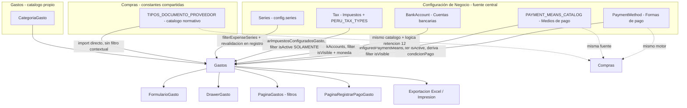

# Auditoría de Fuentes de Verdad — Módulo de Gastos

**Alcance:** auditoría puntual de catálogos y fuentes de verdad consumidos por Gastos. No se reabre la auditoría funcional integral previa (`docs/AUDITORIA_FUNCIONAL_MODULO_GASTOS.md`) ni se modifica código. Todo hallazgo aquí es nuevo o específico de este eje (catálogos/fuentes), verificado contra el código actual.

---

## 1. Veredicto ejecutivo

**🟡 CENTRALIZADAS CON INCONSISTENCIAS**

No existe ningún catálogo duplicado ni hardcode indebido dentro de Gastos: Formas de pago, Medios de pago, Cuentas bancarias, Categorías, Series e incluso Tipos de documento provienen todos de una única fuente central, correctamente reutilizada. El problema no es de origen sino de **consumo sin filtro contextual ni validación cruzada**: Gastos muestra el catálogo completo de tipos de documento de Compras (incluyendo códigos que en Compras disparan lógica real —retención— que Gastos no replica), no valida coherencia entre proveedor/beneficiario y tipo de documento, no valida coherencia entre tratamiento del IGV y la afectación real del impuesto elegido, y tiene un supuesto no verificado (`tax.type === 'PERCENTAGE'`) que produciría un cálculo incorrecto si el usuario activara manualmente un impuesto de monto fijo (ICBPER).

---

## 2. Mapa general de fuentes

---

## 3. Formas de pago

**Fuente de verdad:** `PaymentMethod` (`configuracion-sistema/modelos/PaymentMethod.ts`), persistido en `ContextoConfiguracion.state.paymentMethods`, tenant-scoped. Se administra en Configuración de Negocio → Pagos → pestaña "Formas de pago" (`SeccionMediosPago.tsx`, separa `contadoMethods`/`creditoMethods` por `pm.code`). El label visible "Crédito 30-60 días" **no es un valor almacenado**: se genera dinámicamente (`buildCreditPaymentMethodName`, `shared/payments/paymentTerms.ts`) a partir de los días de crédito de la plantilla de cuotas de cada método.

**Consumo por Gastos:** `FormularioGasto.tsx` filtra `config.paymentMethods` por `isActive`; el selector único de "Forma de pago" alimenta `useCreditTermsConfigurator` (mismo motor que Compras); `condicionPago` (contado/crédito) se **deriva** de si el método es de crédito, nunca se elige por separado.

**Consumo por Compras:** mismo motor `useCreditTermsConfigurator`/`paymentTerms.ts`.

**Respuesta directa:** sí, "Contado" y los créditos que usa Gastos salen 100% de la fuente central de Configuración; no existe lista paralela ni hardcode dentro de Gastos.

---

## 4. Medios de pago

**Fuente de verdad:** catálogo SUNAT estático `PAYMENT_MEANS_CATALOG` (`shared/payments/paymentMeans.ts`, 19 códigos oficiales) + preferencias de usuario (visible/favorito/default) en un store propio de `localStorage` — **no vive dentro de `ContextoConfiguracion.state`**, es un mecanismo de persistencia separado del de Formas de pago. Se administra en la misma pantalla de Configuración, pestaña "Medios de pago".

**Consumo por Gastos:** `getConfiguredPaymentMeans()` filtrado por `isVisible`; ningún array hardcodeado de medios dentro de Gastos. `isCashPaymentMeanCode(code)` (consulta `PAYMENT_MEANS_CATALOG[].isCash`, solo códigos 008/009 = Efectivo) determina si un medio implica movimiento de Caja.

**Consumo por Compras/Cobranzas:** idéntica fuente.

**Respuesta directa:** sí, Gastos consume exclusivamente la fuente central de Medios de pago.

**Nota arquitectónica (no defecto):** Formas de pago y Medios de pago son catálogos legítimamente distintos y ambos centralizados, pero persisten en dos mecanismos de infraestructura diferentes (contexto de Configuración vs. `localStorage` directo) — irrelevante para el usuario final, pero vale documentarlo.

---

## 5. Información bancaria

**Fuente de verdad:** `BankAccount` (`configuracion-sistema/modelos/BankAccount.ts`: banco, tipo de cuenta, moneda, número, CCI, `isVisible`, `isFavorite`). **No existe un campo `isDefault`/cuenta predeterminada** en el modelo. `BANK_CATALOG` es una lista fija de 6 bancos peruanos — catálogo de referencia legítimo para el selector "banco" al crear una cuenta, no algo que Gastos deba centralizar de otra forma.

**Consumo por Gastos:** mismo hook central `useBankAccounts()`; filtra correctamente por `isVisible && currencyCode === moneda del gasto` antes de ofrecer las cuentas en el mismo componente de pago compartido con Compras. Sin conciliación ni saldo — consistente con el resto del sistema. No se encontró ninguna cuenta bancaria hardcodeada ni duplicada dentro de Gastos.

---

## 6. Impuestos

**Fuente de verdad:** `Tax` (`configuracion-sistema/modelos/Tax.ts`), catálogo semilla `PERU_TAX_TYPES` con códigos SUNAT reales y `affectationCode` del Catálogo N° 07 (Gravado/Exonerado/Inafecto/Exportación). El seed real de un tenant nuevo activa por defecto IGV18, IGV10, Exonerado, Inafecto y Exportación (ISC e ICBPER existen en el catálogo pero no se activan por defecto).

**Consumo por Gastos:** `listarImpuestosConfiguradosGasto` filtra únicamente por `isActive` — **muestra todos los impuestos activos sin distinguir tipo ni afectación**. Snapshot histórico correcto (tasa/impuesto se fijan al registrar y nunca se releen). No hay tasa hardcodeada en código de producción.

**Hallazgo real (latente):** la función siempre calcula `tasa: tax.rate / 100`, asumiendo `tax.type === 'PERCENTAGE'`. Si un usuario activara manualmente ICBPER (`type: 'FIXED_AMOUNT'`, S/0.50 fijo) desde Configuración de Negocio, Gastos lo ofrecería igual en el selector y lo trataría como una tasa porcentual de 0.5% en vez de un monto fijo — cálculo incorrecto. Hoy es inalcanzable porque el seed por defecto no activa ICBPER/ISC, pero el código no tiene ningún guard que lo prevenga si se activaran. Ver GAS-FUENTE-P2-002.

Además, el modelo central `Tax` sí tiene `affectationCode`/`affectationName`, pero Gastos **nunca los lee** — solo extrae `id`, `nombre` y `tasa`. Esto es la causa raíz de que no exista ninguna validación de coherencia entre "Tratamiento del IGV" e "Impuesto aplicable" (ver §12).

**Respuesta directa:** no hay afectación tributaria hardcodeada de forma indebida; la debilidad real es la ausencia de un filtro por `tax.type`/afectación al listar impuestos aplicables.

---

## 7. Categorías de gasto

Fuente única confirmada: `CategoriaGasto`/`categoriaId` solo aparece dentro de la carpeta `gastos/` y en su UI de administración en Configuración de Negocio. No existe ningún segundo repositorio ni catálogo paralelo de categorías en otro módulo del ERP.

---

## 8. Series

**Fuente de verdad:** catálogo central `config.series`, consumido vía `filterExpenseSeries` (filtra por establecimiento activo) para poblar el selector, y **revalidado en vivo contra la misma fuente central en el momento de registrar** (`resolverSerieGastoSeleccionada`, invocado en el contexto de Gastos, no en el formulario) — es decir, la validación de negocio no confía en lo que el formulario cacheó. Excluye correctamente series inactivas/suspendidas y series de tipo distinto a "Gasto"/"Pago a proveedor" según corresponda. No se detectó ningún valor propio o cacheado fuera de esta fuente central.

---

## 9. Tipos de documento — análisis exhaustivo

**Origen exacto:** `apps/senciyo/src/pages/Private/features/compras/constantes/tiposDocumentoProveedor.ts` — un array `TIPOS_DOCUMENTO_PROVEEDOR` con 9 entradas fijas (`{codigo, nombre, nombreCorto}`): 01 Factura, 03 Boleta de Venta, 07 Nota de Crédito, 08 Nota de Débito, 12 Recibo por Honorarios, 14 Recibo por Arrendamiento, 40 Comprobante de Percepción, 56 Comprobante de Retención, 91 Comprobante de no domiciliado.

**¿Es configurable por el usuario?** No — es una constante de código (catálogo normativo de códigos SUNAT), no persistida en Configuración. Esto es correcto y legítimo: no debería ser editable por el usuario.

**¿Está hardcodeado dentro de Gastos o importado?** Importado directamente (`FormularioGasto.tsx` hace `import { TIPOS_DOCUMENTO_PROVEEDOR } from '../../compras/constantes/tiposDocumentoProveedor'`) y recorrido tal cual en el selector, anteponiendo manualmente la opción "Sin documento" (convención de UI con valor vacío, no un elemento del catálogo).

**¿Está duplicado?** No — es un catálogo de **Compras**, reutilizado por Gastos, sin ninguna segunda copia del array ni de sus labels en otro archivo.

**¿Quién más lo consume?** 8 archivos de Compras (`FormularioComprobanteCompra.tsx`, `TablaDocumentosPagoCompra.tsx`, `TablaComprobantesCompra.tsx`, `PanelDetalleComprobanteCompra.tsx`, `PanelDetallePagoCompra.tsx`, `BuscadorDocumentoOrigenPago.tsx`, `TablaCuentasPorPagar.tsx`, `PanelDetalleCuentaPorPagar.tsx`) más Gastos (`FormularioGasto.tsx`, `servicioGasto.ts`, `consultaGastosOperativos.service.ts`).

**Catálogo distinto y no confundible:** existe uno totalmente separado en `comprobantes-electronicos/models/constants.ts` (boleta/factura/nota_credito) para documentos que **la empresa emite** en Ventas — dirección opuesta (emitido vs. recibido). No es duplicación, es la separación correcta.

**Hallazgo funcional clave — mismo código, comportamiento distinto según el módulo:** el código `'12'` (Recibo por Honorarios) dispara en Compras una regla de negocio real: `FormularioComprobanteCompra.tsx` fuerza `modalidadInventario='no_afecta_inventario'` y habilita un checkbox "Aplica retención" que recalcula `netoAPagar = total - montoRetencion`, persistido en el comprobante. Gastos **no tiene ningún campo ni lógica equivalente** — decisión deliberada y documentada en el código (comentario explícito: "un gasto no tiene retención, a diferencia de un Recibo por Honorarios"), pero el efecto es que el mismo código de catálogo produce un importe de CxP distinto según si el usuario registró el RxH vía Compras (con retención aplicada) o vía Gastos directamente (importe pleno, sin retención). Ver GAS-FUENTE-P2-001.

**Nota de Crédito / Nota de Débito:** sin ninguna lógica relacional en ningún módulo del sistema (ni Compras ni Gastos). No existe campo de "documento referenciado" hacia un comprobante original de un tercero en ningún modelo — hoy, elegir NC/ND genera una CxP nueva e independiente por el total ingresado, igual que una Factura. Es una característica heredada del catálogo/Compras compartido, no introducida por Gastos.

**Comprobante de Percepción (40):** el modelo `ComprobanteCompra.percepcion` existe (`tasaPercepcion`, `montoPercepcion`, `totalConPercepcion`) pero ningún formulario lo popula hoy — es un label sin efecto también en Compras, no solo en Gastos.

**Comprobante de Retención (56) y No domiciliado (91):** labels planos sin lógica propia en ningún módulo del sistema. Retención no distingue que normativamente lo emite un tercero **hacia** la empresa (dirección inversa a Factura/Boleta/RxH, que la empresa recibe de su proveedor). No existe ningún módulo de RRHH/no domiciliado que le dé significado funcional a ese código.

---

## 10. Matriz de compatibilidad documental

| Documento | Fuente | Sustenta gasto directo | Requiere referencia previa | Mostrar en Gastos | Observación |
|---|---|---:|---:|---:|---|
| Sin documento | Convención UI (no es parte del catálogo) | Sí | No | Sí | Cubre el caso "sin comprobante" correctamente |
| Factura (01) | `TIPOS_DOCUMENTO_PROVEEDOR` | Sí | No | Sí | Tratamiento uniforme, sin peculiaridad |
| Boleta de Venta (03) | ídem | Sí | No | Sí | Igual que Factura |
| Nota de Crédito (07) | ídem | Parcial — hoy se trata como documento independiente | Conceptualmente sí (normativamente modifica un comprobante previo), pero el sistema no lo modela así en ningún módulo | Revisar | Genera CxP nueva por el total, sin vínculo a un documento original — heredado de Compras, no exclusivo de Gastos |
| Nota de Débito (08) | ídem | Parcial | Igual que NC | Revisar | Mismo comportamiento que NC |
| Recibo por Honorarios (12) | ídem | Sí, pero sin la retención que sí aplica en Compras para el mismo código | No | Sí, con salvedad | Inconsistencia entre módulos que comparten catálogo (ver §9) |
| Recibo por Arrendamiento (14) | ídem | Sí | No | Sí | Label plano, mismo tratamiento que Factura/Boleta en todo el sistema |
| Comprobante de Percepción (40) | ídem | Label sin efecto (también en Compras) | No aplica hoy | Revisar | Campo de modelo existe pero desconectado de todo formulario |
| Comprobante de Retención (56) | ídem | Label plano, sin distinguir direccionalidad (lo emite un tercero hacia la empresa) | No aplica hoy | Revisar | Sin lógica en ningún módulo |
| Comprobante de no domiciliado (91) | ídem | Label plano, sin lógica de no domiciliado en el sistema | No aplica hoy | Revisar | Sin módulo de RRHH/no domiciliado que le dé sentido funcional |

**Lectura conjunta:** el catálogo central es correcto y no debe tocarse (es normativo, código SUNAT). Lo que corresponde revisar es si Gastos debería aplicar una regla contextual que oculte o marque de forma distinta los códigos que hoy son labels sin efecto en todo el sistema (Percepción, Retención, No domiciliado) y que aclare la salvedad de Recibo por Honorarios frente a Compras — no un cambio al catálogo mismo.

---

## 11. Proveedor / Beneficiario vs Documento

| Combinación | ¿Permitida hoy? | ¿Validación en dominio? | ¿Validación en UI? | Observación |
|---|---|---|---|---|
| Sin proveedor formal + Factura | Sí | No | No | Una Factura normativamente exige emisor identificado (RUC); el sistema no lo exige |
| Sin proveedor formal + Recibo por Honorarios | Sí | No | No | Mismo problema — RxH normalmente identifica a un emisor |
| Sin proveedor formal + Recibo por Arrendamiento | Sí | No | No | Mismo problema |
| Sin proveedor formal + Sin documento | Sí | No (no hace falta) | No (no hace falta) | Caso de uso principal y correcto (movilidad, propinas) |

Los campos `tipoDocumento` y `proveedorId`/`beneficiario` son completamente independientes tanto en `FormularioGasto.tsx` como en todas las funciones `validar...` de `servicioGasto.ts` — ninguna los relaciona. No hay ni bloqueo ni advertencia. Ver GAS-FUENTE-P3-001.

---

## 12. Tratamiento del IGV vs Impuesto aplicable

- El selector "Impuesto aplicable" muestra **todos** los impuestos activos configurados, sin filtrar según el `tratamientoImpuesto` elegido (recuperable/no_recuperable/sin_desglose).
- **No existe ninguna regla** que impida combinaciones como "Impuesto recuperable" + "Exonerado 0%" o "Impuesto no recuperable" + "Inafecto 0%" — confirmado por ausencia total de comparación entre `tratamientoImpuesto` y la afectación del impuesto elegido en el código.
- Cuando el tratamiento es "Sin desglose", el formulario **oculta correctamente** el selector de "Impuesto aplicable" (no lo pide) — este caso está bien resuelto.
- Causa raíz: el modelo central `Tax` sí tiene `affectationCode`/`affectationName` (Gravado/Exonerado/Inafecto/Exportación), pero Gastos nunca los lee — solo usa `id`, `nombre` y `tasa`. Sin leer la afectación real, es estructuralmente imposible validar la coherencia entre ambos campos. Ver GAS-FUENTE-P3-002.

---

## 13. Terminología Forma de pago / Medio de pago

| Pantalla | Texto actual | Concepto real | ¿Correcto? |
|---|---|---|---|
| Formulario — selector contado/crédito | "Forma de pago *" | Forma de pago (`config.paymentMethods`) | Sí |
| Formulario/Pago — selector efectivo/transferencia/tarjeta | "Medio de pago" | Medio de pago | Sí |
| Drawer — sección de pago | "Condición: Crédito/Contado" + "Forma de pago: [nombre]" | Condición derivada + Forma de pago real | Sí (deliberado, no redundante — ver §14) |
| Drawer — tab Pagos | "Medio(s) de pago: [nombres]" | Medio de pago | Sí |
| Listado — filtro/columna | "Condición de pago" | Condición de pago (contado/crédito) | Sí |
| Exportación Excel | Columnas separadas "Condición de pago" y "Forma de pago" | Ambas, correctamente distinguidas | Sí |
| Impresión | "Condición: Crédito/Contado" + "Forma de pago: [nombre]" | Igual que Drawer | Sí |

**No se encontró ninguna inconsistencia terminológica real entre pantallas.** Las 3 nociones (condición, forma, medio de pago) se usan de forma consistente en las 7 pantallas revisadas.

---

## 14. Redundancias de presentación

El Drawer y la impresión muestran "Condición: Crédito/Contado" junto con "Forma de pago: [nombre configurado, ej. 'Crédito 30-60 días']". **No es una redundancia accidental**: está documentado explícitamente en el código que "Condición" da un resumen binario de un vistazo y "Forma de pago" da el nombre exacto configurado, que puede llevar información adicional (los días de crédito) que "Crédito" a secas no transmite. Ambas se derivan de los mismos dos campos reales (`condicionPago`/`formaPagoMetodoId`), sin una tercera fuente — no hay duplicación de datos, solo dos niveles de detalle en la presentación.

---

## 15. Fuentes de verdad finales

| Concepto | Fuente de verdad | Archivo/modelo | Consumidores principales | ¿Centralizada? | Observación |
|---|---|---|---|---|---|
| Forma de pago | `PaymentMethod` | `configuracion-sistema/modelos/PaymentMethod.ts` | Gastos, Compras | Sí | Label de crédito generado dinámicamente, no almacenado |
| Medio de pago | `PAYMENT_MEANS_CATALOG` + prefs | `shared/payments/paymentMeans.ts` | Gastos, Compras, Cobranzas | Sí | Persistencia separada de Formas de pago (nota arquitectónica) |
| Cuenta bancaria | `BankAccount` | `configuracion-sistema/modelos/BankAccount.ts` | Gastos, Compras | Sí | Sin campo "predeterminada"; referencial, sin saldo (por diseño) |
| Impuesto | `Tax` | `configuracion-sistema/modelos/Tax.ts` | Gastos, Compras, Ventas | Sí | Gastos ignora `affectationCode`; asume siempre tasa porcentual |
| Categoría de gasto | `CategoriaGasto` | `gastos/modelos/CategoriaGasto.ts` | Solo Gastos | Sí | Catálogo propio y legítimo del módulo, sin duplicado |
| Serie Gasto | `Series` (`config.series`) | Configuración central | Gastos | Sí | Revalidada en vivo al registrar, no confía en caché del formulario |
| Serie Pago | `Series` (`config.series`) | Configuración central | Gastos, Compras | Sí | Misma fuente, tipo "Pago a proveedor" |
| Tipo de documento | `TIPOS_DOCUMENTO_PROVEEDOR` | `compras/constantes/tiposDocumentoProveedor.ts` | Gastos (2 archivos), Compras (8 archivos) | Sí | Catálogo normativo legítimo, pero consumido sin filtro contextual en Gastos |
| Proveedor | Catálogo `Cliente`/`Proveedor` | `gestion-clientes` | Gastos, Compras, Ventas | Sí | Mismo catálogo, sin maestro paralelo (confirmado en auditoría previa) |

---

## 16. Hardcodes encontrados

### Hardcodes correctos/justificados
- `TIPOS_DOCUMENTO_PROVEEDOR` — catálogo normativo de códigos SUNAT, no debe ser editable por el usuario.
- `PAYMENT_MEANS_CATALOG` — catálogo normativo SUNAT de medios de pago, con capa de preferencias de usuario encima.
- `BANK_CATALOG` — lista fija de bancos peruanos para el selector al crear una cuenta; catálogo de referencia, no de negocio.
- `PERU_TAX_TYPES` — catálogo semilla de impuestos con códigos y afectación SUNAT reales.

### Hardcodes incorrectos
Ninguno encontrado dentro de Gastos. No hay arrays locales de tipos de documento, medios de pago, formas de pago ni bancos dentro de la carpeta `gastos/`.

### Duplicaciones
Ninguna encontrada. El catálogo de documentos **emitidos** (Ventas, `comprobantes-electronicos`) es correctamente distinto del catálogo de documentos **recibidos** (Compras/Gastos) — no es una duplicación sino la separación conceptual correcta.

---

## 17. Problemas reales encontrados

1. Gastos ignora el `type` del impuesto (`PERCENTAGE` vs `FIXED_AMOUNT`) al calcular la tasa aplicable — riesgo latente si se activa ICBPER/ISC (GAS-FUENTE-P2-002).
2. El código de catálogo `'12'` (Recibo por Honorarios) produce un importe de CxP distinto según si se registra vía Compras (con retención) o vía Gastos (sin retención) — mismo documento, dos comportamientos (GAS-FUENTE-P2-001).
3. Sin validación de coherencia entre proveedor/beneficiario y tipo de documento (GAS-FUENTE-P3-001).
4. Sin validación de coherencia entre tratamiento del IGV y afectación real del impuesto, porque Gastos no lee `affectationCode` (GAS-FUENTE-P3-002).
5. Varios códigos del catálogo de documentos (Percepción, Retención, No domiciliado) son labels sin ningún efecto funcional en **todo el sistema**, no solo en Gastos — no es un problema exclusivo de este módulo.

---

## 18. Qué NO debe tocarse

- El catálogo `TIPOS_DOCUMENTO_PROVEEDOR` en sí (es normativo y correcto que sea una constante, no configuración editable).
- El catálogo `PAYMENT_MEANS_CATALOG` y su capa de preferencias.
- El modelo `PaymentMethod` y el motor de generación dinámica del nombre de crédito.
- El modelo `BankAccount`/`BANK_CATALOG`.
- El catálogo `CategoriaGasto` (propio y correcto).
- El mecanismo de Series y su revalidación en vivo al registrar.
- La separación entre catálogo de documentos emitidos (Ventas) y recibidos (Compras/Gastos).

---

## 19. Qué debería corregirse posteriormente

### Fuente central
- Ninguna corrección de fuente central es indispensable. El único candidato es que `listarImpuestosConfiguradosGasto` (código de Gastos, no de la fuente central) debería considerar `tax.type` antes de asumir porcentaje — esto se corrige en el consumidor, no en `Tax`.

### Regla contextual de Gastos
- Filtrar o marcar distinto los tipos de documento que hoy son labels sin efecto (Percepción, Retención, No domiciliado) al mostrarlos en el selector de Gastos.
- Aclarar (o replicar de forma simplificada) la salvedad de Recibo por Honorarios frente a la retención que sí aplica en Compras, para que el importe de CxP no dependa silenciosamente de qué módulo se usó.
- Agregar un guard por `tax.type` en `listarImpuestosConfiguradosGasto` antes de que ICBPER/ISC se vuelvan alcanzables.
- Evaluar si corresponde una validación blanda (advertencia, no bloqueo) para combinaciones proveedor-formal-ausente + documento tributario formal (Factura/RxH/Recibo por Arrendamiento).
- Evaluar si corresponde usar `affectationCode` del impuesto para al menos advertir combinaciones incoherentes con el tratamiento del IGV elegido.

### Presentación/UX
- Ninguna encontrada en este eje — la terminología de pantallas ya es consistente y la redundancia del Drawer es deliberada y útil.

**No se implementa nada de esto ahora** — queda para decisión posterior.

---

## 20. Veredicto sobre Tipos de documento

1. **¿Existe una fuente de verdad?** Sí.
2. **¿Dónde?** `apps/senciyo/src/pages/Private/features/compras/constantes/tiposDocumentoProveedor.ts`.
3. **¿Está hardcodeada?** Sí, como constante de código — correcto, porque es un catálogo normativo SUNAT, no un dato de negocio configurable por el usuario.
4. **¿Está centralizada?** Sí, un único array, sin copias.
5. **¿Otros módulos la reutilizan?** Sí — 8 archivos de Compras además de Gastos; es un catálogo de Compras que Gastos reutiliza correctamente (no al revés).
6. **¿Gastos muestra todo el catálogo?** Sí, sin ningún filtro contextual.
7. **¿Debería mostrar todo?** No necesariamente — varios códigos (Percepción, Retención, No domiciliado) son labels sin efecto funcional en ningún módulo, y Recibo por Honorarios tiene una salvedad real (retención) que Gastos no replica. Mostrarlos todos sin distinción puede sugerir al usuario una capacidad (tratamiento tributario especial) que el sistema no ofrece hoy desde Gastos.
8. **¿Qué documentos deberían mantenerse tal cual?** Sin documento, Factura, Boleta de Venta, Recibo por Arrendamiento — tratamiento uniforme y sin peculiaridad detectada.
9. **¿Qué documentos requieren revisión?** Nota de Crédito y Nota de Débito (sin modelo de referencia a documento original en ningún módulo), Recibo por Honorarios (salvedad de retención no replicada), Comprobante de Percepción/Retención/No domiciliado (labels sin efecto en todo el sistema).
10. **¿La solución futura debe tocar el catálogo central o solo Gastos?** Solo Gastos (regla contextual de presentación/validación). El catálogo central en `compras/constantes/tiposDocumentoProveedor.ts` es correcto tal como está y no debería modificarse por esta causa.

---

## 21. Conclusión

### ¿Las fuentes de verdad que consume Gastos están correctamente diseñadas?
**PARCIAL.** El origen de cada catálogo es correcto y único; las inconsistencias están en el nivel de consumo (falta de filtro contextual y de validación cruzada), no en el nivel de fuente.

### ¿Existe algún catálogo duplicado dentro de Gastos?
**NO.**

### ¿Existe algún hardcode incorrecto?
**NO** — todos los hardcodes encontrados son catálogos normativos legítimos (SUNAT/bancos de referencia), correctamente centralizados y reutilizados.

### ¿Tipos de documento requiere corrección?
**SÍ** — no en su fuente, sino en cómo Gastos lo consume: falta una regla contextual que distinga los documentos funcionalmente uniformes de los que son labels sin efecto o que ocultan una salvedad (retención) que sí opera en Compras.

### ¿La corrección debe hacerse en Configuración/fuente central o solamente en Gastos?
**Solamente en Gastos** (y puntualmente en el consumidor de impuestos de Gastos para el guard de `tax.type`). Ninguna fuente central requiere cambios por lo encontrado en esta auditoría.
