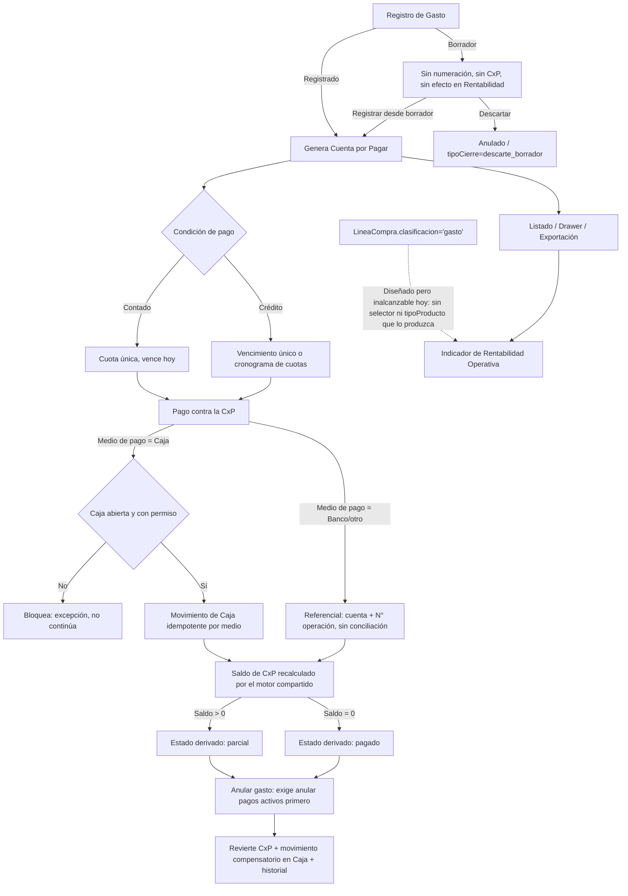

# Auditoría Funcional Integral — Módulo de Gastos

**Alcance del producto evaluado:** ERP comercial orientado a emprendedores (SenciYo). No se evalúa contra estándares de ERP corporativo/contable/tesorería.

**Metodología:** reconstrucción del módulo directamente desde el código actual (`apps/senciyo/src/pages/Private/features/gastos/` y sus dependencias en `compras/`, `control-caja/`, `configuracion-sistema/`, `roles/`). Los documentos `apps/senciyo/AUDITORIA_MODULO_GASTOS.md`, `docs/AUDITORIA_EXHAUSTIVA_MODULO_GASTOS.md` y `docs/AUDITORIA_MODULO_GASTOS_INTEGRACIONES.md` se usaron solo como antecedente histórico; todo hallazgo aquí fue re-verificado contra el código vigente.

---

## 1. Veredicto ejecutivo

**🟡 ALINEADO CON BRECHAS**

El módulo tiene una arquitectura financiera correcta y ya endurecida por dos rondas de auditoría previas: Gasto, Cuenta por Pagar y Pago son conceptos separados con una única fuente de verdad cada uno, la integración con Caja es bloqueante (no puede quedar un gasto "pagado" sin salida real de caja), los estados documental/financiero/vencimiento están correctamente separados, y la anulación/edición respetan los efectos financieros ya comprometidos. Todos los hallazgos P0/P1 de auditorías anteriores (fallo silencioso de Caja, bypass de permisos, idempotencia de pago, efectivo en moneda extranjera) están corregidos y confirmados en el código actual.

La brecha real encontrada en esta ronda: la consolidación de "gasto operativo" que debería incorporar líneas de Compras clasificadas como `gasto` está bien construida y probada, pero **opera hoy sobre un conjunto siempre vacío**, porque no existe en la UI de Compras ninguna forma de asignar esa clasificación a una línea real. Es una capacidad diseñada correctamente pero inalcanzable en la práctica — no es un defecto de integridad financiera, pero sí una brecha funcional real del punto 18/19 del alcance pedido.

Fuera de eso, no hay complejidad innecesaria, no hay funcionalidades empresariales que deban agregarse, y el módulo es usable por un emprendedor sin conocimientos contables.

---

## 2. Definición del módulo actual

Gastos es un módulo propio dentro de SenciYo (no un sub-flujo de Compras) para registrar egresos operativos del negocio — con o sin comprobante fiscal — clasificarlos por categoría, generar su obligación de pago cuando corresponde, liquidarla contra Caja/Banco, y consultarlos en listado, indicadores de Rentabilidad Operativa e impresión/exportación. Reutiliza deliberadamente la infraestructura de Compras para CxP y Pagos (vía `tipoOrigen: 'gasto'`) en lugar de duplicarla, y el catálogo de Clientes/Proveedores en lugar de mantener un maestro de beneficiarios paralelo.

Estructura real: 2 pestañas (Gastos, Categorías); no existe pestaña de "Recurrentes" (deferred conscientemente, sin infraestructura de tareas programadas en el repo).

---

## 3. Alcance real encontrado

- Registro de gasto en borrador o directo a registrado, con o sin documento sustentatorio.
- Categorías de gasto propias (10 semillas editables por empresa), sin jerarquía.
- Proveedor formal o beneficiario informal (mutuamente excluyentes), mismo catálogo que Compras.
- Multimoneda con tipo de cambio obligatorio si difiere de la moneda base.
- Tratamiento de IGV con 3 políticas (recuperable/no recuperable/sin desglose), snapshot histórico.
- Contado y crédito, con vencimiento único o cronograma de cuotas (motor compartido con Compras).
- Generación de Cuenta por Pagar reutilizando el motor de Compras.
- Pago único, parcial o múltiple contra esa CxP, con idempotencia real verificada.
- Integración bloqueante con Caja (no permite pago "fantasma"), banco puramente referencial.
- Edición en 3 niveles según compromiso financiero; anulación con motivo obligatorio y reversión de Caja; nunca borrado físico.
- Historial de eventos y campos de auditoría (`creadoPor`, `anuladoPor`, `fechaAnulacion`).
- Listado con filtros (incluye "con/sin documento"), columnas configurables, exportación a Excel fiel a lo filtrado.
- Consolidación de indicadores de gasto operativo en Rentabilidad (Gasto directo + líneas de Compra clasificadas `gasto` — esta segunda fuente está inalcanzable hoy, ver §19).
- Permisos granulares (`ver/crear/anular/pagar/categorías`) validados en ruteo, menú y dominio.
- Aislamiento multiempresa por tenant en todos los repositorios.
- 11 archivos de test, ~305 casos, cubriendo dominio/servicios/integración (sin tests de componente/UI).

---

## 4. Flujo funcional actual

---

## 5. Configuración actual

| Configuración | ¿Existe? | Dónde | ¿Es suficiente? | ¿Falta algo? |
|---|---|---|---|---|
| Categorías de gasto | Sí, propia de Gastos | `SeccionCategoriasGasto.tsx`, Configuración de Negocio (`/configuracion/negocio`) | Sí — CRUD + activar/inactivar, nunca eliminación física | No |
| Series (numeración "Gasto") | Sí, catálogo central de Series | Configuración → Series, tipo documental "Gasto" | Sí — reutilizada, filtrada por establecimiento | No |
| Impuestos (IGV) | Sí, `config.taxes` | Configuración de Negocio → Impuestos | Sí — tasa nunca hardcodeada | No |
| Monedas / moneda base | Sí, `config.currencies` | Configuración de Negocio | Sí | No |
| Medios/formas de pago | Sí, `PaymentMethod` | Configuración de Negocio → Pagos | Sí — misma fuente que decide crédito/cronograma | No |
| Bancos/cuentas | Sí, referencial (`BankAccount`, sin saldo) | Configuración de Negocio | Sí para el alcance actual (no se ofrece conciliación en ningún módulo) | No — conciliación no aplica a este producto |
| Establecimientos | Sí, opcional en el gasto ("Aplica a") | Selector en formulario | Sí — ausente = gasto de toda la empresa | No |
| Permisos de Gastos | Sí, catálogo dedicado | `catalogoPermisos.ts` + pantalla de Roles | Sí, granular y con enforcement real | No |

El usuario **no necesita configurar nada exclusivo** antes de usar Gastos: hay 10 categorías semilla por empresa, y el resto (series, impuestos, monedas, medios de pago) ya existe compartido con Compras/Ventas. El único requisito de configuración es tener al menos una serie activa de tipo "Gasto" y una de "Pago a proveedor" (bloqueo explícito con mensaje si falta) — razonable, no una carga adicional real.

---

## 6. Registro de Gastos

Formulario único (`FormularioGasto.tsx`) con validación centralizada (`servicioGasto.ts`). Campos y obligatoriedad reales:

- **Serie*** — obligatoria solo al registrar/pagar, nunca en borrador. Correctamente ubicada (se resuelve del catálogo central filtrado por establecimiento y tipo "Gasto").
- **Fecha del gasto*** (`fechaReconocimiento`) — siempre obligatoria; es la fecha que alimenta Rentabilidad, distinta de la fecha de emisión del documento del proveedor y de la fecha de pago. Bien diferenciada, sin duplicidad confusa.
- **Categoría*** — obligatoria siempre.
- **Establecimiento ("Aplica a")** — opcional; ausencia = gasto general de empresa. Correcto para no forzar un dato que no siempre aplica.
- **Concepto*** — texto libre obligatorio; sustituye la necesidad de un catálogo cerrado de "tipos de gasto".
- **Proveedor o Beneficiario** — mutuamente excluyentes vía checkbox "Sin proveedor formal"; se exige uno u otro, nunca ambos ni ninguno. Modelado correcto (ver §9).
- **Documento sustentatorio** (tipo/fecha/serie/número) — 100% opcional; el bloque completo se oculta si no hay tipo de documento. Cubre explícitamente el escenario "sin comprobante".
- **Moneda* + Tipo de cambio*** — TC obligatorio solo si la moneda difiere de la base.
- **Tratamiento del IGV** (recuperable/no recuperable/sin desglose, default sin desglose) + **Impuesto aplicable*** (obligatorio solo si hay desglose) + modo de ingreso (total incluye IGV vs. subtotal).
- **Total*** — obligatorio, mayor a 0, rechaza NaN/Infinity.
- **Forma de pago*** — selector único que deriva contado/crédito (no hay un radio botón separado y redundante) + vencimiento o cronograma de cuotas si es crédito.
- **Adjuntos** y **Observaciones** — opcionales.
- **Datos del pago** — sección oculta por defecto, solo aparece si el usuario elige "Registrar y pagar".

**Evaluación:** ningún campo duplicado, ninguna obligatoriedad injustificada, ninguna omisión esencial. La única observación menor: no hay lookup automático de tipo de cambio contra una tabla de TC diario (el usuario lo ingresa manualmente) — razonable para el alcance de este producto, no se considera brecha.

---

## 7. Documentos y sustentos

El campo `tipoDocumento` es completamente opcional, con "Sin documento" como valor por defecto. Cuando está vacío, se ocultan fecha/serie/número del documento y el gasto sigue siendo válido y registrable — cubre correctamente el caso "Movilidad S/ 15 sin factura". Los adjuntos (reutilizados de Compras: `factura_proveedor`/`voucher_pago`/`otro`) son independientes del campo `tipoDocumento`: se puede adjuntar un voucher aunque no haya documento fiscal formal. La presentación ("Sin documento") es consistente en tabla, Drawer, Excel e impresión (misma función de formato en los cuatro lugares). Ambos escenarios — con y sin documento formal — están correctamente cubiertos.

---

## 8. Categorías y clasificación

CRUD completo (`servicioCategoriaGasto.ts`): creación y edición con anti-duplicado insensible a mayúsculas/espacios, activación/inactivación (nunca eliminación física), conteo de uso antes de desactivar (excluye correctamente borradores descartados). Estructura plana, sin jerarquías ni cuentas contables — correcto para el alcance. 10 categorías semilla razonables (Alquileres, Servicios básicos, Publicidad, Movilidad, Comisiones, Mantenimiento, Honorarios, Limpieza, Suscripciones, Otros), editables por empresa. El selector del formulario filtra a categorías activas pero conserva visible la ya asignada a un gasto existente aunque se haya desactivado después (sin desaparición silenciosa). Administración centralizada en Configuración de Negocio; consumo de solo lectura en Gastos, sincronizado entre pestañas por evento.

---

## 9. Proveedor / Beneficiario

Mismo catálogo, sin maestro duplicado: el buscador de proveedores de Gastos es literalmente el mismo componente de Compras, filtrando `Cliente`/`Cliente-Proveedor`. "Beneficiario" es un campo de texto libre alternativo, activado por el mismo checkbox que excluye al proveedor formal — pensado explícitamente para movilidad, propinas y gastos sin documento. La regla de negocio exige uno de los dos, nunca proveedor formal como obligación ciega. Modelado correcto y sin duplicidad de maestros.

---

## 10. Tributación

**Interno vs. tributario, separado con claridad:**
- Base imponible/IGV se derivan siempre desde el motor compartido con Compras (nunca una tasa hardcodeada; siempre resuelta desde la configuración de impuestos vigente al momento del registro).
- El usuario ingresa por subtotal o por total, nunca calcula el IGV a mano.
- **Snapshot histórico real**: `impuestoId`/`tasaImpuesto` se fijan al momento del registro y nunca se releen en vivo desde la configuración actual para un gasto ya registrado.
- Redondeo consistente (`round2`) en todos los cálculos.
- `tratamientoImpuesto` (recuperable/no recuperable/sin desglose) es explícitamente **política de clasificación, no un motor de cálculo**: el desglose de monto recuperable/no recuperable no se calcula en ningún punto del sistema. Sí afecta el "importe reconocido como gasto operativo" para Rentabilidad (control interno), pero no constituye una declaración tributaria formal. Esta separación está documentada en el propio código y es la correcta para este producto: Gastos no debe convertirse en un módulo contable.

**Particularidades tributarias avanzadas** (detracción, retención, percepción, recibo por honorarios): **no existen en absoluto** en el módulo, ni siquiera parcialmente. Es una decisión consciente y documentada en el código (un comentario aclara explícitamente que un gasto "no tiene retención, a diferencia de un Recibo por Honorarios"), no un olvido. Clasificación: **NO APLICA** para el alcance actual de este ERP comercial; recomendable solo si en el futuro el producto decide ofrecer un módulo de Recibos por Honorarios propio (evolución futura, no brecha).

---

## 11. Contado y Crédito

Ambos generan siempre una Cuenta por Pagar — la condición de pago no determina si hay o no obligación formal, solo el vencimiento. En contado, la cuota única vence el mismo día si no se paga en el acto ("Registrar y pagar" es una orquestación de dos pasos —registrar + aplicar pago—, nunca un estado especial que salte la CxP). En crédito, se asigna `fechaVencimiento` o un cronograma de cuotas (mismo motor de Compras, `useCreditTermsConfigurator`). Ambos modos están correctamente resueltos y probados (tests de integración dedicados).

---

## 12. Cuentas por Pagar

**Reutilizada, no duplicada.** El tipo `CuentaPorPagar` que usa Gastos es literalmente el mismo modelo de Compras, distinguido por `tipoOrigen: 'gasto'` (los campos exclusivos de Compras quedan vacíos). El repositorio es el mismo para ambos módulos. No existe una segunda tabla ni un segundo cálculo de saldo: `saldoPendiente` nace del total del gasto y de ahí en adelante solo lo recalcula el motor compartido de aplicación/reversión de pagos. Un saldo cero significa pagada, nunca eliminada — el registro persiste siempre.

**Respuesta directa:** sí, la arquitectura actual de CxP es correcta para Gastos — cumple exactamente el patrón "reutilizar, no reinventar" que corresponde a este alcance de producto.

---

## 13. Pagos

**Pago es una entidad independiente**, no un estado dentro de Gasto: `Gasto` solo guarda `cuentaPorPagarId` y `pagosRelacionados` (IDs), nunca montos ni fecha de pago propios. El estado de pago del gasto (`pendiente`/`parcial`/`pagado`) está declarado explícitamente como derivado y "nunca persistido como una segunda fuente de verdad" — se resuelve en tiempo real contra la CxP.

Pagos parciales y múltiples se soportan vía el mismo mecanismo de Compras (reutiliza `FormularioPagoCompra` completo, con un arreglo de una sola CxP). Si el saldo ya es cero, la página bloquea el acceso al pago.

**Idempotencia verificada en ambos flujos activos**: "Registrar y pagar" y "Registrar pago" independiente comprueban la clave de idempotencia contra el repositorio realmente persistido (no contra estado en memoria). El hallazgo de una auditoría anterior sobre falta de idempotencia en "Registrar pago" independiente **ya no aplica** — el hook central ahora siempre genera y envía la clave.

Anulación de un pago individual: bloquea si ya está anulado o si tiene medio de caja con la caja cerrada; genera un movimiento de Ingreso compensatorio por cada medio de caja, con clave de idempotencia determinista por medio (evita colisión cuando un pago tiene dos líneas de efectivo); revierte el saldo de la CxP; deja evento en el historial del Gasto.

**Fuente de verdad del pago:** el propio objeto `PagoCompra` persistido, nunca un campo replicado en `Gasto`.

---

## 14. Caja y Bancos

**Caja — bloqueante, no puede quedar un gasto "pagado" sin salida real de caja.** `agregarMovimiento` lanza una excepción (`CajaCerradaError`/`PermisoCajaError`) si la caja está cerrada o falta el permiso de registrar movimientos — antes de una corrección de auditoría previa, esta función fallaba en silencio (toast + `return`), lo cual sí permitía persistir el pago sin egreso real. Hoy está corregido y confirmado. Además, cada línea de medio de caja usa su propia clave de idempotencia antes de invocar el movimiento, y el estado de caja se verifica explícitamente antes de intentar el pago (doble defensa: dominio + Caja).

**Riesgo residual identificado y ya mitigado, no ignorado:** el modelo de `Movimiento` de Caja no tiene campo de moneda. Esto se resuelve bloqueando explícitamente el medio de pago en efectivo cuando el gasto está en moneda distinta a la base (tanto en UI como en el dominio) — evita que un monto en dólares entre a Caja como si fueran soles. No es una brecha abierta, es una regla de bloqueo deliberada y correcta dado que Caja no es multimoneda en ningún otro módulo del sistema.

**Bancos — puramente referenciales**, como corresponde a este alcance: cuenta bancaria + referencia de operación, sin saldo gestionado, sin conciliación, sin movimiento bancario independiente del pago. Es coherente con el resto del sistema, que tampoco ofrece gestión bancaria avanzada en ningún módulo. Suficiente para un ERP comercial para emprendedores; no se marca como defecto.

---

## 15. Estados

Tres dimensiones separadas y explícitamente nunca fusionadas en el modelo:

1. **Documental**: `borrador | registrado | anulado`.
2. **Financiero** (`pendiente | parcial | pagado`) — nunca persistido, siempre derivado en vivo desde la CxP.
3. **Vencimiento** — no tiene un campo de estado propio (`vigente/por_vencer/vencido`); solo existe `fechaVencimiento` como dato crudo, y cualquier cálculo de vencido se infiere fuera del modelo (en filtros/columnas del listado).

La UI fusiona documental+pago en una sola columna visual de presentación, pero el propio código aclara que es solo para presentación — las fuentes internas nunca se mezclan en el modelo. Correctamente separado.

**Inconsistencia menor detectada (de comentario, no de comportamiento):** un comentario en `Gasto.ts` sobre el campo `estadoDocumento` dice "nunca 'borrador': un gasto nace ya reconocido", lo cual contradice directamente el resto del archivo y el comportamiento real (el borrador existe y se usa activamente). Parece un comentario residual de una versión anterior del modelo. No rompe nada en ejecución, pero es una fuente real de confusión para quien lea el código — ver hallazgo GAS-FUNC-P3-002.

---

## 16. Edición

Tres niveles (`completa | limitada | bloqueada`), aplicados tanto en el dominio como reflejados en la UI (el formulario deshabilita campos según el mismo cálculo que el backend-lógico, no un `if` cosmético separado):

- **Borrador** → completa (nada comprometido).
- **Registrado sin pagos activos** → completa (incluye el caso de pagos previos ya anulados, calculado correctamente sobre pagos activos, no sobre el conteo bruto de `pagosRelacionados`).
- **Registrado con ≥1 pago activo** → limitada: solo se persisten observaciones y adjuntos; el resto se descarta explícitamente en tiempo de ejecución (no solo oculto en UI), evitando desincronizar CxP/Pago/Caja ya comprometidos.
- **Anulado** → bloqueada (solo consulta).

La edición completa resincroniza la CxP solo cuando el gasto todavía no tiene pagos — coherente con el nivel de edición. No se detectó ninguna vía para modificar importe, proveedor, moneda o condición de pago cuando ya existen efectos financieros incompatibles.

---

## 17. Anulación y trazabilidad

**Anulación de gasto**: bloqueada explícitamente en tres casos con mensaje propio — borrador (se descarta, no se anula), ya anulado, o con pagos activos (exige anular primero los pagos). Exige motivo no vacío, anula la CxP asociada, marca `tipoCierre='anulacion'` (distinto de `'descarte_borrador'`), registra `fechaAnulacion`/`anuladoPor`, y agrega evento al historial.

**Anulación de pago individual**: valida bloqueo, exige caja abierta si hay medio de caja involucrado, genera movimiento de Ingreso reversorio con clave de idempotencia por medio, marca el pago como anulado con motivo/fecha/usuario, revierte el saldo de la CxP, y deja evento en el historial del Gasto. Tiene test de integración dedicado.

**Eliminación física**: no existe para gastos ni pagos registrados. Un borrador descartado reutiliza el mismo estado terminal `anulado` (con `tipoCierre` distinto) pero nunca desaparece del arreglo de datos — solo queda oculto del listado operativo normal, preservado para consulta. Correcto: ningún registro con posible efecto financiero desaparece silenciosamente.

**Trazabilidad**: cada gasto tiene `creadoPor`, fechas de creación/actualización, y un historial de eventos (usuario, fecha, acción, detalle) que registra cada mutación relevante — creación, borrador descartado, conversión a registrado, edición completa/limitada, pago aplicado, pago anulado, gasto anulado. `anuladoPor`/`fechaAnulacion`/`motivoAnulacion` también se persisten como campos de primer nivel (redundante con el historial, para consulta rápida). Única omisión menor: no existe un campo `editadoPor` de primer nivel — quién editó solo queda en el evento del historial, nunca como campo propio del objeto (mejora menor, no brecha).

---

## 18. Compras vs Gastos

La responsabilidad está bien delimitada conceptualmente y documentada en el propio código: Compras resuelve el flujo completo (Requerimiento → Orden → Comprobante → CxP → Pago) para adquisiciones formales de bienes/servicios con proveedor, mientras Gastos resuelve directamente (Registrar → CxP → Pago) egresos operativos que no necesariamente pasan por ese ciclo. No hay solapamiento de motor: ambos comparten CxP y Pago, pero cada uno origina sus propios registros.

**Riesgo real no mitigado por el sistema:** nada impide que un usuario registre manualmente en Gastos un concepto que también fue comprado y clasificado como línea de gasto en Compras (doble captura del mismo hecho económico) — no hay validación de duplicado por proveedor+monto+fecha entre ambos módulos. Es un riesgo de uso, no un defecto de arquitectura: los dos modelos son independientes por diseño y el sistema no tiene forma de inferir que representan el mismo hecho. No se encontró tampoco ayuda contextual en la UI que oriente al usuario sobre cuándo usar cada módulo.

---

## 19. Gastos operativos provenientes de Compras

`LineaCompra.clasificacion` admite 5 valores (`producto|servicio|gasto|suministro|activo_fijo`) y su único efecto funcional hoy es excluir la línea de generación de movimiento de inventario, más (desde una corrección de auditoría previa) alimentar el indicador consolidado de gasto operativo en Rentabilidad. La función de consolidación (`proyectarLineasGastoDesdeComprobantesCompra` + `calcularIndicadoresGastoOperativoConsolidado`) está bien escrita, deduplicada correctamente (una sola suma por línea, sin generar CxP/Pago paralelo) y probada con 76 casos.

**Hallazgo confirmado por verificación puntual:** esa ruta **es inalcanzable en la práctica actual**. La única función de producción que construye líneas de compra desde un producto real asigna la clasificación mediante un ternario binario (`servicio` si `tipoProducto === 'SERVICIO'`, si no `producto`) — nunca `gasto`. El catálogo de productos solo admite dos tipos (`BIEN`/`SERVICIO`, confirmado también por la validación de importación Excel); no existe un tercer tipo de producto ni un selector manual de clasificación en ningún formulario de línea de compra. Todo uso de `clasificacion: 'gasto'` en el repositorio aparece exclusivamente en archivos de test, nunca en un flujo real. Es decir: la lógica de consolidación es correcta, pero el canal de entrada que la alimentaría no existe — hoy opera siempre sobre un conjunto vacío. Ver hallazgo GAS-FUNC-P2-001.

El listado propio de Gastos (`PaginaGastos.tsx`) correctamente **no** mezcla líneas de Compras en su tabla — solo la vista de Rentabilidad Operativa consume la consolidación, lo cual es conceptualmente correcto (las líneas de Compra no son entidades Gasto editables/anulables).

---

## 20. Indicadores y Rentabilidad

Indicadores existentes: gasto total, por categoría, por establecimiento, por período, pendiente/parcial/pagado (vía filtros y columnas del listado, no un dashboard dedicado separado) y el indicador consolidado de "gasto operativo" en la página de Rentabilidad Operativa (Gasto directo + líneas de Compra clasificadas gasto — hoy solo el primer componente tiene datos reales, ver §19). Anulados no distorsionan los cálculos (excluidos explícitamente de `importeReconocidoComoGasto` y de los proyectores). Moneda/TC se tratan correctamente en la proyección (hay manejo explícito de TC faltante, según los tests del servicio). Suficiente para que un emprendedor responda las preguntas centrales del alcance (cuánto gasté, en qué, a quién, cuánto pendiente) sin necesitar un dashboard complejo — no se exige más para este producto.

---

## 21. Listado, búsqueda, filtros y exportación

Listado con buscador libre, selector de periodo/fechas, panel de filtros (categoría, proveedor, condición de pago, moneda, estado documental, estado de pago, y **con/sin documento** — cubre exactamente el escenario "gasto sin comprobante" pedido en el alcance), columnas configurables y reordenables persistidas por empresa, y exportación a Excel. El filtro de estado documental por defecto incluye anulados (decisión explícita, no oculta información por accidente).

Exportación: exporta exactamente las filas ya filtradas en pantalla, con las mismas funciones de presentación que la tabla/Drawer (nunca códigos crudos), bloquea la exportación si no hay filas, y no mezcla anulados fuera del filtro activo del usuario. Coincide con lo mostrado en pantalla.

---

## 22. Permisos

5 permisos granulares: `gastos.ver`, `gastos.crear` (incluye editar mientras no tenga pagos), `gastos.anular`, `gastos.pagar` (incluye anular pagos), `gastos.categorias.gestionar`. Suficiente para este nivel de producto — no se necesita ni se recomienda un esquema de aprobación multinivel.

**Enforcement real en tres capas independientes**, no solo estructura de datos: ruteo (`conPermisos` envuelve cada ruta), menú (oculta el módulo si falta `gastos.ver`), y dominio (cada comando del contexto vuelve a verificar el permiso internamente, con el argumento explícito en el propio código de que ocultar un botón no basta porque los comandos son invocables directamente). Existe una suite de 17 tests de integración dedicada exactamente a esta combinación.

---

## 23. Multiempresa

Aislamiento confirmado a nivel de repositorio: todos los repositorios de Gastos (gastos, categorías) usan una clave de almacenamiento que **lanza** si no hay tenant activo, en vez de caer a un almacén global compartido. CxP/Pagos comparten almacén con Compras pero bajo el mismo patrón de tenantización. El permiso además se valida contra el establecimiento de la sesión actual, con test explícito de que un rol otorgado en un establecimiento no aplica en otro. No se detectó ninguna consulta que cruce datos entre empresas.

(Nota transversal, no específica de Gastos: toda la persistencia observada es `localStorage` del navegador, no un backend remoto — característica arquitectónica de todo el sistema, no una brecha de este módulo.)

---

## 24. Experiencia del emprendedor

> ¿Es simple? Sí — un único formulario, con secciones opcionales que se ocultan si no aplican (documento, adjuntos, pago inmediato). No hay pasos redundantes ni pantallas intermedias innecesarias.

> ¿Es entendible? En general sí. La única terminología semi-técnica es "IGV recuperable/no recuperable/sin desglose" — usa lenguaje llano comparado con un ERP contable, pero no tiene ayuda contextual (tooltip) para un usuario que no sepa qué significa "recuperable". Mejora recomendable, no bloqueante.

> ¿Es suficientemente completo? Sí para el ciclo registrar→clasificar→pagar→consultar. La única capacidad realmente incompleta es la consolidación de gasto vía Compras (§19), que no es visible para el usuario final como un defecto (simplemente ese origen nunca aporta datos).

> ¿Existe complejidad innecesaria? No se detectó. No hay conceptos contables expuestos, no hay pasos obligatorios que debieran tener un valor por defecto, no hay duplicación de catálogos con Compras.

---

## 25. Matriz funcional completa

| Capacidad | ¿Existe? | Calidad actual | ¿Necesaria para este ERP? | Clasificación | Observación |
|---|---:|---|---:|---|---|
| Registro con/sin documento | Sí | Correcta | Sí | ✅ Correcta | Cubre ambos escenarios explícitamente |
| Borrador vs registrado | Sí | Correcta | Sí | ✅ Correcta | Sin efecto financiero en borrador |
| Categorías de gasto | Sí | Correcta | Sí | ✅ Correcta | Plana, sin jerarquía, adecuado |
| Proveedor/Beneficiario | Sí | Correcta | Sí | ✅ Correcta | Mismo catálogo, sin duplicidad |
| Multimoneda + TC | Sí | Correcta | Sí | ✅ Correcta | TC manual, sin lookup automático |
| Tratamiento IGV (política) | Sí | Correcta | Sí | ✅ Correcta | Snapshot histórico real |
| Detracción/Retención/Percepción/RxH | No | — | No | 🚫 No aplica | Decisión consciente y documentada |
| Contado/Crédito | Sí | Correcta | Sí | ✅ Correcta | Ambos generan CxP |
| Cuenta por Pagar | Sí (reutilizada) | Correcta | Sí | ✅ Correcta | Fuente única de saldo |
| Pago (entidad independiente) | Sí | Correcta | Sí | ✅ Correcta | Nunca estado dentro de Gasto |
| Idempotencia de pago | Sí | Correcta | Sí | ✅ Correcta | Verificada en ambos flujos |
| Integración con Caja | Sí | Correcta (bloqueante) | Sí | ✅ Correcta | Corregido respecto a auditoría previa |
| Integración con Banco | Sí (referencial) | Correcta | Sí, solo referencial | ✅ Correcta | Conciliación no aplica a este producto |
| Estados separados (doc/financiero/vencimiento) | Sí | Correcta | Sí | ✅ Correcta | Comentario residual confuso, no funcional |
| Edición por niveles | Sí | Correcta | Sí | ✅ Correcta | Runtime, no solo UI |
| Anulación con reversión | Sí | Correcta | Sí | ✅ Correcta | Incluye reversión de Caja |
| Eliminación física | No existe | — | No debe existir | ✅ Correcta | Correcto que no exista |
| Trazabilidad/historial | Sí | Correcta | Sí | ✅ Correcta | Falta `editadoPor` de primer nivel |
| Consolidación Gasto+Compras en Rentabilidad | Sí (código) / No (dato real) | Diseño correcto, canal inalcanzable | Sí | 🟡 Parcial | Ver GAS-FUNC-P2-001 |
| Listado + filtros | Sí | Correcta | Sí | ✅ Correcta | Incluye filtro con/sin documento |
| Exportación | Sí | Correcta | Sí | ✅ Correcta | Fiel a lo filtrado |
| Permisos granulares | Sí | Correcta (enforcement real) | Sí | ✅ Correcta | 3 capas de validación |
| Multiempresa | Sí | Correcta | Sí | ✅ Correcta | Tenantización estricta |
| Aprobaciones multinivel | No | — | No | 🚫 No aplica | Empresarial, fuera de alcance |
| Gastos recurrentes | No | — | No ahora | ⏭️ Futuro | Deferred conscientemente en diseño |
| Viáticos/anticipos/reembolsos | No | — | No | 🚫 No aplica | Empresarial, fuera de alcance |
| Centros de costo/proyectos | No | — | No | 🚫 No aplica | Empresarial, fuera de alcance |
| OCR de comprobantes | No | — | No ahora | ⏭️ Futuro | Alto esfuerzo, valor no urgente |
| Conciliación bancaria | No | — | No | 🚫 No aplica | Fuera de alcance de este ERP |
| Duplicar gasto | No encontrado | — | Podría aportar valor | 🔵 Mejora | Bajo esfuerzo relativo |
| Aviso proactivo de vencimiento | No encontrado (solo dato crudo) | — | Podría aportar valor | 🔵 Mejora | No indispensable |
| Tooltip en "IGV recuperable" | No | — | Mejora UX | 🔵 Mejora | Bajo esfuerzo |
| Tests de UI/componente | No existen | — | Calidad, no funcional | 🔵 Mejora | Fuera del criterio funcional puro |

---

## 26. Qué está correctamente implementado

- Separación conceptual Gasto / CxP / Pago, con una única fuente de verdad para cada uno.
- Reutilización deliberada del motor de CxP/Pago/Cronograma de cuotas de Compras (sin duplicación).
- Bloqueo real (no cosmético) de pago en efectivo sin caja abierta o sin permiso.
- Idempotencia de pago verificada en ambos flujos de registro de pago.
- Snapshot histórico de impuesto y separación clara entre control interno y tratamiento tributario.
- Estados documental/financiero/vencimiento correctamente separados, sin persistir un estado derivado.
- Edición en niveles según compromiso financiero, aplicada también en runtime (no solo UI).
- Anulación con motivo obligatorio, reversión de Caja y preservación de historial; nunca borrado físico.
- Proveedor = Beneficiario sobre el mismo catálogo, sin maestro paralelo.
- Documento sustentatorio opcional, cubriendo el caso "sin comprobante".
- Permisos granulares con enforcement en tres capas.
- Aislamiento multiempresa estricto en todos los repositorios.
- Listado con filtro "con/sin documento" y exportación fiel a lo filtrado.

Ninguno de estos puntos requiere modificación.

---

## 27. Qué falta realmente

- **Canal real para que una línea de Compras clasificada `gasto` exista de verdad** (tercer tipo de producto o selector manual de clasificación) — sin esto, la consolidación de Rentabilidad Operativa nunca recibe datos de Compras (GAS-FUNC-P2-001). Es la única brecha funcional indispensable para que el punto 18/19 del alcance esté realmente cerrado, no solo diseñado.

No se identificó ninguna otra funcionalidad indispensable ausente para que el ciclo registrar→clasificar→pagar→consultar esté completo.

---

## 28. Mejoras recomendables

- Corregir el comentario residual y contradictorio sobre `estadoDocumento` en `Gasto.ts` (confunde a quien lea el modelo, aunque no afecta runtime).
- Agregar tooltip/ayuda contextual breve en el campo "Tratamiento del IGV" (recuperable/no recuperable/sin desglose).
- "Duplicar gasto" para conceptos que se repiten con variación mínima (ej. movilidad diaria).
- Aviso simple (badge/columna resaltada) de vencimiento próximo, aprovechando el dato `fechaVencimiento` ya existente — hoy solo es un dato crudo filtrable, no una alerta proactiva.
- Campo `editadoPor` de primer nivel en `Gasto` (hoy solo queda en el historial de eventos).
- Tests de componente/UI para el formulario, listado y exportación (calidad de ingeniería, no brecha funcional para el usuario).

---

## 29. Evolución futura

- Gastos recurrentes (ya deferred conscientemente en el diseño original, requiere infraestructura de tareas programadas que hoy no existe en el repo).
- OCR de comprobantes para captura rápida.
- Recibo por Honorarios / Retención propios de Gastos, si el producto decide ofrecer ese tratamiento tributario más adelante.
- Categorías favoritas o accesos rápidos de captura si el volumen de uso lo justifica.

---

## 30. Qué NO necesita este módulo actualmente

- Aprobaciones multinivel / workflows de autorización.
- Viáticos, anticipos, reembolsos de empleados.
- Presupuestos y centros de costo avanzados / proyectos.
- Conciliación bancaria y gestión de saldo bancario.
- Integración contable / cuentas contables / plan de cuentas.
- Detracción, retención y percepción como motores de cálculo propios de Gastos.
- Jerarquías de categorías o planes de cuentas de gasto.
- Un módulo separado de Tesorería.

Todas estas son propias de ERPs corporativos y agregarían complejidad sin valor proporcional para un emprendedor.

---

## 31. Complejidad innecesaria detectada

Ninguna. No se encontraron campos técnicos innecesarios, pasos redundantes, configuraciones obligatorias sin default razonable, ni duplicación de catálogos con Compras.

---

## 32. Inconsistencias funcionales

- Comentario contradictorio sobre `estadoDocumento` en `Gasto.ts` (ver §15 y GAS-FUNC-P3-002) — inconsistencia de documentación interna, no de comportamiento.
- La consolidación de gasto operativo desde Compras (§19) está construida y probada como si el canal de entrada existiera, pero ese canal no existe en ningún flujo real de producción — inconsistencia entre diseño/tests y alcanzabilidad real.

---

## 33. Hallazgos

### GAS-FUNC-P2-001 — Consolidación de gasto operativo desde Compras opera sobre un conjunto vacío

**Tipo:** Brecha funcional
**Prioridad:** P2
**Situación actual:** `LineaCompra.clasificacion` admite el valor `'gasto'` y existe un servicio (`consultaGastosOperativos.service.ts`) que consolida correctamente esas líneas junto con los Gastos directos en el indicador de Rentabilidad Operativa, sin duplicar importes ni generar CxP/Pago paralelo.
**Evidencia:** La única función de producción que asigna `clasificacion` a una línea de compra (`crearLineaCompraDesdeProducto`, usada por Órdenes de Compra y por el formulario de Comprobante de Compra) usa un ternario binario: `servicio` si `tipoProducto === 'SERVICIO'`, si no `producto`. El catálogo de productos solo admite `BIEN`/`SERVICIO` (confirmado por la validación de importación Excel, que rechaza cualquier otro valor). No existe selector manual de clasificación en ningún formulario de línea de compra. Todo uso de `clasificacion: 'gasto'` en el repositorio aparece únicamente en archivos de test.
**Impacto para el emprendedor:** el indicador de "gasto operativo consolidado" en Rentabilidad siempre refleja solo los Gastos directos, nunca las compras de servicios/insumos que el negocio hubiera querido clasificar como gasto operativo vía Compras — sin que el usuario tenga forma de saberlo ni de corregirlo, porque la opción simplemente no existe en la interfaz.
**Comportamiento esperado:** o bien el catálogo de productos permite un tercer tipo ("Gasto"/"Servicio interno") que se traduzca en `clasificacion='gasto'`, o bien el formulario de línea de compra ofrece un selector manual de clasificación para casos donde el producto no lo determine por sí solo.
**Recomendación conceptual:** decidir un único punto de entrada (catálogo de productos o selector manual) antes de dar por cerrada la integración; no se requiere tocar la lógica de consolidación, que ya es correcta.

### GAS-FUNC-P3-002 — Comentario contradictorio sobre `estadoDocumento` en el modelo de Gasto

**Tipo:** Defecto (de documentación interna, no de comportamiento)
**Prioridad:** P3
**Situación actual:** Un comentario junto al campo `estadoDocumento` en `Gasto.ts` afirma "nunca 'borrador': un gasto nace ya reconocido", mientras que el resto del mismo archivo y el comportamiento real del sistema (borrador con reglas propias, conversión explícita a registrado) contradicen esa afirmación.
**Evidencia:** `crearGasto` acepta y usa `estadoDocumento: 'borrador'` como valor real desde el flujo de creación; el resto del archivo describe correctamente el ciclo borrador→registrado.
**Impacto para el emprendedor:** ninguno en el uso del producto; riesgo de confusión solo para quien mantenga el código a futuro.
**Comportamiento esperado:** el comentario debería describir el ciclo real de estados, no un estado de una versión anterior del modelo.
**Recomendación conceptual:** corregir el comentario para que sea consistente con el resto del archivo.

### GAS-FUNC-P3-003 — Sin ayuda contextual para "Tratamiento del IGV"

**Tipo:** Mejora
**Prioridad:** P3
**Situación actual:** El campo ofrece las opciones "Recuperable / No recuperable / Sin desglose" sin tooltip ni texto de ayuda.
**Evidencia:** No se encontró ningún elemento de ayuda inline asociado a ese campo en el formulario.
**Impacto para el emprendedor:** un usuario sin conocimientos contables podría no saber cuál opción aplica a su caso y dejar el valor por defecto ("sin desglose") de forma poco informada.
**Comportamiento esperado:** un texto breve de ayuda o tooltip que explique en lenguaje simple qué implica cada opción.
**Recomendación conceptual:** agregar ayuda contextual; no requiere cambios de modelo ni de lógica.

---

## 34. Matriz de decisión final

| Área | Resultado | ¿Requiere acción? |
|---|---|---|
| Registro | Correcto | No |
| Clasificación (categorías) | Correcto | No |
| Documentos | Correcto | No |
| Tributación | Correcto (política, no motor de cálculo — por diseño) | No |
| Contado | Correcto | No |
| Crédito | Correcto | No |
| CxP | Correcto (reutilizada de Compras) | No |
| Pagos | Correcto (entidad independiente, idempotente) | No |
| Caja | Correcto (bloqueante, corregido en auditoría previa) | No |
| Bancos | Correcto (referencial, por diseño) | No |
| Estados | Correcto (separados) | Sí — corregir comentario residual (P3) |
| Anulación | Correcto | No |
| Reportes (listado/exportación) | Correcto | No |
| Rentabilidad / consolidación con Compras | Incompleto en la práctica | **Sí — GAS-FUNC-P2-001** |
| Configuración | Correcto y mínimo | No |
| UX | Correcto | Sí — mejora menor (tooltip IGV, P3) |
| Permisos | Correcto (enforcement real) | No |
| Multiempresa | Correcto | No |
| Trazabilidad | Correcto (falta `editadoPor` de primer nivel) | No (mejora opcional) |

---

## 35. Conclusión final

### ¿SenciYo tiene actualmente un verdadero Módulo de Gastos?
**SÍ.** Es un módulo propio, con modelo, servicios, contexto, repositorios y pruebas dedicadas — no un sub-flujo disfrazado de Compras.

### ¿Es completo para un ERP comercial orientado a emprendedores?
**CASI.** El ciclo registrar→clasificar→pagar→consultar está completo y correctamente implementado. La única pieza realmente incompleta es la consolidación de gasto operativo proveniente de Compras, que hoy es código muerto en la práctica.

### ¿Falta alguna funcionalidad indispensable antes de considerarlo cerrado funcionalmente?
**SÍ**, una sola:
- Habilitar un canal real (catálogo de productos con tercer tipo, o selector manual) para que `LineaCompra.clasificacion='gasto'` sea alcanzable, y así la consolidación de Rentabilidad Operativa refleje también los gastos operativos capturados vía Compras.

### ¿Qué debería quedar para backlog futuro?
- Gastos recurrentes.
- OCR de comprobantes.
- Recibo por Honorarios / Retención propios de Gastos (si el producto lo decide más adelante).
- Duplicar gasto, aviso proactivo de vencimiento, campo `editadoPor` de primer nivel, tooltip de ayuda en tratamiento de IGV.
- Tests de componente/UI.

### ¿Hay funcionalidades que NO deberíamos implementar porque complicarían innecesariamente el producto?
- Aprobaciones multinivel.
- Viáticos, anticipos, reembolsos de empleados.
- Presupuestos y centros de costo avanzados / proyectos.
- Conciliación bancaria y gestión de saldo bancario.
- Integración contable / plan de cuentas.
- Jerarquías de categorías de gasto.
- Un módulo de Tesorería separado.
