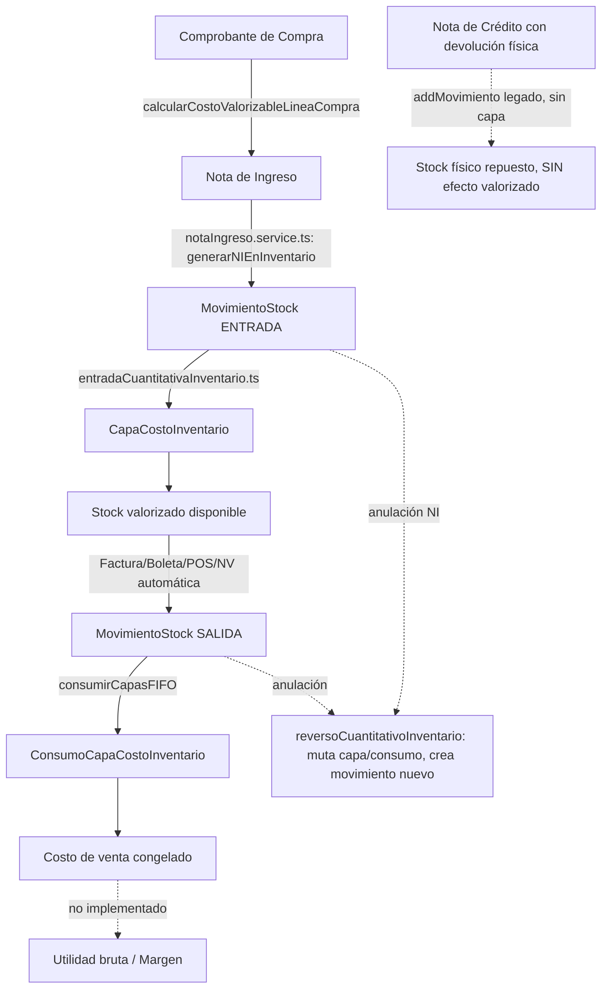

# Auditoría de Inventario Valorizado y Preparación para Rentabilidad

**Fecha:** 2026-07-29 · **Rama auditada:** `Rentabilidad` · **Tipo:** auditoría de solo lectura (sin cambios de código)

---

## 1. Veredicto ejecutivo

**APROBADO CON OBSERVACIONES.**

El motor de Kardex valorizado (capas de costo FIFO, consumo, transferencias, reversos) está sólidamente implementado y probado **para el alcance que efectivamente cubre**. Existen brechas reales — no del núcleo de costeo, sino de la periferia (transferencias entre establecimientos, devoluciones físicas, sincronización de estados en Compras, y sobre todo el lado de Ventas) — que deben resolverse o acotarse explícitamente antes de construir Rentabilidad sobre ellas.

- **¿El Kardex valorizado está completo?** Parcialmente. Completo para entradas (Compras/NI/ajustes/importación), salidas (Factura/Boleta/POS/NV automática/NS/ajustes) y transferencias/reversos **intra-establecimiento**. Incompleto para transferencias **entre establecimientos** (usan una ruta legada que nunca genera capas) y para devoluciones físicas por Nota de Crédito (nunca reactivan costo). Ver §5, §9.
- **¿El costo de venta es confiable?** Sí, **cuando existe** — el costo persistido en `ConsumoCapaCostoInventario` es un snapshot congelado, nunca recalculado, con relación real al documento y a la capa de origen. Pero solo existe si `estadoValorizacion === 'activa'` en el momento de la venta; no hay reconstrucción retroactiva de ventas históricas cuantitativas. Ver §7.
- **¿El stock valorizado es confiable?** Sí. Respeta empresa/establecimiento/almacén/búsqueda, excluye capas revertidas/agotadas, y se calcula antes de paginar (verificado en código, no solo documentado). Ver §8.
- **¿Compras está correctamente conectado?** Sí, con una inconsistencia real de sincronización: un Comprobante de Compra queda bloqueado para anulación de forma **permanente** tras generar una Nota de Ingreso, incluso si esa NI luego se anula (el reverso de inventario funciona, pero el estado del CC nunca se resincroniza). Ver §6.
- **¿Puede calcularse margen bruto actualmente?** **No.** Cero implementación de utilidad/margen en todo el repositorio (confirmado por búsqueda exhaustiva). Falta un campo de "venta neta" (ni siquiera hay una fórmula única de descuento por línea entre los subsistemas de Emisión y Documentos Comerciales), y no existe un id de línea compartido entre el lado comercial (`CartItem`) y el lado de inventario (`ConsumoCapaCostoInventario`) — la unión debe hacerse por `documentoOrigenId + productoId`, no por un id de línea único de extremo a extremo. Ver §7, §10.
- **¿Qué impide avanzar?** Nada bloquea el **diseño** de Rentabilidad (el diseño técnico ya existe, ver §11). Sí deben resolverse antes de calcular utilidad con confianza: (a) definir una fórmula única de "venta neta" por línea, (b) decidir cómo tratar ventas sin valorización activa en el momento de la venta, (c) decidir cómo tratar devoluciones físicas (hoy no revierten costo). Ninguna requiere rediseñar el motor de capas.

---

## 2. Alcance revisado

**Módulos/carpetas:** `gestion-inventario` (completo, ~140 archivos), `compras` (modelos, servicios, mapeadores, contexto, componentes de listado), `comprobantes-electronicos` (hooks de emisión, POS, lista de comprobantes), `documentos-comerciales` (Nota de Venta, Orden de Venta, reserva de stock), `indicadores-negocio` (página, componentes, store, integración), `configuracion-sistema` (estado de valorización, moneda), `shared/columns`, `shared/export`, `shared/currency`, `shared/tenant`.

**Servicios clave inspeccionados:** `consultaKardexValorizado.service.ts`, `servicioKardexValorizado.ts`, `entradaCuantitativaInventario.ts`, `salidaCuantitativaInventario.ts`, `transferenciaCuantitativaInventario.ts`, `reversoCuantitativoInventario.ts`, `operacionCuantitativaInventarioComun.ts`, `notaIngreso.service.ts`, `notaSalida.service.ts`, `valorizacionInicial.service.ts`, `mapeadorCCaNI.ts`, `servicioReservaStock.ts`, `useComprobanteActions.tsx`.

**Modelos:** `MovimientoStock`, `CapaCostoInventario`, `ConsumoCapaCostoInventario`, `ComprobanteCompra`/`LineaCompra`, `CartItem`/`InstantaneaDocumentoComercial`, `CuentaPorPagar`/`PagoCompra`.

**Pantallas:** Inventario → Movimientos, Stock Actual, Notas de Ingreso/Salida; Compras (5 tabs); Indicadores (Resumen/Reportes).

**Pruebas:** 56 archivos, 1094 tests (baseline confirmado por ejecución real, no asumido — ver §16, §17).

---

## 3. Arquitectura actual

Flujo real Compra → costo de venta, verificado en código (no documentación):



---

## 4. Inventario cuantitativo

**Estado:** completo y estable — es la capa sobre la que se construyó todo lo demás, sin cambios en esta iteración.

**Fortalezas:**
- `MovimientoStock` (`gestion-inventario/models/inventory.types.ts:46-96`) mantiene campos cuantitativos puros (`cantidad`, `cantidadAnterior`, `cantidadNueva`) más campos estructurales opcionales (`documentoOrigenId`, `tipoDocumentoOrigen`, `lineaOrigenId`, `capaId`, `estado`, `movimientoReversoDeId`) — deliberadamente **sin ningún campo monetario** (comentario explícito líneas 79-83: el valor vive solo en capas/consumos).
- Reconciliación de stock (`utils/reconciliacionStockInventario.ts`, 23 tests) verifica consistencia entre stock proyectado y capas, independiente del valor.

**Riesgos:** ninguno nuevo detectado en esta auditoría; el cuantitativo es la base ya validada en etapas previas.

---

## 5. Kardex valorizado

**Estado:** sólido en su núcleo, con una brecha estructural real en transferencias inter-establecimiento.

**Fuentes de verdad confirmadas:**
- Entradas: `costoUnitarioBaseMonedaBase` proviene siempre de la línea del documento (Compra/NI/ajuste/importación), nunca de `Product.precioCompra` en el flujo recurrente — `entradaCuantitativaInventario.ts:214-279` (`construirCapasEntradaValorizada`) toma el costo directo de la línea (línea 232).
- Salidas: `consumirCapasFIFO` (`operacionCuantitativaInventarioComun.ts:522-568`) selecciona capas por `ordenarCapasFifo` (fechaEntrada→fechaCreacion→id) y congela el costo en `ConsumoCapaCostoInventario` en el momento del consumo (líneas 543-557) — nunca recalculado después (confirmado por test dedicado del repositorio: "el repositorio no los recalcula").
- Multi-capa: ejemplo obligatorio verificado en 3 lugares independientes (`importacionCuantitativaInventario.test.ts`, `salidaCuantitativaInventario.test.ts`, `consultaKardexValorizado.service.test.ts`): 10 unidades a costo 10 + 2 a costo 12 = **124**.

**Trazabilidad:**
- Reversos (`reversoCuantitativoInventario.ts`): mutan la MISMA capa/consumo (`estado:'revertida'/'revertido'`), nunca crean filas compensatorias; el `MovimientoStock` original **nunca se edita** — se crea uno nuevo con `movimientoReversoDeId`. Protegido contra doble reverso (`yaFueRevertido`).

**Brecha real (Importante):** **transferencias entre establecimientos distintos usan una ruta completamente separada y legada** (`InventoryService.registerTransferSalida/registerTransferEntrada`, `services/inventory.service.ts:342-441`) que **nunca** importa ni escribe `CapaCostoInventario`/`ConsumoCapaCostoInventario`. Solo las transferencias **intra**-establecimiento pasan por el motor valorizado (`transferenciaCuantitativaInventario.ts`, cableado real en `useInventory.ts:495-536` vía `valorizacionHabilitada`). Consecuencia: el stock físico se mueve correctamente entre establecimientos, pero el Kardex valorizado queda mudo para ese movimiento — se proyectará como `tieneValorizacion:false` para siempre, sin importar que la empresa esté en `activa`.

**Evidencia de calidad:** cero uso de `Product.precioCompra` como costo real (solo como propuesta editable en valorización inicial, con confirmación explícita obligatoria); cero recálculo de FIFO en lectura; cero lectura de repositorio por fila.

---

## 6. Compras y costo de adquisición

**IGV:** capturado neto o bruto según `resolverRecuperabilidadImpuesto` (`mapeadorCCaNI.ts:108-131`) — nunca asume recuperabilidad sin una determinación explícita; lanza si `tratamientoImpuestoCompra==='pendiente_configuracion'`.

**Descuentos:** solo existe descuento **por línea** (`LineaCompra.descuentoUnitario`), ya incorporado en `subtotal`/`total` antes de llegar a la capa. **No existe descuento global ni prorrateo** — búsqueda exhaustiva sin resultados.

**Gastos adicionales (landed cost):** **no existe ningún concepto de flete/seguro/gastos de importación** en Compras — el costo capturado es exclusivamente el importe de la línea del comprobante.

**Moneda:** `cc.tipoCambio` (histórico, del propio documento) se congela en la capa (`tipoCambioAplicado`, `fechaTipoCambio`) — nunca se usa el tipo de cambio vigente para releer una operación ya registrada. Lanza si falta un TC válido para moneda extranjera (nunca asume TC=1).

**Ingreso:** relación estrictamente **1 Comprobante de Compra → 1 Nota de Ingreso** (todo o nada) — `procesarGeneracionNIDesdeCC` (`ContextoCompras.tsx:1720-1722`) bloquea explícitamente una segunda NI del mismo CC. **No existe recepción parcial.**

**Anulaciones — inconsistencia real (Importante):** `motivoBloqueoAnulacionCC` (`reglasCompras.ts:572-588`) bloquea la anulación de un CC si tiene NI relacionada, **sin distinguir si esa NI ya fue anulada**. `anularNI` (`useNotasIngreso.ts:136-192`) revierte el inventario correctamente (vía `reversoCuantitativoInventario.ts`) pero **nunca resincroniza** `cc.notasIngresoRelacionadas`/`cc.estadoInventario`. Resultado: un CC con una NI ya anulada **nunca puede anularse** por esta vía, y su `estadoInventario` queda mostrando un valor desactualizado.

**Separación costo/deuda/pago:** confirmada estructuralmente — `CuentaPorPagar`/`PagoCompra` no tienen ningún campo de costo/producto/capa, y ningún servicio de pagos importa nada de `gestion-inventario`. Pagar tarde, parcial o anular un pago **nunca** puede alterar el costo ya congelado en una capa.

---

## 7. Ventas y costo de venta

**Documentos que generan salida real:** Factura/Boleta/POS (mismo código, `useComprobanteActions.tsx:928`) y Nota de Venta en modo `'automatico'` (`servicioReservaStock.ts:493`, mismo motor). Nota de Venta en modo `'nota_salida'` difiere la salida real hasta que se genera una Nota de Salida. **Orden de Venta nunca genera salida real** — solo reserva.

**Vinculación:** `MovimientoStock.lineaOrigenId === ConsumoCapaCostoInventario.lineaDocumentoSalidaId` (mismo id sintético `${documentoIdVenta}-${indice}`) — unión sólida entre movimiento y consumo. **Pero** el `CartItem` (lado comercial: producto, precio, descuento) **no tiene ese mismo id de línea** — la unión hacia el costo debe hacerse por `(documentoOrigenId, productoId)`, no por un id de línea único de extremo a extremo. Es una unión confiable (el carrito fusiona duplicados del mismo producto), pero es una unión de dos niveles de id, no uno solo.

**Anulación:** mismo motor (`reversoCuantitativoInventario.ts`), localiza movimientos por `documentoOrigenId + tipoDocumentoOrigen + claveIdempotencia`, restaura consumos/capas.

**Brecha crítica (Bloqueante para devoluciones):** **Nota de Crédito con devolución física NO usa el motor valorizado.** Usa la fachada legada `addMovimiento` (`inventory.facade.ts`), crea un `MovimientoStock` tipo `ENTRADA`/`DEVOLUCION_CLIENTE` **sin `documentoOrigenId`, sin capa nueva, sin reversar el consumo original**. Hoy, una devolución física repone la cantidad pero el costo de esa mercadería queda permanentemente fuera del Kardex valorizado.

**Descuentos — inconsistencia real:** `usePayment.calculateTotals` (comprobantes-electronicos, usado por Factura/Boleta/POS) **ignora `descuentoItem` por completo**; `calcularDesgloseTributos` (documentos-comerciales, usado por Cotización/OV/NV) **sí lo aplica** pero agrupa por tasa de impuesto, no por línea. El descuento global nunca se redistribuye a las líneas. **No existe un campo "venta neta" en ningún lado.**

**Ventas gratuitas:** bloqueadas explícitamente (`price <= 0` rechaza la emisión completa) — no representable hoy.

**Productos no inventariables/servicios:** correctamente excluidos, con una defensa fail-closed en el motor (`validarLinea` rechaza toda la operación si el producto no es inventariable, sin importar qué decida la UI) — mitiga una inconsistencia real entre canales (Emisión Tradicional usa `esProductoInventariable`; POS usa una heurística distinta basada en presencia de datos de stock).

**Multi-almacén:** una sola línea del carrito puede repartirse entre almacenes vía FIFO; cada segmento genera su propio movimiento/consumo — correcto.

**Costo valorizado condicional:** solo existe si `resolverModoOperacion(estadoValorizacion) === 'valorizado_exclusivo'` en el momento exacto de la venta. Si la empresa no está en ese estado, la venta es puramente cuantitativa — sin costo, sin posibilidad de reconstrucción retroactiva.

**Utilidad bruta / margen bruto:** **cero implementación** — búsqueda exhaustiva de `utilidadBruta`/`margenBruto`/`grossProfit`/`grossMargin` en todo el repositorio: 0 resultados.

---

## 8. Stock valorizado

- Cálculo: `calcularValorStockPorProductoAlmacen` (`consultaKardexValorizado.service.ts:180-204`) excluye explícitamente capas `estado==='revertida'` y `cantidadDisponible<=0`.
- Alcance: `datosDisponibilidad` (`useInventarioDisponibilidad.ts:186-272`) ya filtra por establecimiento/almacén desde el cálculo base.
- Filtros: `valorInventarioValorizado` se suma sobre `datosFiltrados` (post-búsqueda/"solo con disponible"), **nunca** sobre `datosOrdenados`/`datosPaginados` — verificado línea por línea en el código, con comentario explícito confirmando la intención.
- Paginación: la suma ocurre **antes** de `datosPaginados` (que deriva de `datosOrdenados`, que deriva de `datosFiltrados`) — no hay riesgo de que la paginación recorte el total.
- Doble conteo: no detectado — cada capa contribuye una sola vez, indexada por `productoId:almacenId`.

---

## 9. Trazabilidad de extremo a extremo

| Origen | Documento | Movimiento | Artefacto valorizado | Reverso | Estado |
|---|---|---|---|---|---|
| Compra | Comprobante de Compra → Nota de Ingreso | `MovimientoStock` ENTRADA | `CapaCostoInventario` | Muta capa (`revertida`), crea movimiento nuevo | ✅ Completo |
| Ajuste positivo | Ajuste manual | `MovimientoStock` AJUSTE_POSITIVO | `CapaCostoInventario` | Igual que entrada | ✅ Completo |
| Importación (incremento) | Lote de importación | `MovimientoStock` ENTRADA | `CapaCostoInventario` | Igual que entrada | ✅ Completo |
| Venta (Factura/Boleta/POS) | Comprobante electrónico | `MovimientoStock` SALIDA | `ConsumoCapaCostoInventario` | Muta consumo+capa, crea movimiento nuevo | ✅ Completo (solo si `estadoValorizacion==='activa'` al momento de la venta) |
| Nota de Venta (automática) | NV | `MovimientoStock` SALIDA | `ConsumoCapaCostoInventario` | Igual que venta | ✅ Completo |
| Nota de Salida | NS | `MovimientoStock` SALIDA | `ConsumoCapaCostoInventario` | Igual que venta | ✅ Completo |
| Transferencia intra-establecimiento | Transferencia | SALIDA+ENTRADA | Consumo (origen) + capa espejo (destino) | Ambas legs mutadas, 2 movimientos nuevos | ✅ Completo |
| **Transferencia inter-establecimiento** | Transferencia | SALIDA+ENTRADA | **Ninguno** | N/D | ❌ **No genera capa/consumo — ruta legada** |
| **Nota de Crédito (devolución física)** | NC | `MovimientoStock` ENTRADA (legado) | **Ninguno** | N/D | ❌ **No reactiva capa ni revierte consumo original** |

---

## 10. Preparación para utilidad y margen

| Dato requerido | Fuente actual | Relación disponible | Confiabilidad | Brecha |
|---|---|---|---|---|
| Documento de venta | `InstantaneaDocumentoComercial` | `documentoOrigenId` en movimiento/consumo | Alta | Ninguna |
| Ítem de venta (producto, cantidad, precio) | `CartItem` | Por `productoId`, no por `lineaId` compartido | Media | Falta un id de línea común entre lado comercial y lado inventario |
| Producto | `Product`/`productoId` en ambos lados | Directa | Alta | Ninguna |
| Almacén | `almacenId` en movimiento | Directa | Alta | Ninguna |
| Movimiento de salida | `MovimientoStock` | `lineaOrigenId` | Alta | Ninguna |
| Consumos valorizados | `ConsumoCapaCostoInventario` | `lineaDocumentoSalidaId` | Alta, **solo si venta ocurrió con valorización activa** | Ventas cuantitativas históricas no tienen costo, por diseño (correcto, pero limita cobertura) |
| Importe neto vendido ("venta neta") | **No existe como campo** | N/A | Baja — ni siquiera hay fórmula única entre subsistemas | Requiere definir y unificar el cálculo de descuento por línea |
| Moneda | `monedaBase`/`ConsumoCapaCostoInventario.monedaBase` | Directa | Alta | Ninguna |
| Tipo de cambio histórico | `CapaCostoInventario.tipoCambioAplicado` | Directa (congelado) | Alta | Ninguna |
| Estado del comprobante | `EstadoDocumentoCC`/estado de comprobante | Directa | Alta | Debe excluirse anulados del cálculo de utilidad (no verificado que ya se excluyan en ningún reporte, porque no existe reporte) |

**Fórmulas evaluadas (no implementadas):**
- *Venta neta* = requiere derivación nueva; hoy ningún subsistema la calcula de forma consistente por línea.
- *Costo de venta* = suma de `ConsumoCapaCostoInventario.valorConsumidoMonedaBase` por `lineaDocumentoSalidaId`/`documentoOrigenId` — **esta parte SÍ está lista**.
- *Utilidad bruta* = venta neta − costo de venta — bloqueada por la ausencia de "venta neta".
- *Margen bruto %* = utilidad bruta / venta neta × 100 — misma dependencia.

**Distinción obligatoria:** utilidad/margen **bruto** (venta neta − costo de venta) es lo único para lo que existen datos parciales. Utilidad/margen **neto** (después de gastos administrativos, planilla, alquileres, comisiones, impuestos empresariales) **no tiene ninguna fuente real en el sistema hoy** — no debe mezclarse ni inferirse.

---

## 11. Indicadores y Reportes actuales

**Estructura confirmada:** `IndicadoresPage.tsx` con dos vistas por query param (`?view=reportes`), no rutas separadas: "Resumen" (KPIs de venta: total ventas, ticket promedio, top productos/vendedores/clientes, formas de pago — ningún campo de costo) y "Reportes" (`ReportsHub.tsx`, catálogo de 8 categorías de reporte con auto-export por deep-link).

**Reutilizable:** el mecanismo `REPORTS_HUB_PATH` ('/indicadores?view=reportes') + `useAutoExportRequest`/`autoExportParams.ts` ya es el patrón estándar para que un módulo destino reciba `autoExport=1` y regrese al hub tras exportar. `@/shared/columns/ColumnsManager` y `exportDatasetToExcel`/`cargarXlsx` (lazy-loaded) son la infraestructura real ya compartida.

**No debe duplicarse:** ni el patrón de exportación, ni `ColumnsManager`, ni el mecanismo de filtro de período (aunque cada módulo hoy hand-rolls su propio `DateRangePicker`/inputs de fecha — no hay uno global reutilizable, es una inconsistencia preexistente, no algo a replicar).

**Hallazgo relevante:** el diseño técnico ya existente (`docs/diseno-tecnico-kardex-valorizado-integracion-compras.md`, §27.3 y Etapa 5) **ya prevé explícitamente** que los reportes de rentabilidad se agreguen como nuevas entradas en `reportDefinitions.ts` bajo una categoría **"Rentabilidad"** dentro del Reports Hub existente — esta auditoría confirma que esa decisión de diseño previa es consistente con la estructura real del código.

---

## 12. Recomendación de ubicación UX

**Ubicación recomendada: Indicadores → Reportes → nueva categoría "Rentabilidad".**

```
Indicadores
├── Resumen
└── Reportes
    └── Rentabilidad
        ├── Resumen de utilidad (tarjetas)
        └── Detalle por venta / producto (tabla + Excel)
```

Esta estructura está respaldada por evidencia real, no es una preferencia estética:
- Ya existe el mecanismo de navegación (`ReportsHub.tsx` + `reportDefinitions.ts`) exactamente para esto.
- El diseño técnico previo del propio repositorio ya apunta a esta ubicación (§11).
- Separa correctamente "movimientos físicos" (Inventario) de "resultado comercial" (Indicadores) — principio explícitamente pedido en el encargo.

**Sería incorrecto:**
- **Nuevo tab de Inventario:** mezclaría un resultado financiero con movimientos físicos — Inventario ya tiene un alcance claro (cantidad + costo, nunca precio de venta ni utilidad).
- **Nueva columna aislada en Kardex:** el propio Kardex de Movimientos ya está acotado a costo (no utilidad) por diseño explícito de la etapa anterior — mezclarlo rompería esa separación deliberada.
- **Nuevo tab de Compras:** la utilidad depende de la venta, no de la compra — ubicarlo en Compras invertiría la relación causal.
- **Tarjeta sin detalle en Dashboard:** no existe "Dashboard" como concepto separado de Indicadores → Resumen; añadir una tarjeta sin detalle no resolvería la necesidad de auditar por producto/documento.
- **Módulo principal independiente:** no hay evidencia de que la navegación actual necesite un nuevo ítem de primer nivel — el menú lateral ya tiene 12 módulos; Rentabilidad es un reporte, no una operación transaccional nueva.

---

## 13. Propuesta funcional conceptual

*(Sin implementar — solo elementos con utilidad concreta, cada uno justificado.)*

- **Indicadores superiores:** Venta neta del periodo, Costo de venta del periodo, Utilidad bruta del periodo, Margen bruto % del periodo — los 4 valores que la fórmula bruta produce, nada más (no "utilidad neta" hasta que exista una fuente real de gastos).
- **Filtros:** periodo (reutilizar `DateRangePicker` de Indicadores), establecimiento (reutilizar el `<select>` ya existente) — ambos ya existen en Indicadores. Producto/categoría: solo si se confirma que aporta valor real de análisis (no "por colocar").
- **Tabla detallada:** una fila por línea de venta con valorización disponible — columnas mínimas: fecha, documento, producto, cantidad, venta neta, costo de venta, utilidad bruta, margen bruto %.
- **Columnas opcionales:** cliente, vendedor, almacén, moneda (reutilizando el mismo criterio de `ColumnsManager` ya aplicado en Compras/Movimientos).
- **Gráficos útiles:** margen bruto % por producto (identifica productos con margen bajo) y evolución de utilidad bruta en el tiempo — ambos con una utilidad de decisión concreta, no decorativos.
- **Navegación:** desde una tarjeta en Indicadores → Resumen (si se decide mostrar un resumen ahí) hacia Reportes → Rentabilidad (detalle), igual patrón que ya usa el resto del hub.
- **Excel:** mismo botón "Exportar", mismo `exportDatasetToExcel`, exporta el conjunto filtrado completo (no la página visible), nunca IDs técnicos.

---

## 14. Reutilización técnica

| Necesidad | Componente/servicio existente | Reutilizable | Adaptación requerida |
|---|---|---|---|
| Costo de venta por línea | `ConsumoCapaCostoInventario` + `consultaKardexValorizado.service.ts` | Sí | Ninguna — ya calcula esto exactamente |
| Unir venta con costo | `documentoOrigenId` + `productoId` | Sí, parcial | Escribir un nuevo selector de join (no existe hoy) — sería el único servicio nuevo justificable |
| Venta neta por línea | Ninguno unificado | No | Requiere decisión de producto: qué fórmula de descuento usar |
| Botón Exportar | `exportDatasetToExcel`/`cargarXlsx` | Sí | Ninguna |
| ColumnsManager | `@/shared/columns/ColumnsManager` | Sí | Ninguna — mismo patrón que Compras |
| Filtro de periodo | `DateRangePicker` (indicadores-negocio) | Sí | Ninguna |
| Filtro de establecimiento | `<select>` de Indicadores | Sí | Ninguna |
| Navegación Reportes | `ReportsHub.tsx` + `reportDefinitions.ts` | Sí | Agregar entradas, no crear infraestructura nueva |
| Gráficos | `charts` (ya usado en Indicadores/Compras) | Sí | Ninguna |
| Permisos | `indicadores.ver` | Sí | Ninguno nuevo necesario, salvo decisión explícita de negocio de restringir por separado (ver §21) |

---

## 15. Hallazgos

| Severidad | Hallazgo | Evidencia | Impacto | Recomendación |
|---|---|---|---|---|
| Importante | Transferencias inter-establecimiento no generan capa/consumo | `services/inventory.service.ts:342-441` (ruta legada, sin import de capas) | El Kardex valorizado queda incompleto para ese movimiento de forma permanente | Evaluar (fuera de esta auditoría) migrar esa ruta al motor valorizado antes de reportar rentabilidad multi-establecimiento |
| Importante | NC con devolución física no revierte costo valorizado | `useComprobanteActions.tsx:961-1073` usa `addMovimiento` legado, sin `documentoOrigenId`/capa | Devoluciones no recuperan costo; el margen de un producto devuelto quedaría mal calculado si se incluye | Debe decidirse explícitamente cómo tratar devoluciones antes de incluirlas en Rentabilidad |
| Importante | CC nunca se puede anular tras generar NI, incluso si la NI ya fue anulada | `reglasCompras.ts:572-588` + `useNotasIngreso.ts:136-192` (no resincroniza) | Inconsistencia de estado visible en Compras, no afecta el costo ya congelado | Fuera de alcance de Rentabilidad; documentar como deuda técnica de Compras |
| Importante | Cero campo "venta neta"; descuento por línea inconsistente entre subsistemas | `usePayment.tsx` (ignora descuento) vs `documentoComercial.helpers.ts` (sí lo aplica) | Bloquea el cálculo de utilidad bruta hasta unificar | Debe resolverse como parte del diseño de Rentabilidad, no antes |
| Importante | Cero pruebas automatizadas de UI (`.test.tsx`) en todo `gestion-inventario` | Confirmado por búsqueda — 0 archivos | Las garantías de UI (gating por estado, "—" nunca inventado) están verificadas solo por lectura de código | Aceptar como limitación conocida (jsdom no instalado); no bloquea Rentabilidad si el nuevo reporte reutiliza los mismos servicios ya probados |
| Mejora | `StockSummary.valorTotalStock` y `resumen.valorTotal` (precio de venta) son código muerto/no consumido | `inventory.types.ts:143`, `useInventarioDisponibilidad.ts:401` | Cómputo desperdiciado, sin riesgo de datos incorrectos | Limpieza opcional, no urgente |
| Mejora | 5 tablas de Compras usan `localStorage` sin `lsKey` (no tenantizado) | `TablaComprobantesCompra.tsx:100/120/136` y 4 análogos | Preferencia de columnas compartida entre empresas del mismo navegador — no es fuga de datos de negocio, es cosmético | Corregir cuando se toque Compras de nuevo, no urgente |
| Mejora | 2 supresiones reales de tipo (`any`) en callbacks de NI/NS compartidos con selector de productos | `FormularioNotaIngreso.tsx:373-374`, `FormularioNotaSalida.tsx:318-319` | Pérdida de seguridad de tipos en un callback, sin evidencia de bug actual | Tipar cuando se toque ese formulario |
| Sin impacto real | `'PEN'` como fallback en `PanelImportacionStock.tsx:401` | Solo puebla un campo de bitácora del lote, no la capa de costo | Ninguno confirmado | No requiere acción |
| Sin impacto real | Símbolo `'S/'`/`'$'` hardcodeado en `DetalleNotaSalida.tsx` | Patrón ya extendido en varios módulos de venta, fuera del alcance de esta auditoría | Cosmético | No requiere acción en esta etapa |

*No se incluyen hallazgos de "servicio paralelo", "lectura por fila O(n²)", "tipo duplicado" ni "TODO/FIXME" — se buscaron exhaustivamente y se confirmó su ausencia (ver evidencia en cada sección).*

---

## 16. Cobertura de pruebas

**Motor de Kardex (unit/integración, todas sobre lógica pura — sin DOM):**

| Área | Archivo | # `it(` |
|---|---|---|
| Entradas | `entradaCuantitativaInventario.test.ts` | 22 |
| Salidas | `salidaCuantitativaInventario.test.ts` | 44 |
| Transferencias | `transferenciaCuantitativaInventario.test.ts` | 22 |
| Reversos | `reversoCuantitativoInventario.test.ts` | 23 |
| Importación | `importacionCuantitativaInventario.test.ts` / `importacionValorizadaInventario.test.ts` | 15 / 10 |
| Repositorios de capas/consumos | `capaCostoInventario.repository.test.ts` / `consumoCapaCostoInventario.repository.test.ts` | 26 / 23 |
| Máquina de estados de valorización | `estadoActivacionValorizacionInventario.test.ts` | 16 |
| Valorización inicial | `valorizacionInicial.service.test.ts` | 85 |
| Orquestador central | `servicioKardexValorizado.test.ts` / `.ajusteValorizado.test.ts` | 45 / 11 |
| Consulta valorizada (Kardex de lectura) | `consultaKardexValorizado.service.test.ts` | 15 |
| Nota de Ingreso / Nota de Salida | `notaIngreso.service.test.ts` / `notaSalida.service.test.ts` | 29 / 49 |
| Reserva de stock (NV/OV) | `servicioReservaStock.test.ts` | 26 |
| Ventas → inventario | `useComprobanteActions.test.ts` | 31 |
| Mapeador Compra→NI | `mapeadorCCaNI.test.ts` | 31 |
| Sincronización CC↔NI | `ContextoCompras.ni.test.ts` | 12 |
| Reglas de Compras | `reglasCompras.test.ts` | 33 |
| Pagos/Cuentas por Pagar | `servicioCuentaPorPagar.test.ts` / `servicioPagoCompra.test.ts` | 17 / 10 |

**Brechas reales:**
- **Cero archivos `.test.tsx`** en todo el repositorio bajo `gestion-inventario` — ningún componente de UI (Movimientos, Stock Actual, modales) tiene prueba automatizada propia. El repositorio no tiene `jsdom`/`@testing-library/react` instalado (`vitest.config.ts` usa `environment:'node'`).
- **Cero prueba que ejercite el join comercial↔costo** (venta neta, utilidad bruta) — no existe porque la funcionalidad no existe.
- **Cero prueba de POS como integración propia** — se apoya en la cobertura de `useComprobanteActions.test.ts` al compartir código, correcto pero sin verificación directa del canal POS.

**Nivel de confianza:** alto para el motor de capas/consumo/reversos (lógica pura, exhaustivamente probada, con ejemplos numéricos verificados). Medio para la integración venta↔costo (probada en el nivel de "se creó el consumo correcto", no en el nivel de "se puede calcular utilidad"). Bajo/nulo para cualquier cálculo de rentabilidad (no existe código que probar).

---

## 17. Validaciones ejecutadas

| Comando | Resultado |
|---|---|
| `git status --short` | Limpio (sin cambios) |
| `git branch --show-current` | `Rentabilidad` |
| `npx tsc -b --noEmit` | ✅ Limpio, sin errores |
| `npm run lint` (workspace senciyo) | ✅ 0 errores, 0 warnings |
| `npm run build` (SenciYo) | ✅ Exitoso |
| `npm run build:pm` (Portal PM) | ✅ Exitoso |
| `npx vitest run` | ✅ 56 archivos, **1094/1094** pruebas |
| `npm ls vitest` | `vitest@3.2.7`, sin cambios de dependencias |
| `git diff --check` | Sin errores |

No se corrigió ningún fallo (no hubo ninguno que corregir). No se modificó `package.json` ni lockfiles.

---

## 18. Archivos relevantes

**Modelos:** `gestion-inventario/models/{inventory.types,capaCostoInventario.types,consumoCapaCostoInventario.types,estadoActivacionValorizacion.types}.ts`, `compras/modelos/{ComprobanteCompra,LineaCompra,OrdenCompra,CuentaPorPagar,PagoCompra}.ts`, `comprobantes-electronicos/.../comprobante.types.ts`.

**Servicios:** `gestion-inventario/services/{servicioKardexValorizado,consultaKardexValorizado.service,notaIngreso.service,notaSalida.service,valorizacionInicial.service}.ts`, `gestion-inventario/utils/{entradaCuantitativaInventario,salidaCuantitativaInventario,transferenciaCuantitativaInventario,reversoCuantitativoInventario,operacionCuantitativaInventarioComun}.ts`, `compras/mapeadores/mapeadorCCaNI.ts`, `documentos-comerciales/utils/servicioReservaStock.ts`.

**Repositorios:** `gestion-inventario/repositories/{capaCostoInventario,consumoCapaCostoInventario,stock}.repository.ts`.

**UI:** `gestion-inventario/pages/InventoryPage.tsx`, `gestion-inventario/components/tables/MovementsTable.tsx`, `gestion-inventario/components/modals/MovimientoDetalleModal.tsx`, `gestion-inventario/components/disponibilidad/{DisponibilidadTable,InventarioSituacionPage,DisponibilidadSettings}.tsx`, `compras/componentes/listados/Tabla*.tsx`, `indicadores-negocio/pages/IndicadoresPage.tsx`, `indicadores-negocio/components/ReportsHub.tsx`.

**Stores/hooks:** `gestion-inventario/hooks/{useInventory,useInventarioDisponibilidad,useNotasIngreso}.ts`, `comprobantes-electronicos/hooks/useComprobanteActions.tsx`, `indicadores-negocio/hooks/useIndicadores.ts`.

**Exportación:** `shared/export/exportToExcel.ts`, `shared/export/cargarLibreriasExcel.ts`, `shared/export/autoExportParams.ts`, `shared/columns/ColumnsManager.tsx`.

**Pruebas:** las 17 filas de la tabla en §16.

---

## 19. Qué está terminado

- Motor de entradas valorizadas (Compras/NI/ajuste positivo/importación con incremento), con costo real, IGV neto/bruto según recuperabilidad, moneda extranjera con TC histórico congelado.
- Motor de salidas FIFO (Factura/Boleta/POS/NV automática/NS/ajuste negativo/importación con reducción), costo congelado, multi-capa verificado.
- Transferencias intra-establecimiento con magnitud garantizada idéntica origen↔destino.
- Reversos/anulaciones que mutan el artefacto original y crean un movimiento nuevo, con protección contra doble reverso.
- Servicio de consulta valorizada (`consultaKardexValorizado.service.ts`) — único, sin duplicación, sin recalcular FIFO, sin usar precio de venta/compra.
- Stock Actual valorizado: valor por producto/almacén, valor total respetando filtros y paginación, exclusión de capas revertidas/agotadas.
- UI de Movimientos con columnas configurables (operativas + valorizadas), detalle de origen del costo sin IDs técnicos, Excel que respeta la misma proyección.
- Separación estructural costo/deuda/pago en Compras.

---

## 20. Qué falta realmente

**Necesario para margen bruto:**
- Definir y unificar una fórmula única de "venta neta" por línea (hoy dos subsistemas la calculan distinto, uno de ellos no la calcula en absoluto).
- Construir el selector de join documento-de-venta ↔ costo (por `documentoOrigenId`+`productoId`) — el único servicio nuevo razonablemente necesario.
- Decidir el tratamiento de ventas sin valorización activa en el momento de la venta (excluir del reporte, o marcar como "sin costo registrado").

**Necesario para devoluciones/notas de crédito:**
- Decidir si las devoluciones físicas deben empezar a pasar por el motor valorizado (hoy no lo hacen) antes de incluirlas en cualquier cálculo de utilidad — de lo contrario, un producto devuelto no descontará su costo del cálculo.

**Necesario para moneda extranjera:**
- Ninguna brecha adicional detectada más allá de las ya cubiertas por el motor existente (TC histórico ya se congela correctamente en capas y consumos).

**Opcional o futuro:**
- Migrar transferencias inter-establecimiento al motor valorizado.
- Resolver la sincronización CC↔NI tras anulación.
- Limpiar código muerto (`StockSummary.valorTotalStock`, `resumen.valorTotal`).
- Tenantizar las claves de columnas de Compras.
- Utilidad/margen **neto** — requiere una fuente real de gastos que hoy no existe; explícitamente fuera de alcance.

---

## 21. Riesgos antes de continuar

*(Solo riesgos demostrados en código, no hipotéticos.)*

- **Riesgo de subestimar costo en reportes de rentabilidad si se incluyen transferencias inter-establecimiento o devoluciones físicas** sin tratamiento especial — ambas rutas no generan/revierten capas hoy.
- **Riesgo de inconsistencia visual en Compras** (CC que parece "con inventario completo" pero cuya NI ya fue anulada) — no afecta el costo, pero puede confundir a quien audite manualmente el origen de una capa.
- **Riesgo de doble criterio de descuento** si Rentabilidad reutiliza `usePayment.tsx` para unas ventas y `documentoComercial.helpers.ts` para otras sin normalizar — produciría "venta neta" inconsistente entre Factura/Boleta/POS y Nota de Venta/Cotización.

No se identificó ningún riesgo de pérdida de datos, doble conteo de costo, ni fuga de datos entre empresas (aislamiento tenant verificado consistentemente en todos los repositorios de capas/consumos).

---

## 22. Recomendación final

1. **¿Se puede avanzar con rentabilidad?** Sí, en diseño y en la parte de costo (ya lista). No aún en la parte de venta neta (requiere decisión de producto antes de escribir código).
2. **¿Hay algún bloqueante?** Ninguno que impida diseñar. El único bloqueante real para **calcular con confianza** es la ausencia de una fórmula única de venta neta.
3. **¿Qué debe resolverse antes?** Unificar el cálculo de descuento/venta neta entre `usePayment.tsx` y `documentoComercial.helpers.ts`; decidir el tratamiento de devoluciones físicas y de ventas sin valorización activa.
4. **¿Cuál es la ubicación recomendada?** Indicadores → Reportes → nueva categoría "Rentabilidad" (ya previsto en el diseño técnico existente del repositorio).
5. **¿Qué debe evitarse duplicar?** El servicio de proyección de costo (`consultaKardexValorizado.service.ts`), el exportador (`exportDatasetToExcel`/`ColumnsManager`), y la navegación del Reports Hub (`reportDefinitions.ts`).
6. **¿Qué fuentes de verdad deben mantenerse?** `ConsumoCapaCostoInventario`/`CapaCostoInventario` para costo (nunca `Product.precioCompra` ni precio de venta); el documento de venta original para importe/descuento/impuesto (nunca inventado ni recalculado desde el costo).

---

**Ruta del archivo:** `docs/AUDITORIA_INVENTARIO_VALORIZADO_RENTABILIDAD.md`
