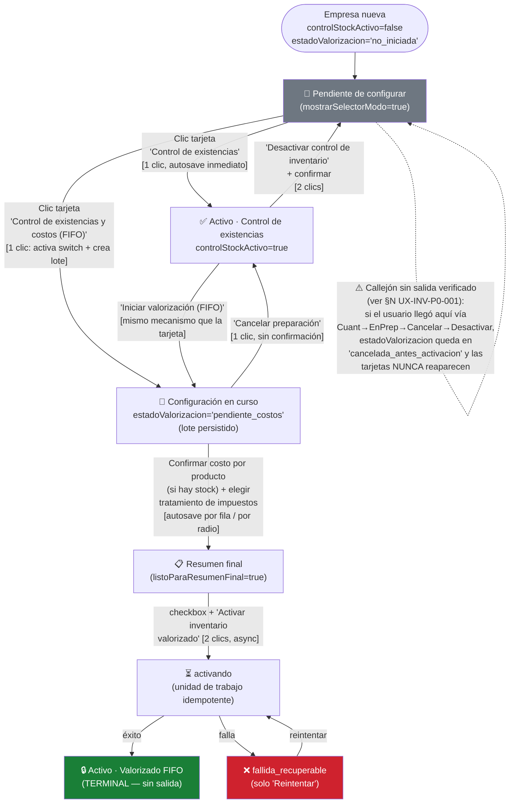
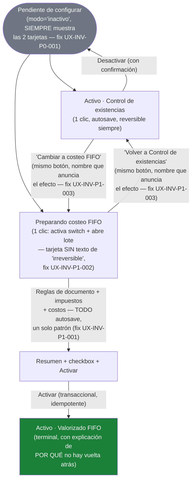

# Auditoría UX — Configuración actual de Inventario

**Fecha:** 2026-08-07
**Alcance:** Análisis exclusivo (sin modificar código) del flujo de configuración de Inventario, tal como existe hoy tras la centralización del 2026-08-05 (`docs/IMPLEMENTACION_CONFIGURACION_CENTRAL_INVENTARIO_2026-08-05.md`).
**No incluye:** motor FIFO/Kardex, Compras, Ventas, ni inventario operativo (movimientos, transferencias, alertas).
**Método:** lectura de código fuente (archivo:línea citado en cada afirmación), lectura de tests existentes donde aportan evidencia, e inferencia UX explícitamente marcada como tal. No se ejecutó el prototipo en navegador (sin infraestructura de render de componentes en el repo — ver nota en `docs/IMPLEMENTACION_CONFIGURACION_CENTRAL_INVENTARIO_2026-08-05.md` §J); toda afirmación de comportamiento está marcada **[código]** (deducida de leer la implementación) o **[test]** (respaldada por un test existente).

---

## A. Veredicto ejecutivo

## ⚠️ FUNCIONAL PERO DEMASIADO COMPLEJO

La arquitectura de fondo es sólida y ya adoptó la forma correcta — **una sola página con divulgación progresiva**, no un wizard ni un modal (`ConfiguracionInventario.tsx`, `/configuracion/inventario`). El problema no es la estructura; es que varias piezas de comportamiento dentro de esa página son **inconsistentes entre sí** (guardado mixto, nombres de acción que no explican su efecto, un texto de "irreversible" que aparece antes de que exista algo irreversible) y existe **un callejón sin salida real** confirmado por lectura de código (§K, CAM-07 no es el único caso — hay uno más grave descrito en §N, UX-INV-P0-001). No requiere una reescritura; requiere correcciones puntuales.

---

## B. Explicación del flujo actual en lenguaje simple

Imagina que entras por primera vez a Inventario. Ves un banner azul ("Configura tu inventario") con un botón. Lo sigues y llegas a una página nueva, `/configuracion/inventario`.

Ahí ves dos tarjetas: "Control de existencias" y "Control de existencias y costos (FIFO)". No hay ningún botón "Continuar" — **la tarjeta misma es el botón**. En el instante en que haces clic, el sistema ya activó algo: si elegiste la primera, tu inventario queda activo de inmediato (así de simple, sin paso adicional). Si elegiste la segunda, el sistema hizo dos cosas a la vez sin decírtelo explícitamente: activó el control de existencias Y empezó a preparar el costeo FIFO — pero esa preparación todavía se puede cancelar sin ningún daño.

Debajo aparece una tabla para decidir cómo cada documento (Factura, Nota de Venta, Guía) descuenta stock. Aquí SÍ hay un botón "Guardar cambios" — a diferencia de la tarjeta de arriba, que no lo tenía. Nada te avisa por qué unas cosas se guardan solas y otras necesitan botón.

Si elegiste FIFO, unas secciones más abajo te preguntan cómo tratar los impuestos de tus compras — esto se guarda solo, con solo hacer clic en el radio (otra vez sin botón, distinto de la tabla de arriba). Si tienes stock existente, tienes que confirmar el costo de cada producto uno por uno. Al final aparece un resumen con una advertencia de que "esto es irreversible", un checkbox que debes marcar, y un botón rojo para activar.

Una vez activado el FIFO, ya no hay ningún botón para volver atrás — ni siquiera en el primer segundo después de activar, aunque en ese instante exacto (antes de cualquier venta) técnicamente no se ha perdido nada todavía (ver §J).

---

## C. Estados actuales

### C.1 Las dos fuentes de verdad reales

No existe un "estado de Inventario" guardado como tal. Todo se **deriva** de dos campos ya existentes:

| Fuente | Tipo | Ubicación |
|---|---|---|
| `SalesPreferences.controlStockActivo` | `boolean \| undefined` | `configuracion-sistema/contexto/ContextoConfiguracion.tsx:98` |
| `PreferenciasInventario.estadoValorizacion` | enum de 9 valores | `configuracion-sistema/contexto/ContextoConfiguracion.tsx:121`, tipo en `gestion-inventario/models/estadoActivacionValorizacion.types.ts:18-27` |

`resolverModoInventario(controlStockActivo, estadoValorizacion)` (`gestion-inventario/utils/estadoActivacionValorizacionInventario.ts:68-76`) combina ambas en `ModoInventario = 'inactivo' | 'cuantitativo' | 'valorizado'`. `resolverEstadoVisualInventario(modo, estadoValorizacion)` (mismo archivo, líneas 110-119) traduce eso a los **5 estados visuales** que la UI realmente muestra.

### C.2 Los 5 estados visuales — fuente, significado y comportamiento

| Estado visual | Fuente técnica exacta [código] | Significado funcional | Significado para el usuario | ¿Puede quedar indefinidamente? | ¿Qué lo sacó de ahí? |
|---|---|---|---|---|---|
| `pendiente` | Rama `else` final de `resolverEstadoVisualInventario` (línea 118) — es el **catch-all**, no una condición explícita | Ni control de existencias ni valorización están activos, y no hay una preparación de FIFO en curso | "Pendiente de configurar" | Sí, indefinidamente — y también de forma **permanente e irrecuperable** en un caso concreto (§N, UX-INV-P0-001) | Elegir cualquiera de las dos tarjetas — **excepto en el caso roto** |
| `cuantitativo_activo` | `modo === 'cuantitativo'` sin estado de valorización en curso (línea 117) | Control de existencias activo, sin costeo | "Activo · Control de existencias" | Sí, indefinidamente — es un estado terminal válido, no requiere avanzar a FIFO nunca | Iniciar valorización, o desactivar (vuelve a `pendiente`) |
| `valorizado_activo` | `modo === 'valorizado' && estadoValorizacion === 'activa'` (línea 115) | FIFO activo, capas de costo operando | "Activo · Valorizado FIFO" | Sí — es terminal por diseño, **sin salida** (`TRANSICIONES_PERMITIDAS.activa = []`, línea 149) | Nada — no existe acción de salida |
| `configuracion_en_curso` | `estadoValorizacion` ∈ `{en_preparacion, pendiente_costos, validada, activando, fallida_recuperable}` (línea 116, lista en líneas 102-108) | Hay un lote de preparación de valorización abierto, todavía sin activar | "Configuración en curso" | Sí — nada fuerza a terminarlo ni a cancelarlo, puede quedar abierto indefinidamente sin penalidad | Cancelar preparación, o completar la activación |
| `requiere_atencion` | `estadoValorizacion === 'suspendida_por_inconsistencia'` (línea 114) | El motor detectó una inconsistencia entre stock físico y capas | "Requiere atención" | Sí, hasta que soporte intervenga — la UI no ofrece ninguna acción de auto-recuperación (`ConfiguracionInventario.tsx:415-427`, solo lectura) | Ninguna acción de la UI — requiere intervención externa |

### C.3 Hallazgo: `requiere_atencion` es hoy un estado **inalcanzable** desde la UI

Búsqueda exhaustiva (`grep -r "suspendida_por_inconsistencia'"`) confirma que **ningún** sitio de producción despacha ese valor — solo aparece en el tipo (`estadoActivacionValorizacion.types.ts`), en el resolvedor (`estadoActivacionValorizacionInventario.ts`), en un modal de solo-lectura (`MovimientoDetalleModal.tsx`) y en tests. Es un estado defensivo reservado para una detección futura del motor, no algo que un usuario pueda producir hoy. Es correcto que exista en el tipo (el switch exhaustivo de `resolverModoOperacion` lo exige, línea 36-40), pero es innecesario que la UI ya le dedique una sección completa (líneas 414-427) cuando, en la práctica actual, nunca se renderiza.

### C.4 La pregunta central de §4: ¿"Pendiente de configurar" e "Inactivo" son estados distintos?

**No existen dos etiquetas.** No hay ningún lugar del código que muestre el texto "Inactivo" para Inventario. Todo lo que hoy se llamaría conceptualmente "inactivo" (`modo === 'inactivo'`) se renderiza con el mismo texto: **"Pendiente de configurar"** (`ETIQUETA_ESTADO_VISUAL.pendiente`, `ConfiguracionInventario.tsx:102`; `ETIQUETA_INVENTARIO.pendiente`, `PanelConfiguracion.tsx:86`; `ETIQUETA_ESTADO_VISUAL_INVENTORY_PAGE.pendiente`, `InventoryPage.tsx:51`).

Esto responde la pregunta de raíz: la ambigüedad que percibe el usuario **no es que existan dos estados confusos** — es al revés: **existen dos situaciones reales distintas (nunca configurado vs. desactivado después de haber avanzado) que hoy comparten una sola etiqueta**, y una de esas dos situaciones ya no tiene forma de salir de "Pendiente" (§N, UX-INV-P0-001). El texto "Inactivo" que el usuario cree recordar probablemente viene de la ubicación anterior (`ModalConfiguracionInventario.tsx`, eliminada en la centralización) — no existe en el código actual.

---

## D. Flujo actual completo



### D.1 Tabla paso a paso

| Paso | Pantalla | Estado visible | Acción | Qué cambia realmente | ¿Se guarda? | ¿Puede volver? |
|---|---|---|---|---|---|---|
| 1 | `/inventario` | Banner "Configura tu inventario" (`CintilloControlStock.tsx`, visible solo si `!controlStockActivo`, `InventoryPage.tsx:611-616`) | Clic "Configurar inventario" | Solo navega — `navigate('/configuracion/inventario?returnTo=...')` (`InventoryPage.tsx:183-185`) | No aplica | Sí (botón "Volver"/query param) |
| 2 | `/configuracion/inventario` | "Pendiente de configurar" + 2 tarjetas (`mostrarSelectorModo`, línea 378) | Clic tarjeta "Control de existencias" | `dispatch SET_SALES_PREFERENCES {controlStockActivo:true, ...reglas}` (`activarCuantitativo`, líneas 198-214) | **Sí, inmediatamente** — autosave global (§E) | No aplica — ya está activo |
| 2' | `/configuracion/inventario` | "Pendiente de configurar" + 2 tarjetas | Clic tarjeta "FIFO" | `dispatch SET_SALES_PREFERENCES {controlStockActivo:true}` **+** `iniciarPreparacionValorizacion` crea un lote persistido y transiciona `no_iniciada→en_preparacion→pendiente_costos` en el mismo clic (`iniciarValorizado`, líneas 219-248) | **Sí, inmediatamente**, en dos colecciones de localStorage distintas (§E) | Sí — "Cancelar preparación" |
| 3 | Sección B | "Reglas por documento" (tabla) | Cambiar radios (Factura/Boleta, NV, GR) | Solo estado local de React (`localFyB`/`localNV`/`localGR`, líneas 150-152) — **nada persiste todavía** | **No** hasta clic en "Guardar cambios" | Sí, sin consecuencia — recargar descarta el cambio local |
| 4 | Sección B | — | Clic "Guardar cambios" | `dispatch SET_SALES_PREFERENCES` con los 3 campos (`guardarReglasDocumento`, líneas 180-195) | Sí, inmediatamente | No aplica |
| 5 (solo FIFO) | Sección C | "Tratamiento de impuestos de compra" | Clic un radio | `dispatch SET_PREFERENCIAS_INVENTARIO` directo — **sin botón intermedio** (`handleActualizarTratamiento`, líneas 328-334) | **Sí, inmediatamente** (autosave, sin "Guardar") | Sí — cambiar el radio de nuevo, autosave otra vez |
| 6 (solo FIFO con stock) | Sección D | Tabla de stock inicial | Escribir costo, clic "Confirmar" | `confirmarCostoDetalle` escribe directo al repositorio del lote (`ConfiguracionInventario.tsx:277-296`) — **tercer canal de persistencia**, fuera del contexto/reducer | Sí, inmediatamente, por fila | Sí — "Recalcular" si el stock cambió |
| 7 | Resumen | "Resumen antes de activar" | Marcar checkbox + clic "Activar inventario valorizado" | `validarYActivarValorizacion` — valida, transiciona `pendiente_costos→validada→activando→activa`, crea las `CapaCostoInventario` iniciales, todo en una unidad de trabajo idempotente (`handleActivarValorizacion`, líneas 338-376) | Sí, transaccionalmente (el mecanismo más robusto de todos, §E) | **No** — es la frontera real de irreversibilidad (§J) |

---

## E. Qué guarda cada acción

**Hallazgo central de esta sección:** conviven en la misma página **cuatro mecanismos de persistencia distintos**, sin ninguna señal visual que distinga cuál aplica a cada campo.

| Configuración | Autosave | Guardado explícito | Momento real de persistencia | Riesgo UX |
|---|---:|---:|---|---|
| Modo (tarjeta inicial) | ✅ | — | Al clic, vía `dispatch` + efecto global de `ContextoConfiguracion.tsx:2278-2318` que persiste TODO el snapshot del tenant en cada cambio de estado (`persistTenantSnapshot`, línea 2318) | Bajo — el usuario nunca pierde esto, pero tampoco entiende que ya se guardó (no hay ningún "✓ Guardado") |
| Reglas por documento | ❌ | ✅ Botón "Guardar cambios" (`ConfiguracionInventario.tsx:530-532`) | Solo al clic — antes de eso vive en `useState` local (líneas 150-152) | **Medio** — si el usuario cambia radios y navega con "Volver" o recarga sin guardar, el cambio se pierde **en silencio**, sin ninguna advertencia (`window.confirm`/`beforeunload` inexistente en todo el archivo) |
| Tratamiento de impuestos | ✅ | — | Al clic del radio, `dispatch` directo (línea 333) | **Medio-alto** — es visualmente casi idéntico a "Reglas por documento" (misma página, mismos radios, mismo estilo), pero se comporta al revés (autosave vs. botón) |
| Costo confirmado por producto/almacén | ✅ | — (el botón "Confirmar" es el propio disparador del autosave, no un "guardar" separado) | Inmediato, `confirmarCostoDetalle` escribe directo a `localStorage` vía el repositorio del lote (`valorizacionInicialInventario.repository.ts:103-113` → `guardarColeccionTenantizada`, `coleccionLocalStorageInventario.ts:136-139`) — **nunca pasa por el reducer de Contexto** | Bajo en términos de pérdida de datos, pero es una tercera arquitectura de persistencia distinta a las dos anteriores, invisible para quien lee solo `ConfiguracionInventario.tsx` sin seguir la cadena de imports |
| Cancelar preparación / Iniciar valorización | ✅ | — | Inmediato, mismo repositorio de lote + `dispatch SET_PREFERENCIAS_INVENTARIO` | Bajo |
| Activación final | ✅ (transaccional) | Botón "Activar inventario valorizado" es la propia activación, no un "guardar" de algo ya decidido antes | `ejecutarActivacionValorizacion` vía `reservarOperacionIdempotente` + `ejecutarUnidadTrabajoInventario` (`valorizacionInicial.service.ts:964-1061`) — el único mecanismo con manejo real de fallos/reintento/idempotencia | Bajo — es, con diferencia, la ruta mejor construida de las cuatro |

**Respuestas directas a §6:**
- ¿Se pierde si el usuario regresa? Solo las reglas por documento no guardadas (radios sin "Guardar cambios").
- ¿Se pierde si recarga? Igual — solo eso; todo lo demás ya está en `localStorage` de forma sincrónica en el mismo clic.
- ¿Se conserva si cierra el navegador / cambia de empresa? Sí para todo lo persistido — `localStorage` sobrevive cierre de pestaña; el cambio de empresa usa una clave de tenant distinta (`lsKey`), así que cada empresa ve su propio estado sin contaminación.
- ¿Existe indicador de cambios pendientes o confirmación antes de abandonar? **No, en ningún punto de la página** — ni para las reglas de documento (el único campo que sí puede perderse) ni para nada más.

**Conclusión de §6:** sí existe la "mezcla incoherente" que la auditoría pedía comprobar — es real, está en el código (no es una percepción), y afecta específicamente a dos secciones visualmente gemelas (Reglas por documento vs. Tratamiento de impuestos) que se comportan de forma opuesta sin ninguna pista visual.

---

## F. Selección inicial: Control de existencias vs. FIFO

Ambas tarjetas son un `<button>` que ejecuta una función con efectos reales en el mismo clic (`ConfiguracionInventario.tsx:437-461`) — **no navegan a ninguna otra pantalla, no son una selección "borrable"**, activan de inmediato:

- **"Control de existencias"** (`activarCuantitativo`, líneas 198-214): 1 clic → `controlStockActivo:true` persistido. Es una activación real, completa e inmediata, no una preparación.
- **"Control de existencias y costos (FIFO)"** (`iniciarValorizado`, líneas 219-248): 1 clic → activa el switch maestro **y** crea un lote de preparación persistido, con `estadoValorizacion` pasando de `'no_iniciada'` a `'pendiente_costos'` en la misma llamada síncrona (`iniciarPreparacionValorizacion`, `valorizacionInicial.service.ts:98-131`, que a su vez encadena las transiciones `no_iniciada→en_preparacion→pendiente_costos` sin pausa intermedia útil, líneas 115-116 del mismo archivo).

**Respuestas puntuales:**
- ¿Simplemente navega? No, en ningún caso.
- ¿Activa Inventario? Sí, ambas — de inmediato.
- ¿Persiste información? Sí, ambas, en el mismo clic.
- ¿Puede cancelarse sin consecuencias? La tarjeta de Control de existencias, técnicamente sí (vía "Desactivar control de inventario" + confirmación) pero con fricción de UI y **con la trampa descrita en §N** si además hubo un ciclo de FIFO cancelado antes. La tarjeta de FIFO, sí — "Cancelar preparación" está siempre disponible mientras no se llegue a `'activando'`.
- ¿Qué ocurre si el usuario hace clic accidentalmente? Ya activó algo real. No hay un paso de confirmación previo al clic en ninguna de las dos tarjetas.
- ¿Existe una acción visible para cambiar de modalidad? Indirecta y no evidente: el botón "Iniciar valorización (FIFO)" (línea 547, visible solo cuando ya está en cuantitativo) es en realidad el mecanismo de "cambiar de Control de existencias a FIFO", pero no se presenta como tal — se presenta como una función nueva, no como "cambiar tu elección anterior".
- ¿Es intuitivo que la tarjeta sea clickeable? Razonablemente sí (cursor, hover, `border-blue-300` al pasar el mouse) — el problema no es la afinidad táctil, es que el clic **activa** en vez de solo **elegir**.
- ¿Debería existir un "Continuar" en vez de guardar implícito? Ver recomendación en §R — para "Control de existencias" no hace falta (activación de bajo riesgo, siempre reversible); para "FIFO" tampoco hace falta un paso extra porque lo que el clic realmente hace (activar switch + abrir una preparación cancelable) ya es seguro — el problema no es la ausencia de un paso, es el **texto** de la tarjeta anunciando "irreversible" cuando en ese instante nada lo es todavía (ver hallazgo UX-INV-P1-002, §N).
- ¿Está claro que todavía no se ha activado nada (para FIFO)? **No** — el texto de la tarjeta FIFO dice literalmente "Esta activación es irreversible" (línea 458) en el mismo botón que, al hacer clic, abre una preparación que **sí se puede cancelar sin ningún daño**. El texto describe la activación *final* (varios pasos después) como si fuera consecuencia del clic actual.

---

## G. Reglas por documento

Confirmado por lectura de `ConfiguracionInventario.tsx:68-79` y `465-536`:

- **Configurables** (radios): Factura/Boleta, Nota de Venta, Guía de Remisión — cada uno con "Automático al emitir/generar" y "Mediante Nota de Salida"; Nota de Venta además tiene una tercera opción "No afecta stock" (línea 498-503, exclusiva de este documento).
- **Fijos** (informativos, con tooltip): Orden de Venta ("Reserva stock"), Cotización ("No afecta stock"), Nota de Ingreso ("Aumenta stock"), Nota de Salida ("Descuenta stock") — líneas 74-79, 509-524.

**Evaluación:**
- ¿Es necesaria la tabla completa? Sí — la distinción configurable/fijo es real y corresponde a comportamiento de negocio genuino (no es un artificio de UI), y mostrar los 4 fijos da contexto útil sin pedir ninguna decisión sobre ellos.
- ¿El usuario entiende por qué unos tienen radios y otros no? No hay ninguna pista textual que lo explique — visualmente los fijos están en gris (`bg-gray-50/40`, línea 510) lo cual ayuda un poco, pero no hay un encabezado o nota tipo "estos documentos no son configurables porque su comportamiento es fijo por ley/proceso".
- "Automático al emitir" / "Mediante Nota de Salida" / "No afecta stock": son razonablemente claros por sí mismos para alguien que ya sabe qué es una Nota de Salida — el riesgo es para un usuario nuevo que todavía no conoce ese documento; ahí el tooltip ayuda pero solo existe para los fijos, no para las opciones de radio.
- ¿El botón "Guardar cambios" está en un lugar lógico? Sí, al final de la tabla — el problema no es su ubicación, es que **es el único botón de guardado explícito de toda la página**, rompiendo la consistencia con el resto (§E).
- ¿Podría integrarse esta decisión en la configuración inicial? No es necesario forzarlo — ya vive en la misma página, inmediatamente después de elegir el modo, sin navegación adicional. Esto ya cumple el espíritu de "una sola vista".

---

## H. Tratamiento de impuestos de compra

Fuente: `opcionesTratamientoImpuestoCompra.ts:28-44`, render en `ConfiguracionInventario.tsx:585-607`.

| Opción persistida | Etiqueta visible | Ayuda visible |
|---|---|---|
| `impuesto_recuperable` | "Excluir impuestos recuperables" | "El impuesto recuperable no forma parte del costo." |
| `impuesto_no_recuperable` | "Incluir impuestos en el costo" | "El impuesto no recuperable forma parte del costo." |
| `segun_afectacion` | "Definir por cada línea de compra" | "Cada línea de tus compras decide si su impuesto forma parte del costo." |

**Respuestas puntuales:**
1. ¿Se guarda inmediatamente? Sí (§E).
2. ¿Puede cambiarse antes de activar? Sí, libremente, sin restricción.
3. ¿Puede cambiarse después de activar? Sí — la sección sigue visible y editable en `valorizado_activo` (línea 585, la condición incluye ese estado).
4. ¿Afecta históricos? No — el bloque verde de `valorizado_activo` lo declara explícitamente: "las compras ya registradas conservan su tratamiento original" (líneas 578-579).
5. ¿Afecta solo futuras compras? Sí, confirmado por el mismo texto.
6/7. ¿Existe razón para presentarla durante la activación / podría no ser un "paso"? Aquí está el problema real: **es obligatoria para poder activar** — `verificarCondicionesValidacion` (`valorizacionInicial.service.ts:293-294`) bloquea la validación si `tratamientoImpuestoCompra === 'pendiente_configuracion'` (el valor por defecto, `ContextoConfiguracion.tsx:881`). Es decir, sí es una decisión real y necesaria, no decorativa — pero se presenta indistinguible de las demás secciones "informativas" de la página, sin marcar que es un requisito bloqueante.
8. ¿Lenguaje comprensible para un no contable? Parcialmente — "impuestos recuperables" y "forma parte del costo" asumen un vocabulario contable mínimo; no hay un ejemplo numérico ni una remisión a "esto afecta cómo se calcula tu costo unitario", que sería más concreto para un usuario sin ese vocabulario.
9. ¿Qué información mínima necesita para elegir? Un ejemplo concreto (p. ej. "si compras a 100 + 18 de IGV, con esta opción tu costo registrado sería X") ayudaría más que la frase abstracta actual — no se propone implementarlo aquí, solo se señala la brecha.

---

## I. Stock inicial

Fuente: `ConfiguracionInventario.tsx:609-709`, detección en `deteccionValorizacionInicial.ts:31-47`.

### Caso A — Stock = 0

`detallesConStock.length === 0` → mensaje simple: "No tienes stock existente por valorizar." + "Las capas de costo empezarán a crearse con tus próximas entradas." (líneas 613-617). **No hay tabla vacía, no hay contadores en cero** — esto ya está corregido respecto al hallazgo de la auditoría previa (`docs/IMPLEMENTACION_CONFIGURACION_CENTRAL_INVENTARIO_2026-08-05.md` §H, "Flujo innecesario de stock cero: cerrado").

Sin embargo, la sección completa (con su título "Stock inicial" y el enlace "Cancelar preparación" debajo, línea 704) **sigue apareciendo igual que si hubiera stock** — el usuario con stock cero todavía atraviesa: tarjeta FIFO → tratamiento de impuestos (obligatorio) → esta sección (mensaje simple) → resumen → checkbox → activar. No hay un camino más corto específico para "sin stock", aunque tampoco hay nada extra que decidir en esta sección concreta. Es un caso límite razonable de mantener, no un hallazgo grave.

### Caso B — Stock positivo

El usuario debe, por cada fila producto+almacén con `cantidadDetectada > 0`:
1. Ver el costo propuesto (precargado desde `Product.precioCompra` si existe, o vacío — `resolverPropuestaCosto`, `deteccionValorizacionInicial.ts:61-73`).
2. Editarlo si quiere (input local, `costosLocales`, línea 154).
3. Clic "Confirmar" (autosave inmediato, §E) — o "Recalcular" si `requiereRecalculo` (el stock cambió desde que se detectó, línea 679-682).

¿Puede modificar un costo? Sí, libremente, hasta que `estadoValorizacion === 'validada'` (a partir de ahí el input desaparece y solo se muestra el valor confirmado, línea 661-663 — coherente, porque `validada` es un snapshot aprobado e inmutable por diseño de la máquina de estados).
¿Puede volver atrás? Sí — "Cancelar preparación" sigue disponible en toda esta sección.
¿Qué pasa si se equivoca? Puede corregir el costo con "Confirmar" de nuevo sobre la misma fila mientras no esté `validada`; no hay penalidad ni bloqueo por corregir.

**Complejidad necesaria solo para empresas con stock:** la tabla completa (columnas Producto/Almacén/Stock/Costo confirmado + acción por fila) es proporcional al problema real solo cuando hay ≥1 fila — con cero filas, ya se reduce correctamente a un mensaje de una línea. No se identifica complejidad "de más" que deba eliminarse aquí.

---

## J. Irreversibilidad

Esta es la sección más importante de la auditoría por instrucción explícita del encargo. Se responde con la máxima precisión posible a partir del código, distinguiendo **imposibilidad técnica** de **decisión de producto**.

### J.1 Antes de iniciar preparación (`no_iniciada` / `cancelada_antes_activacion`)

100% reversible. No existe ningún lote, ninguna capa, ningún registro. El único "costo" de deshacer una elección es la fricción de la UI (confirmar desactivación), nunca una imposibilidad real.

### J.2 Durante la preparación (`en_preparacion` / `pendiente_costos` / `validada`)

También 100% reversible, y **técnicamente demostrado, no solo inferido**: `TRANSICIONES_PERMITIDAS` (`estadoActivacionValorizacionInventario.ts:142-152`) permite `cancelada_antes_activacion` desde los tres estados (`en_preparacion`, `pendiente_costos`, `validada`). El comentario del propio código lo confirma: *"'activa' es inalcanzable en esta etapa, así que nunca existe una capa o movimiento de migración que revertir"* (`valorizacionInicial.service.ts:244-246`). Ningún `CapaCostoInventario` existe todavía; ningún `stockPorAlmacen` fue tocado. Incluso `validada` (snapshot aprobado) puede cancelarse — no hay una razón técnica que lo impida, es simplemente el último punto antes de activar.

### J.3 El instante de la activación (`activando` → `activa`, sin consumos FIFO todavía)

Aquí está la respuesta más matizada y la más importante de responder con exactitud:

- **Técnicamente**, en el primer instante tras `activa` — antes de que exista ninguna venta, ajuste o movimiento que haya consumido una capa — revertir **sería reconstructible sin pérdida de información real**: las únicas capas que existen son las de `procedencia: 'migracion_inicial'` (`valorizacionInicial.service.ts:819`), creadas a partir del mismo lote que sigue existiendo íntegro; borrarlas y devolver `estadoValorizacion` a `cancelada_antes_activacion` no destruiría ningún dato de negocio real (no hay historial de consumo que reconstruir, porque no ha ocurrido ninguno).
- **Por diseño de producto**, sin embargo, la máquina de estados cierra la puerta de inmediato: `TRANSICIONES_PERMITIDAS.activa = []` (línea 149) — "activa permanece sin salida (irreversible: ninguna acción de desactivar ni retroceso)". Esto es una **decisión explícita**, documentada en el propio comentario del código, no un límite del motor.
- La UI refleja fielmente esta decisión de producto — el bloque verde de `valorizado_activo` (`ConfiguracionInventario.tsx:569-582`) es honesto y no exagera: dice literalmente que no existe una acción de desactivar, revertir, ni reescribir capas.

**Conclusión directa a la pregunta obligatoria del encargo:**
> *¿La irreversibilidad debería comenzar al activar FIFO o cuando ya existe historia valorizada?*

Hoy comienza **al activar** (por decisión de producto, no por necesidad técnica en el primer instante). La postura correcta —y la que ya sigue el sistema— es **conservadora por seguridad**, lo cual es razonable como salvaguarda simple y explicable: nunca hay que distinguir en tiempo real "¿ya hubo un consumo o no?" para decidir si el botón de revertir debe existir. El costo de esa conservación es que el mensaje debería explicarlo así — como una salvaguarda de producto, deliberadamente más estricta de lo mínimo técnicamente necesario — en vez de sugerir (como hace hoy el texto "Esta activación es irreversible" en la tarjeta de selección, §F) que la irreversibilidad nace antes de lo que realmente nace.

### J.4 Después del primer movimiento valorizado real

Aquí sí existe una razón técnica fuerte e indiscutible: ya hay consumos de capas (`ConsumoCapaCostoInventario`), Compras/Ventas/Kardex ya operaron asumiendo costeo FIFO, y revertir exigiría reconstruir esa cadena completa de consumos — un problema de reconciliación real, no solo una decisión de política. El bloqueo aquí está más que justificado.

### J.5 El checkbox "Entiendo que esta acción es irreversible"

Un solo checkbox (`ConfiguracionInventario.tsx:735-743`) junto a un botón con estilo destructivo (`!bg-red-600`) y un resumen textual completo arriba (líneas 712-730). Ya es la versión minimalista — la auditoría previa (2026-08-05) documentó que existía un patrón de **doble confirmación redundante** ("Activar valorización" → "Confirmar activación") y fue eliminado (`docs/IMPLEMENTACION_CONFIGURACION_CENTRAL_INVENTARIO_2026-08-05.md` §H). Hoy es: 1 resumen + 1 checkbox + 1 botón. Es defendible mantenerlo tal cual — no sobra ni falta nada evidente; ver §O para el argumento de por qué no se recomienda tocarlo.

### J.6 Clasificación final de reversibilidad

| Momento | Tipo | Reversible hoy en la UI |
|---|---|---|
| Antes de iniciar preparación | Reversible sin restricción | Sí |
| Preparación en curso (`en_preparacion`/`pendiente_costos`/`validada`) | Reversible sin restricción — demostrado por la máquina de transiciones | Sí |
| Justo tras activar, sin consumos | Irreversible **por política de producto** (técnicamente recuperable en este instante preciso) | No |
| Tras el primer consumo FIFO real | Irreversible **técnicamente** | No, y no debería serlo |

---

## K. Capacidad de corregir errores

| Caso | ¿Puede corregirlo hoy? | Cómo | Clics | Consecuencia | ¿Es comprensible? |
|---|---:|---|---:|---|---:|
| **CAM-01** Eligió Control de existencias por error, quiere FIFO antes de activar | Sí | Botón "Iniciar valorización (FIFO)" en la sección de cuantitativo activo (línea 547) — mismo mecanismo que la tarjeta inicial | 1 | Ninguna pérdida; reglas ya guardadas se conservan | Parcial — el botón no se presenta como "cambiar tu elección anterior" |
| **CAM-02** Eligió FIFO por error, quiere volver a Control de existencias antes de terminar | Sí, indirectamente | "Cancelar preparación" (línea 704) — `controlStockActivo` nunca se tocó, así que cancelar deja exactamente en cuantitativo | 1 | Ninguna — no existían capas ni movimientos | No — el nombre "Cancelar preparación" no anuncia que el resultado es "quedas en Control de existencias" |
| **CAM-03** Configuró mal una regla de Factura/Boleta | Sí | Cambiar radio + "Guardar cambios" | 2 | Ninguna, siempre editable, incluso post-activación FIFO | Sí, aunque el botón es fácil de omitir si se asume autosave |
| **CAM-04** Configuró mal impuestos antes de activar | Sí | Cambiar el radio (autosave) | 1 | Ninguna | Sí |
| **CAM-05** Configuró mal impuestos después de activar FIFO | Sí, pero solo futuro | Cambiar el radio (autosave) | 1 | Solo compras futuras; históricas conservan su tratamiento original (ya declarado en el bloque verde) | Parcial — la aclaración vive separada visualmente del control que se está usando |
| **CAM-06** Activó Control de existencias y luego quiere FIFO | Sí | Igual que CAM-01 | 1 | Ninguna | Parcial, igual que CAM-01 |
| **CAM-07** Activó FIFO y se arrepiente de inmediato, sin movimientos | **No** | No existe ninguna acción en la UI para `valorizado_activo` más allá de editar reglas/impuestos futuros | — | Bloqueo permanente por decisión de producto (§J.3) — técnicamente innecesario en este instante exacto, pero el texto en pantalla es honesto al respecto | El texto no distingue "recién activado, cero movimientos" de CAM-08 |
| **CAM-08** Activó FIFO y ya existen movimientos valorizados | **No**, y aquí es correcto que no se pueda | Igual que CAM-07 | — | Bloqueo justificado técnicamente (§J.4) | Mismo texto que CAM-07 — pierde la oportunidad de decir algo más preciso para este caso |

---

## L. Navegación y abandono

- **Configurar inventario desde Inventario:** solo navega, sin efectos secundarios (`InventoryPage.tsx:183-185`).
- **Volver a Inventario / Volver a Configuración:** botón único en el header (`ConfiguracionInventario.tsx:404-407`), usa `returnTo` de query param o cae a `/configuracion` por defecto — comportamiento simple y correcto.
- **Cambiar de pantalla durante la configuración:** todo lo persistido (modo, impuestos, costos confirmados, lote) sobrevive porque se escribió a `localStorage` de forma sincrónica en el clic, no en un guardado diferido — **excepto** las reglas por documento sin "Guardar cambios" (§E).
- **Navegar hacia atrás con el navegador / recargar:** mismo resultado — todo excepto las reglas por documento no guardadas persiste igual, porque la hidratación (`ContextoConfiguracion.tsx:1597-1630`) relee el mismo snapshot de `localStorage` en cada carga de la app.
- **Cerrar sesión / cambiar de empresa:** cada empresa (tenant) tiene su propia clave de `localStorage` (`lsKey`), así que no hay contaminación entre empresas — el estado de Inventario de una empresa nunca se mezcla con el de otra.
- **¿El usuario sabe cómo continuar si deja una "Configuración en curso"?** Sí, razonablemente — el dashboard de Configuración (`PanelConfiguracion.tsx`) y el header de Inventario (`InventoryPage.tsx:477-482`) muestran el mismo estado real (`resolverEstadoVisualInventario`), y volver a `/configuracion/inventario` retoma exactamente donde quedó (el lote persistido sigue ahí).

**¿Tiene sentido obligar a entrar y salir entre vistas?** No se obliga — ya es una sola página. La pregunta relevante de §14 (¿podría resolverse todo en una vista?) ya está **respondida por el propio código**: sí, y de hecho ya lo hace (ver §Q).

---

## M. Carga cognitiva y cantidad de clics

### Ruta A — Control de existencias, desde "Pendiente" hasta "Activo · Control de existencias"

**Mínimo: 1 clic** (la tarjeta). Las reglas de documento son opcionales (ya tienen valores por defecto razonables: `'automatico'`/`'sin_control'` para NV, `ContextoConfiguracion.tsx:875-877`) — no son obligatorias para llegar a "activo".

### Ruta B — FIFO sin stock inicial, desde "Pendiente" hasta "Valorizado activo"

1. Clic tarjeta FIFO.
2. Clic un radio de tratamiento de impuestos — **obligatorio**, porque el valor por defecto (`'pendiente_configuracion'`) bloquea la validación (`valorizacionInicial.service.ts:293-294`).
3. Marcar el checkbox.
4. Clic "Activar inventario valorizado".

**Mínimo real: 4 clics.** Cada uno protege una decisión real (elegir modalidad, decidir tratamiento tributario — obligatorio por diseño del motor, confirmar que se entiende la irreversibilidad) — no hay ningún clic puramente de navegación en esta ruta.

### Ruta C — FIFO con stock existente

Igual que la ruta B, más **1 clic "Confirmar" por cada fila producto+almacén con stock positivo** (o "Recalcular" si el stock cambió durante la preparación). Con *N* filas: **N + 4 clics mínimo.**

**Justificación de qué protege cada paso:** elegir modalidad (irreversible por política, §J.3) merece un clic explícito y consciente; el tratamiento de impuestos es un requisito real del motor, no decorativo; confirmar cada costo por fila es la única forma de que el usuario responda por un dato que el sistema no puede inventar con certeza (el costo real de adquisición); el checkbox final es la única fricción deliberada de todo el flujo. **No se identifican clics redundantes** en el camino productivo mínimo — el problema de esta auditoría no es "demasiados clics", es que algunos de esos clics tienen **nombres y comportamientos que no anticipan su propio efecto** (§N).

---

## N. Hallazgos

### UX-INV-P0-001 — Callejón sin salida: desactivar tras cancelar una preparación deja "Pendiente de configurar" sin tarjetas de selección

**Causa raíz:** `mostrarSelectorModo` exige `estadoValorizacion === 'no_iniciada'` (`ConfiguracionInventario.tsx:378`), no solo `modo === 'inactivo'`.

**Secuencia reproducible por lectura de código:**
1. Elegir "Control de existencias" → `modo='cuantitativo'`, `estadoValorizacion='no_iniciada'`.
2. "Iniciar valorización (FIFO)" → `estadoValorizacion='pendiente_costos'`.
3. "Cancelar preparación" → `estadoValorizacion='cancelada_antes_activacion'` (`cancelarPreparacion`, `valorizacionInicial.service.ts:248-261`). `modo` sigue `'cuantitativo'`.
4. "Desactivar control de inventario" + confirmar → `controlStockActivo=false` (`desactivarControl`, `ConfiguracionInventario.tsx:250-262`). **Esta función nunca toca `estadoValorizacion`.**
5. Ahora: `modo = resolverModoInventario(false, 'cancelada_antes_activacion') = 'inactivo'`. `estadoVisual` cae al `else` final (`'pendiente'`, `estadoActivacionValorizacionInventario.ts:118`) — se muestra "Pendiente de configurar".
6. Pero `mostrarSelectorModo = modo==='inactivo' && estadoValorizacion==='no_iniciada'` → **`false`**, porque el estado real es `'cancelada_antes_activacion'`, no `'no_iniciada'`. **Las dos tarjetas nunca vuelven a aparecer.**
7. `TRANSICIONES_PERMITIDAS['cancelada_antes_activacion'] = ['en_preparacion']` únicamente (`estadoActivacionValorizacionInventario.ts:147`) — no hay transición de vuelta a `'no_iniciada'`. No hay ningún botón en toda la página que dispare `'en_preparacion'` cuando `modo==='inactivo'` (esa acción solo vive dentro de las tarjetas ocultas, o del botón "Iniciar valorización" que exige `modo==='cuantitativo'`, línea 546).

**Resultado:** la empresa queda permanentemente en "Pendiente de configurar" **sin ninguna acción disponible en la UI para volver a activar Inventario**, a pesar de que "Pendiente" es visualmente indistinguible de una empresa que nunca configuró nada.

**Escenario de negocio real:** cualquier empresa que pruebe "quiero ver cómo es FIFO", lo cancele, y luego decida "mejor no quiero ningún control de stock por ahora" cae exactamente aquí.

**Comprobado por:** lectura directa de código (transiciones de estado, condición de render, ausencia de rama alternativa). No requiere ejecución para confirmarlo — es una conclusión determinística de las tres funciones citadas.

---

### UX-INV-P1-001 — Guardado mixto entre dos secciones visualmente gemelas

Reglas por documento (autosave = no, requiere "Guardar cambios") y Tratamiento de impuestos (autosave = sí) usan el mismo estilo de radio, en la misma página, sin ninguna señal que distinga el comportamiento. Ver §E, §G, §H.

### UX-INV-P1-002 — El texto "irreversible" aparece en la tarjeta de selección, antes de que exista algo irreversible

La tarjeta FIFO dice "Esta activación es irreversible" (`ConfiguracionInventario.tsx:458`) en el mismo clic que abre una preparación 100% cancelable (§J.2, §F). El texto correcto de irreversibilidad debería reservarse para el resumen final (donde ya existe, correctamente, líneas 723-730).

### UX-INV-P1-003 — Nombres de acción que no anuncian su efecto real

- "Cancelar preparación" (línea 704), cuando `modo==='cuantitativo'`, en realidad significa "volver a Control de existencias" (CAM-02) — pero el texto no lo dice.
- "Iniciar valorización (FIFO)" (línea 547) es, en la práctica, el mecanismo para "cambiar de Control de existencias a FIFO" (CAM-01/CAM-06) — pero se presenta como una función nueva, no como una corrección de la elección anterior.

### UX-INV-P1-004 — Sin indicador de cambios pendientes ni confirmación de abandono

Único campo real en riesgo: reglas por documento sin "Guardar cambios". No hay ningún `beforeunload`, `window.confirm`, ni badge "cambios sin guardar" en toda la página (confirmado por lectura completa de `ConfiguracionInventario.tsx`, sin ninguna coincidencia).

### UX-INV-P2-001 — El dashboard de Configuración conflacta "en curso" con "requiere atención"

`PanelConfiguracion.tsx:93-98` agrupa `configuracion_en_curso` y `requiere_atencion` en el mismo bucket visual (`'partial'`, 60%) — la descripción textual (`inventarioDescripcion`) sí es correcta y distinta para cada caso, pero el color/porcentaje de la tarjeta no distingue "estás a mitad de una configuración segura" de "hay un problema real que requiere soporte". Menor, porque el texto exacto sigue siendo correcto.

### UX-INV-P2-002 — Sección "Requiere atención" ocupa espacio de mantenimiento para un estado hoy inalcanzable

Confirmado por búsqueda exhaustiva (§C.3): nada en producción despacha `'suspendida_por_inconsistencia'`. No es un error tenerla (el switch exhaustivo de tipos la exige en algún punto), pero es una rama de código sin ningún camino de prueba real hoy.

### UX-INV-P2-003 — El vocabulario de impuestos asume conocimiento contable previo

Ver §H.8 — sin ejemplo numérico ni glosario inline.

---

## O. Elementos redundantes

| Qué sobra | Por qué | Qué problema resuelve hoy | Qué ocurriría si se elimina |
|---|---|---|---|
| El botón "Guardar cambios" de Reglas por documento, **como concepto distinto** de autosave | Es el único punto de la página que exige un guardado explícito — rompe la consistencia sin aportar una protección real (nada más en la página tiene ese patrón, y de todos modos no hay confirmación de abandono) | Hoy permite "probar" varios radios antes de comprometerse | Ninguno real — convertirlo en autosave (como impuestos) no quita ninguna capacidad, solo unifica el comportamiento |
| Nada más se identifica como sobrante | — | — | — |

**Nota importante:** deliberadamente **no** se propone eliminar el checkbox de irreversibilidad, ni el bloque de resumen, ni la tabla de stock inicial, ni los documentos fijos de Reglas por documento — cada uno resuelve un problema real verificado en las secciones anteriores (§G, §I, §J.5). Consistente con la instrucción de "no rediseñar por rediseñar" (§18 del encargo), esta auditoría encuentra **una sola pieza genuinamente redundante** en todo el flujo.

---

## P. Elementos que deben mantenerse

- **La estructura de una sola página con divulgación progresiva.** Ya es la forma correcta (§Q) — no tocar.
- **El checkbox + resumen + botón rojo de activación final.** Ya es la versión minimizada tras la corrección de la auditoría previa; una sola fricción deliberada es proporcional al riesgo real (§J.5).
- **La distinción entre documentos configurables y fijos en Reglas por documento.** Corresponde a una diferencia de negocio real, no decorativa (§G).
- **El mensaje simple para stock cero** ("No tienes stock existente por valorizar") en vez de una tabla vacía — ya está bien resuelto.
- **El bloque verde de `valorizado_activo`**, que es honesto sobre lo que no se puede hacer y por qué (§J.3) — solo necesita explicar el "por qué" con más precisión (política vs. técnica), no cambiar su existencia.
- **Los tres canales de persistencia inmediata** (autosave de modo, autosave de impuestos, autosave transaccional de activación) — son correctos en sí mismos; el problema no es que autosalven, es que **uno de los cuatro** (reglas por documento) no lo hace, no al revés.

---

## Q. Comparación de alternativas

| Criterio | A — Página única (sin divulgación) | B — Wizard explícito (Paso 1/2/3) | C — Divulgación progresiva (⭐ ya implementado) |
|---|---|---|---|
| Facilidad de aprender | Media — todo visible de una vez puede abrumar si hay stock | Alta — un paso a la vez, pero fragmenta información relacionada | Alta — solo aparece lo relevante a la elección ya hecha |
| Clics mínimos | Igual que C | Más — cada "Continuar" es un clic adicional puramente de navegación | Mínimo necesario (§M) |
| Capacidad de corregir | Igual que C | Requiere "Atrás" explícito entre pasos — más clics para lo mismo | Ya disponible (aunque con nombres de acción poco claros, §N) |
| Carga cognitiva | Alta si hay stock (todo junto) | Baja por paso, pero se pierde el contexto de conjunto | Balanceada — crece solo cuando la elección lo requiere |
| Longitud visual | Alta siempre | Corta por paso, pero exige más pantallas totales | Corta cuando corresponde (p. ej. sin stock), crece solo si hace falta |
| Escalabilidad | Mala — cualquier campo nuevo se suma a un muro | Buena, pero a costa de más pasos | Buena — un campo nuevo puede condicionar su propia aparición |
| Claridad de guardado | No mejora nada de lo ya identificado (§E) | Un wizard SUELE guardar solo al final — cambiaría el modelo de autosave actual, contradiciendo cómo ya opera el resto de Configuración del Sistema | Puede corregirse sin cambiar la estructura (§N/§R) |
| Uso móvil | Requiere mucho scroll de una vez | Mejor por pantalla, peor por cantidad de pantallas | Ya responsive (grid `sm:grid-cols-2`, tabla con `overflow-x-auto`) |
| Riesgo de abandono | Alto si hay stock (mucho que procesar de un vistazo) | Medio — cada paso "adicional" es una oportunidad de abandonar | Bajo — el usuario nunca ve más de lo que su propia elección justifica |

### Recomendación: **mantener Alternativa C (divulgación progresiva)** — ya es la que existe.

No se recomienda migrar a un wizard: introduciría más clics de navegación pura (violando §15/§18 del encargo) y rompería el patrón de autosave que ya usa el resto de páginas de Configuración del Sistema. La página única sin divulgación (A) sería peor para el caso con stock (tabla completa + impuestos + resumen todo visible de una vez). **El problema de esta auditoría nunca fue la estructura — es el comportamiento inconsistente dentro de la estructura correcta que ya existe** (§N).

---

## R. Flujo recomendado

**No se propone ninguna reestructuración.** Se proponen únicamente las correcciones de comportamiento ya identificadas en §N, dentro de la misma página y los mismos componentes.



### Respuestas directas a las 15 preguntas de §17

1. **¿Debe permanecer "Pendiente de configurar"?** Sí, pero corrigiendo su condición: debe mostrarse (y mostrar las tarjetas) siempre que `modo === 'inactivo'`, sin exigir además `estadoValorizacion === 'no_iniciada'` — cierra UX-INV-P0-001 sin tocar la máquina de estados subyacente, solo la condición de render.
2. **¿Debe existir "Inactivo" como estado visible distinto?** No — ya no existe hoy (§C.4), y no hace falta crearlo: basta con que "Pendiente" cubra correctamente ambos casos reales (nunca configurado / desactivado después de avanzar), que es exactamente el fix del punto 1.
3. **¿Cómo se selecciona el modo?** Igual que hoy — un clic sobre la tarjeta, con activación inmediata. Es apropiado para "Control de existencias" (bajo riesgo, siempre reversible). Para FIFO, el clic sigue abriendo una preparación cancelable — solo cambia el **texto** de la tarjeta (quitar "irreversible" de ahí).
4. **¿Cuándo se guarda?** Todo, siempre, de inmediato al interactuar — sin excepciones. Esto implica extender el autosave a Reglas por documento (punto 6).
5. **¿Debe existir "Guardar cambios"?** No, en ningún punto de esta página — eliminarlo de Reglas por documento para unificar con el resto (única eliminación recomendada, §O).
6. **¿Debe existir autosave?** Sí, en todos los campos, sin excepción — ya es el patrón dominante (3 de 4 mecanismos); solo falta extenderlo al cuarto.
7. **¿Cómo cambia el usuario una elección?** Con el mismo botón que ya existe hoy ("Iniciar valorización (FIFO)" / "Cancelar preparación"), pero con **texto que declare el resultado**: "Cambiar a costeo FIFO" / "Volver a Control de existencias" — resuelve UX-INV-P1-003 sin agregar ningún botón nuevo.
8. **¿Qué ocurre al cancelar?** Exactamente lo que ocurre hoy (vuelve a cuantitativo o a pendiente según corresponda, sin pérdida) — solo se corrige que el usuario lo sepa de antemano por el nombre del botón.
9. **¿Cuándo aparece FIFO?** Igual que hoy — como una opción disponible desde el inicio (tarjeta) y como una opción posterior desde cuantitativo (botón) — ya es el patrón correcto.
10. **¿Cuándo debe advertirse irreversibilidad?** Únicamente en el resumen final, justo antes del botón de activar — nunca en la tarjeta de selección inicial (fix UX-INV-P1-002).
11. **¿Qué debería ser verdaderamente irreversible?** Lo que ya es irreversible hoy por diseño (`activa`, sin salida) — la recomendación no es cambiar la máquina de estados, es explicar con precisión, en el mismo bloque verde ya existente, que es una salvaguarda deliberada de producto (no solo un límite técnico) — ver §J.3.
12. **¿Debe usarse checkbox?** Sí, mantenerlo tal cual — ya es minimalista (§J.5, §P).
13. **¿Puede resolverse en una única vista?** Sí, y ya se resuelve así — no se propone ningún cambio estructural.
14. **¿Cuál sería el botón final?** El mismo de hoy: "Activar inventario valorizado", rojo, deshabilitado hasta cumplir el checkbox y no tener bloqueantes pendientes.
15. **¿Qué debe ver después de activar?** Lo mismo que ve hoy — el bloque verde terminal — con el único agregado textual del punto 11.

---

## S. Mock funcional textual

### S.1 Estado "Pendiente de configurar" — corregido (cubre ambos casos reales)

```
┌─────────────────────────────────────────────────────────┐
│ Inventario                        [Pendiente de configurar]   ← Volver │
├─────────────────────────────────────────────────────────┤
│ Control de existencias, movimientos y valorización.       │
│                                                             │
│ Elige cómo quieres controlar tu inventario                │
│ Podrás pasar a costeo FIFO más adelante si empiezas por   │
│ control de existencias.                                    │
│                                                             │
│  ┌───────────────────────┐  ┌───────────────────────┐    │
│  │ 📦 Control de          │  │ 📚 Control de          │    │
│  │    existencias         │  │    existencias y       │    │
│  │                        │  │    costos (FIFO)        │    │
│  │ Registra cantidades    │  │ Además de cantidades,   │    │
│  │ por almacén. Tus       │  │ calcula el costo de     │    │
│  │ documentos descontarán │  │ cada salida por capas.  │    │
│  │ stock automáticamente. │  │                          │    │
│  └───────────────────────┘  └───────────────────────┘    │
│  (sin mención de "irreversible" aquí — eso vive solo en   │
│   el resumen final, antes de activar FIFO de verdad)       │
└─────────────────────────────────────────────────────────┘
```

### S.2 Estado "Activo · Control de existencias" — botón con nombre explícito

```
┌─────────────────────────────────────────────────────────┐
│ ✓ Inventario activo · Control de existencias              │
│                                                             │
│              [Cambiar a costeo FIFO]  [Desactivar control] │
└─────────────────────────────────────────────────────────┘
```

### S.3 Estado "Preparando costeo FIFO" — botón de cancelar con nombre explícito

```
┌─────────────────────────────────────────────────────────┐
│ Stock inicial                                              │
│  No tienes stock existente por valorizar.                 │
│  Las capas de costo empezarán a crearse con tus próximas  │
│  entradas.                                                  │
│                                                             │
│              [Volver a Control de existencias]              │
└─────────────────────────────────────────────────────────┘
```

### S.4 Resumen final — único lugar con lenguaje de irreversibilidad

```
┌─────────────────────────────────────────────────────────┐
│ Resumen antes de activar                                   │
│  Modo: Valorizado (costeo FIFO)                            │
│  Tratamiento de impuestos: Excluir impuestos recuperables  │
│  Productos con stock inicial: 0                             │
│                                                             │
│ ⚠ Activar la valorización de inventario es irreversible.  │
│   Es una decisión de seguridad deliberada: una vez         │
│   activo, ninguna acción puede desactivarlo ni revertirlo, │
│   incluso si todavía no registraste ningún movimiento.     │
│                                                             │
│  ☐ Entiendo que esta acción es irreversible.               │
│                                                             │
│              [ Activar inventario valorizado ]              │
└─────────────────────────────────────────────────────────┘
```

---

## T. Actual vs. recomendado

| Tema | Actual | Recomendado | Beneficio |
|---|---|---|---|
| Etiqueta "Pendiente" tras cancelar+desactivar | Muestra "Pendiente" pero oculta las tarjetas para siempre (P0) | Muestra "Pendiente" y las tarjetas siempre que `modo==='inactivo'` | Cierra un callejón sin salida real |
| Texto de la tarjeta FIFO | "Esta activación es irreversible" | Sin mención de irreversibilidad en la tarjeta | El texto deja de anticipar una consecuencia que todavía no ocurre |
| Guardado de Reglas por documento | Botón "Guardar cambios" | Autosave por radio, igual que Impuestos | Un solo patrón de guardado en toda la página |
| Nombre "Iniciar valorización (FIFO)" (desde cuantitativo) | No anuncia que es "cambiar de elección" | "Cambiar a costeo FIFO" | El usuario entiende el resultado antes de hacer clic |
| Nombre "Cancelar preparación" (desde FIFO en curso) | No anuncia que vuelve a Control de existencias | "Volver a Control de existencias" | Igual que arriba |
| Explicación del bloque verde terminal | Dice qué no se puede hacer | Dice qué no se puede hacer + por qué (salvaguarda deliberada) | Responde la pregunta que el usuario realmente tiene |
| Estructura de la página | Una sola vista, divulgación progresiva | Sin cambios | Ya es la forma correcta |
| Checkbox + resumen final | 1 checkbox + 1 botón | Sin cambios | Ya es minimalista |

---

## U. Criterios de aceptación UX (para una implementación futura)

1. Con `modo === 'inactivo'`, las dos tarjetas de selección son visibles **sin excepción**, sin importar el valor de `estadoValorizacion`.
2. Ninguna tarjeta de selección inicial contiene la palabra "irreversible" o equivalente.
3. Toda sección de esta página persiste sin necesidad de un botón "Guardar" — el único gesto de confirmación explícita en toda la página es el checkbox del resumen final de activación.
4. El botón que cambia de Control de existencias a FIFO, y el que cancela una preparación de FIFO, describen en su propio texto el estado resultante (no solo la acción).
5. El bloque de "Inventario valorizado activo" explica, en una frase, que la imposibilidad de revertir es una decisión de seguridad y no solo un límite técnico.
6. Ningún estado nuevo se agrega a `EstadoActivacionValorizacion` ni a `ModoInventario` para resolver los puntos anteriores — todos son correcciones de condición de render y de texto sobre la máquina de estados ya existente.
7. El caso de stock cero sigue mostrando el mensaje de una línea, nunca una tabla vacía ni contadores en cero.

---

## V. Conclusión

1. **¿El flujo actual es fácil de entender?** Parcialmente. La estructura (una página, secciones que aparecen según la elección) es fácil de seguir; lo que confunde es que acciones con nombres parecidos se comportan distinto (guardado) y que el lenguaje de "irreversible" aparece antes de que exista algo irreversible.
2. **¿Qué significa realmente "Pendiente de configurar"?** Hoy significa dos cosas distintas bajo la misma etiqueta: "nunca se configuró nada" y, en un caso específico y verificado (§N), "se desactivó después de haber cancelado una preparación de FIFO" — y esta segunda situación queda **atrapada** sin las tarjetas de selección.
3. **¿Elegir una tarjeta guarda algo?** Sí, de inmediato — activa el switch maestro (ambas tarjetas) y, en el caso de FIFO, además crea y persiste un lote de preparación. No es una simple selección.
4. **¿Cuándo se activa realmente Inventario (control de existencias)?** En el mismo clic sobre la tarjeta o sobre "Iniciar valorización (FIFO)" — no hay un paso de confirmación posterior para esto.
5. **¿Cuándo se activa realmente FIFO?** Solo al final, tras el checkbox y el botón "Activar inventario valorizado" — este es, correctamente, el único punto con verdadera fricción deliberada.
6. **¿Qué puede cambiarse antes de activar FIFO?** Todo — modo, reglas de documento, tratamiento de impuestos, costos por producto — sin restricción técnica, en cualquier orden, cualquier número de veces.
7. **¿Qué puede cambiarse después?** Reglas de documento y tratamiento de impuestos (solo futuro) siguen editables indefinidamente. El modo mismo, no.
8. **¿Qué debería ser irreversible?** Lo que ya lo es por diseño (`activa`, sin salida) — la recomendación no es reducir ni ampliar esa frontera, es explicar con precisión por qué está donde está (§J.3).
9. **¿Hay demasiadas pantallas?** No — es una sola pantalla con secciones condicionales, ya la forma correcta.
10. **¿Hay demasiados clics?** No, el camino mínimo (§M) es proporcional a las decisiones reales que protege; el problema no es la cantidad, es la claridad de lo que cada clic significa.
11. **¿Existe mezcla confusa entre autosave y "Guardar cambios"?** Sí, confirmado y localizado con precisión: Reglas por documento (botón) vs. Tratamiento de impuestos (autosave) — mismo estilo visual, comportamiento opuesto.
12. **¿La configuración debería resolverse en una sola vista?** Sí, y ya se resuelve así.
13. **¿Qué alternativa recomiendas?** Mantener la divulgación progresiva ya implementada (Alternativa C) — no migrar a wizard ni a página plana sin divulgación.
14. **¿Cuál sería el flujo mínimo y seguro?** El que ya existe, con cinco correcciones puntuales de comportamiento y texto (§N, §R) — ninguna reestructuración.
15. **¿El flujo actual debería corregirse antes de considerarlo terminado?** Sí — principalmente por UX-INV-P0-001 (un callejón sin salida real, verificado por lectura de código, no solo una percepción de confusión) y, en segundo lugar, por la inconsistencia de guardado (UX-INV-P1-001) que puede hacer perder cambios reales de reglas de documento sin ningún aviso.
